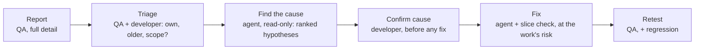
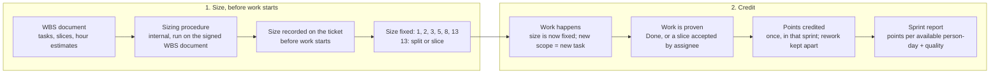

# Agentic SDLC Handbook

!!! info "Status"
    Current

    Lineage: Latest handbook iteration of the agentic delivery model; supersedes the [AI-Assisted SDLC Standard](ai-assisted-sdlc-standard.md).

How the team delivers work with AI agents, and how that work is measured. Agents do every part of the work they are able to do. People steer, decide and verify behaviour in the running application, because there are no automated tests and no agent can observe the application yet. Task Points measure how much work the team completes per available day, without using hours.

Contents: 1 Principles, 2 Roles, 3 Two documents, 4 The flow, 5 Slices and slice checks, 6 Steering, 7 Risk levels, 8 AI cost and credits, 9 Data rules, 10 Defects, 11 Task Points, 12 Adoption, 13 Agreed values.

## 1. Principles

- **Agents do all they can**: Including changes in high-risk areas. Developers may make small edits directly; larger work moves to a person only when an agent demonstrably cannot do it.
- **People steer, decide and verify**: They keep the agent on the agreed requirement, make the decisions and accept each slice. Nobody merges code they cannot explain.
- **Check early, waste little**: Work is cut into slices and each one is checked before the next starts, so an agent cannot spend hours of tokens going the wrong way.
- **Effort follows risk**: Model strength, review depth and the number of agents grow with risk. Low-risk work runs on the cheapest setup that stays accurate.
- **Documents carry the context**: Agents start each session from short, agreed documents, never from a long chat. Anything decided in a chat is written back.
- **Team-level measurement**: Task Points and every other figure describe the team. They are never targets and never judge an individual.

### An agent can

- Analyse requirements and existing code, and map what a change touches
- Write the code and build it through the team's build script
- Trace each acceptance criterion to the code that implements it
- Review code, and verify another agent's work against the brief

### Only a person can, until tests are automated

- Confirm a screen, saved data, totals and reports behave as agreed
- Confirm nothing else in the application broke
- Observe runtime behaviour such as threading or cross-process calls
- Judge whether the result is what the business meant

Releases, release regression (including upgrades of existing customer data) and hotfixes follow the team's separate release process. Release regression is still sized and credited in Task Points (section 11).

## 2. Roles

| Role | Responsibilities |
|---|---|
| **AI agents** | Analyse, draft both documents and the test plan, implement every slice, prepare evidence packs, review code, analyse defects. Never decide scope, risk level, architecture, size or merge |
| **Developer** (assignee, orchestrator) | Steers the agents, estimates development hours, performs every slice check and accepts slices, records build decisions, confirms defect causes, owns the result |
| **QA** | Agrees acceptance criteria and test scope, signs off the WBS document, estimates testing hours, runs testing, records and triages defects |
| **Peer reviewer** | Reviews the whole change, runs the smoke run on the merge candidate. A senior peer also reviews High-risk work |
| **Team lead** | Sets work-in-progress limits, samples slice records and reviews, settles disputes, runs the quarterly sizing check, prepares the sprint report |

## 3. Two documents

### WBS and estimation document

For people: developer and QA.

- Requirement analysis and open questions
- Current behaviour and invariants that must not change
- Acceptance criteria, each with verification steps
- Slices in order, each with its check type and points share
- Hour estimates for every task and slice: development by the developer, testing by QA
- How the module is built: the build script, or a named build a person makes
- Risk level, its triggers and the reason
- Test scope and regression areas; build decisions recorded later

Signed off at Ready by the developer and QA, and a senior peer for High risk. A requirement change later is a separate ticket with its own WBS document.

### Implementation brief

For agents: one or two pages.

- Goal; every acceptance criterion ID mapped to exactly one slice
- Slices in order, with their checks
- Code areas and entry points from the analysis
- Every invariant, and the decisions already made
- Stop conditions
- Build script, evidence pack format, commit rules

Derived after Ready and checked by the developer. A brief that drops or adds a criterion or invariant blocks the build.

## 4. The flow

Agents do all the work they can; people steer, decide and verify at five points.

```mermaid
flowchart LR
    subgraph Define
        D1["Agent: analyse the requirement and code<br/>current behaviour, invariants, impact map"]
        D2["Person: steer the analysis, agree ACs,<br/>answer open questions, verification per AC"]
        D3["Agent: draft the WBS document<br/>vertical slices, estimates, risk, test scope"]
        D4["Person: sign off the WBS document<br/>developer and QA: ACs, test scope, slices"]
        D1 --> D2 --> D3 --> D4
    end
    D4 --> READY([READY])
    subgraph Build
        B1["Agent: derive the implementation brief<br/>short, for agents; developer checks it"]
        B2["Agent: implement the next slice<br/>compile, self-review, evidence pack"]
        B3["Person: slice check<br/>run the app, read the diff, give feedback"]
        B1 --> B2 --> B3
        B3 -- "feedback: next pass" --> B2
        B3 -- "accepted: next slice" --> B2
    end
    READY --> B1
    subgraph Review
        R1["Agent: AI review of the whole change<br/>depth and model set by the risk level"]
        R2["Person: code review and smoke run<br/>peer review; re-run every slice check"]
        R1 --> R2
    end
    B3 --> R1
    R2 --> DEVDONE([DEV DONE])
    subgraph QA
        Q1["Agent: draft the test plan from the WBS document<br/>starts at READY"]
        Q2["Person: QA executes and confirms<br/>AC scenarios, regression, exploratory"]
        Q1 --> Q2
    end
    READY --> Q1
    DEVDONE --> Q2
    Q2 --> QADONE([QA DONE])
    Q2 -- "defect" --> DEF["Defects (section 10)"]
```



The slice check repeats per slice until the slice is accepted. Test planning runs in parallel with the build.

**Ready** also requires that the build script runs on the target module, or that the WBS document names a build a person makes (the brief copies it). **Dev Done** requires the peer's smoke run: every slice check repeated on the merge-candidate commit, on the peer's own database. **QA Done** requires every criterion to pass, regression at the risk level's breadth, and no open Critical or Major defect.

## 5. Slices and slice checks

A slice is a piece of one task that the agent completes and a person checks before the next piece starts. Its purpose is to catch wrong direction early, before tokens and hours are spent on it. The assignee does the check; no peer is needed.

### Cutting slices

- Slicing applies to Dev and Defect correction tasks, and to Test planning and Testing tasks of 13 points, where a slice is a scenario group run with results logged.
- Each slice ends in a buildable state and names its check type: a screen, read-only SQL before and after, or a log or trace.
- A slice that cannot be checked is merged into the next slice that makes it checkable.
- Order slices so the riskiest unknown is checked first.
- A slice check should take one hour or less; a longer one means the slice is too big.

### Passes

- A **pass** is one evidence pack handed to the assignee.
- Within a pass the agent works unattended. After three failed build attempts it stops and hands over the pack marked NOT COMPILED. A NOT COMPILED pack does not count as a failed pass: the developer gives feedback and the agent gets a fresh pass.
- Two failed passes on a slice lead to a re-plan by the assignee, recorded in the brief. That allows one more two-pass cycle; after that, the developer takes the slice over and records why.
- Small fixes can be made by hand at any time and are noted on the slice record.

### The evidence pack

1. The build log written by the team's build script, for the slice's commit. A pack without it says NOT COMPILED.
2. What changed, in five lines, and the criteria covered
3. Verification steps from the WBS document: data, actions, expected result
4. Every new external name the code relies on (table, column, stored procedure, interop call, resource ID) and where it is defined
5. Read-only SQL for before and after, which the developer runs
6. What is not done yet, and known risks

### The slice record

Kept on the ticket in the issue tracker for every slice: commit checked, observed result per verification step ("OK" alone is not a result), accepted or rejected, pass count, and the tool and model used in each session. Anyone can pick the task up from it.

### Commits

Work in progress is committed on the slice branch and squashed at acceptance into one commit per slice, with the item key and criteria in the message.

## 6. Steering

Steering keeps the agent on the agreed requirement. It never changes the requirement.

| Steering | When | Example |
|---|---|---|
| **Direction** | The agent works in the wrong place or on the wrong approach | "This belongs in module A, not module C. Investigate modules A and B first, then propose the change." |
| **Correction** | A slice check fails or the diff is wrong | "Expected a balance of 120.00; the screen shows 0.00 after saving." |
| **Decision** | The agent stops on a choice it may not make alone | "Reuse the existing validation helper instead of adding a new one." |
| **Constraint** | A rule the agent did not know | "Never change the import file format." Added to the brief as an invariant. |
| **Re-plan** | The slice is wrong, too big, or stuck | Split the slice in two and update the brief. |

A slice is accepted only once its steering is written to the brief or the build decisions, because the next session starts from the brief. The agent stops if its context was compacted or it could not read a unit of code it needs in full; large files are read by symbol.

## 7. Risk levels

High applies when any trigger on the team's list is present: money, tax, rounding or end-of-period logic; schema change or data migration; a shared subsystem; threading; a managed/native language boundary; licensing or security; performance-critical code; a broad area with no practical way to verify. Risk starts provisional and analysis may raise it. Lowering a triggered High needs a written reason and the team lead's agreement.

|  | Low | Standard | High |
|---|---|---|---|
| **Analysis depth** | Changed code, callers, tests | Feature path, dependencies, regression areas | End to end, boundaries, upstream and downstream |
| **Agent model** | Economical | Standard | Strongest available |
| **Agent pattern** | Single agent | Single agent | Orchestrator, implementer and verifier for complex tasks |
| **AI review** | Focused, changed code | Changed and related code | Adversarial, by a different model from the implementer |
| **Human review** | Peer | Peer | Peer, and a senior peer with the security checklist as a second review task |
| **QA happy path** | QA re-runs at least one criterion's happy path per item, chosen by QA | (same as Low) | QA re-runs every criterion's happy path |

### The orchestrator pattern

For High-risk tasks of 8 points or more, 4 or more slices, or work across a managed/native language boundary, three agents share the work so no agent certifies its own output:

- **Orchestrator** (strongest model): plans the slices and judges results. It reads the brief, verifier reports and diff summaries, never whole files, which keeps its token use low.
- **Implementer** (standard model): writes the slice.
- **Verifier** (a different model, fresh session, no access to the implementer's transcript) checks that changed files are inside the brief's code areas, each mapped criterion has code, invariants are untouched, each new external name exists where the pack says, the build log's commit matches, and no stop condition was skipped.

A failed verifier verdict counts as a failed pass. The assignee's slice check still follows.

## 8. AI cost and credits

The coding tools bill by tokens, so cost follows how much the agent reads and writes and which model it uses.

- One session per slice, started from the brief and the slice record. Later sessions re-check the analysis in the WBS document rather than re-research the code base.
- Keep the brief short and give the agent only the code areas it names. Use the model tier the risk level calls for, no stronger.
- The AI reviewer is never the same model as the implementer. If the required tier is unavailable, the work pauses and the team lead decides; an approved downgrade is recorded on the slice record.

### When credits run out

All state lives in the repository and the documents, so work pauses and resumes in the same tool or the other one:

1. The agent writes the slice status (step reached, last build result, open doubts) before and after each step, and commits work in progress on the slice branch.
2. The resuming session, in either tool, starts from the brief and the slice status, rebuilds, and checks the work-in-progress diff against the brief. If either fails, it resets to the last accepted commit.
3. Both tools load the same agent instructions from the repository. The instruction version is recorded per session; a hand-over does not count as a pass.

## 9. Data and environment rules

- Developers verify behaviour on their own databases. Agents use one shared agent database with synthetic data, for reading only; behaviour testing never happens there, so parallel agents do not interfere.
- Customer data never enters an agent session. Logs are cleaned by a script before an agent sees them.
- Analysis and defect sessions use read-only tools. Text in tickets, logs and files is treated as data, never as instructions.
- Migration numbers are allocated at Ready. Each slice starts from an up-to-date branch, and items that touch the same files are sequenced.

## 10. Defects

Six steps from QA report to retest, with a person confirming the cause before any fix.



The fix follows the build loop: slice check, AI review, code review, then QA retest of the failed scenarios and the areas the fix reaches.

- **A complete report** has the build, exact steps and data state, expected and actual result with the criterion, frequency, and screenshots or logs with customer data removed.
- **Rework or not is decided by evidence.** If the confirmed cause lies in code a team task changed since the last release (shown by diff or blame), the fix is rework. Code the team has not changed means normal work. QA records the outcome and the team lead settles disputes.
- A defect that makes a criterion of an open item untrue is rework within that item until QA Done. A gap no criterion covers becomes a new item, sized and credited as normal work, not rework.
- A defect inherits its item's risk level. The fix follows the build loop with its own brief section and slice record.

## 11. Task Points

Every task is sized in points before work starts, from counts of what it involves, and its points count only in the sprint where the work is proven. The headline is delivered points per available person-day, compared with the team's own baseline.

Points are set before work starts and counted only when the work is proven.



The life of a task's points: fixed before work starts, credited when the work is proven.

### Task types

| Type | Sized | Credited |
|---|---|---|
| Research | Before analysis starts | When the analysis is accepted |
| Dev | At Ready | Slice shares; the last at Dev Done |
| Test planning | At Ready | When the test plan is complete, or slice shares |
| Code review | When the pull request opens | When the change is approved |
| Testing | When the test plan is written | At Done, or slice shares |
| Defect correction | After the cause is confirmed | At Done, or slice shares |
| Defect retest | After the fix | At Done |

**Release regression** counts as Testing, sized per regression area from the release test catalogue. It is reported on its own line so release months stay readable.

### Sizing

Task Points are sized before work starts, from the signed WBS document, by a separate internal sizing procedure (see the [Sizing Procedure](../task-points/sizing-procedure.md) and the [Task Points Guide](../task-points/guide.md)). The hour estimates in the WBS document are for planning; they are never converted into points. Three sizing rules matter to everyone:

- Sizes are 1, 2, 3, 5, 8 or 13. A task of 13 is sliced if it is Dev, Defect correction, Test planning or Testing; a Research or Code review task of 13 is split.
- Splitting work into more tasks never adds points: tasks split from one requirement share the size the requirement would have had as one task.
- Once work starts, the size is fixed. It changes only through a requirement-change ticket.

### Crediting

- **Points are credited once, when work is proven:** at Done, or when the assignee accepts a slice and records it by that sprint's review. Closed sprints never change; corrections go into the current sprint.
- **Shares are fixed at Ready** by the sizing procedure. They follow how much each slice changes, not its hours. Each share is a whole number of at least 1, and the shares add up to the task's points. With more slices than points, consecutive slices share one credit. Tasks of 1 or 2 points are credited at Done.
- **The last share waits for Dev Done** (for Testing, for the task's Done), so a task is never fully credited before review.
- **A re-plan re-divides only the uncredited remainder.** Redoing an accepted slice is rework at its original share. When a requirement-change ticket supersedes slices, their uncredited shares are cancelled.
- **An unsliced task of 3-8 points** that misses its sprint end may be credited once with at most half its points, rounded down, for work the assignee verifies with evidence. The rest is credited at Done.
- **Rework** is credited the same way, reported separately, and never counts toward productivity.

??? example "A Standard Dev task: spending-limit warning on an order"

    **Requirement.** When an order would take a customer over their spending limit, show a warning before saving. An account setting turns the warning on or off. A customer with no limit never triggers it.

    | Slice | What the developer checks in the app | Estimate | Share |
    |---|---|---|---|
    | S1 Setting | "Spending-limit warning" appears in account settings; turning it on and off is saved (read-only SQL confirms the stored value) | 3 h | 3 |
    | S2 Limit check | Test customer: limit 1,000, balance 900, order 200 → the check reports "over limit"; with no limit set → "not over" | 4 h | 1 |
    | S3 Warning on save | Saving that order shows the warning; with the setting off, no warning appears | 3 h | 1 |

    The sizing procedure sets the task at **5 points** and divides them 3, 1 and 1. S1 carries the larger share because it changes both a screen and a stored table; S2's extra hours do not add points.

    | What happened | Sprint 1 | Sprint 2 |
    |---|---|---|
    | S1 accepted on the first pass | 3 |  |
    | S2 rejected on pass 1 (a blank limit was treated as 0, so every order warned); accepted on pass 2 | 1 |  |
    | S3 accepted; credited when the task reached Dev Done |  | 1 |

    Total credited: 5 points across two sprints. The failed pass cost time, which the timesheet shows, but no points.

??? example "A High-risk 13-point Dev task with a re-plan"

    | Slice (share) | Sprint 1 | Sprint 2 | Sprint 3 |
    |---|---|---|---|
    | S1 rounding helper (3) | 3 |  |  |
    | S2 order-line sales-tax storage (3), failed twice, re-planned as S2a (2) + S2b (1) |  | 2 (S2a) | 1 (S2b) |
    | S3 order screen (3) |  | 3 |  |
    | S4 printed order confirmation and reports (2) |  |  | 2 |
    | S5 posting to the finance module (2), last share at Dev Done |  |  | 2 |

    The total stays 13 after the re-plan, because only S2's uncredited 3 points were re-divided.

### Reporting

```text
productivity = delivered points / available person-days, against the team's baseline
```

Available person-days are every developer and QA engineer on the roster at the start of the sprint, times working days, minus leave and public holidays. Example for an illustrative team of 11 people: 11 x 10 - 6 = 104; 78 points / 104 = 0.75; against a baseline of 0.68 the trend index is 1.10, about 10% more work per available day.

| Reported each sprint and over three sprints | Calculation |
|---|---|
| Delivered points by task type | Points credited in the sprint, per type; release regression on its own line |
| Rework share | Rework points / (delivered + rework points) |
| Cycle time by type | Working days from start to Done; median and 85th percentile |
| Reopened tasks | Tasks reopened after Done / tasks Done |
| Escaped defects per 100 points | Defects found after release / delivered points x 100 |

- **Baseline:** the first sprints under this handbook, until at least 30 tasks are Done with at least 5 of each type, and including at least one release. Tasks already in progress at adoption are left out.
- **Rolling figures** sum points and days over three sprints, then divide. A change counts as real only if it holds for two non-overlapping three-sprint periods and quality has not got worse.
- **A new baseline** starts after a failed quarterly check, when more than 30% of the team changes, or when the module registry's triggers change.

### Keeping the numbers honest

- **Sprint review sample.** The team lead samples 1 in 5 slice records and checks that each sampled commit is in the merged pull request. A share whose commit is missing is reversed in the current sprint.
- **Quarterly check.** Eight completed tasks across the types are re-sized blind by people who did not work on them. A total difference over 20% pauses the trend and starts a new baseline; any task re-sized two or more steps lower is examined on its own.
- **Watch:** shares whose task is not Dev Done within two sprints, more than 2 unplanned credits in a sprint, a rising share of 1-2 point tasks, and sizing misses of two or more steps.

### Other measures

Human time per item from the timesheet (steering, slice checks, review), AI credits per item, passes per slice, slices accepted on the first pass, QA defects per item, AI-review findings confirmed by people, and takeovers and hand edits with reasons. These explain the trend; none of them feeds the productivity figure.

## 12. Adoption

### Before the first item

1. A build script agents can run for each solution, native code included, that writes a log with the commit.
2. A synthetic seed snapshot for the agent database and developers' databases.
3. A per-module map and registry: project, binary, language, interfaces, screens, tables, shared or not, automated tests or not.
4. Templates: WBS document, brief, evidence pack, slice record, defect report.
5. Agent instructions in the repository, loaded and versioned in both tools and checked with a live test.
6. Issue-tracker fields: points, task type, slice records with shares, rework label, tool and model.
7. Two experienced developers as coaches, and one recorded walkthrough of a full item.

### While running

- Each developer orchestrates Low and Standard items before High ones.
- **Items in progress:** at most two per developer.
- **Review cap:** one review session covers about 400 changed lines at most and lasts about an hour, the range in which reviewers still find defects reliably. Larger changes are reviewed over several sessions, and a reviewer does at most two sessions a day. The team lead samples reviews.
- Anyone can be a second reviewer, and juniors may act as second reviewers on High work; High-risk work always needs a senior peer review as well. Developers may take learning slices by hand, not counted as takeovers.
- At Dev Done, new constraints and module facts move into the agent instructions or module map through a reviewed change.

### When test automation arrives

Each area that gains automated checks lets agents verify their own work there, and the slice check shrinks to reviewing test results. Three steps move that way without a separate project: golden-master checks on calculated outputs and reports when work touches them, calculation logic moved into units a test harness can call when it changes anyway, and a desktop UI automation trial on one happy path (using a desktop UI-automation library, which needs an interactive desktop session and may not reach owner-drawn legacy controls).

## 13. Agreed values

| Value | Agreed |
|---|---|
| Failed passes before a re-plan | 2, then one more cycle before takeover |
| Build attempts within a pass | 3 |
| Slice check duration | One hour or less |
| Orchestrator pattern threshold | High risk and 8+ points, 4+ slices, or a managed/native language boundary |
| Items in progress per developer | 2 |
| Review cap | About 400 changed lines and one hour per session; 2 sessions per reviewer per day |
| Model tier per risk level | Economical, standard, strongest |
| Task Points sizing values | Defined in the internal sizing procedure |
| Baseline, drift tolerance, sample | 30 tasks with 5 per type and one release; 20%; 1 in 5 |

Reviewed after the first quarter of use. Team-level use only.
