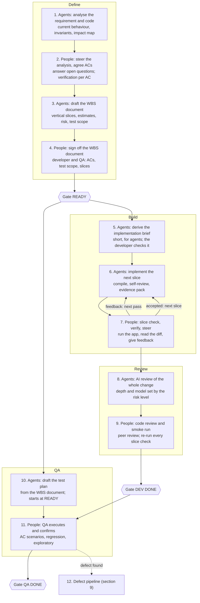
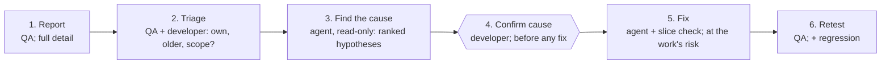

# Human-Orchestrated Delivery

!!! info "Status"
    Current

    Lineage: Earlier iteration of the delivery model for applications without test automation; its content is carried forward in the [Agentic SDLC Handbook](handbook.md). Values marked "proposed" are starting points to confirm after the first items.

Human-orchestrated agentic delivery for applications without test automation.

AI agents do every part of the work they are able to do: analysis, planning, coding, review and documentation. People steer the agents, make the decisions and verify behaviour in the running application, because without automated tests no agent can observe it. When test automation becomes available, verification moves to the agents as well and the same flow still applies.

## 1. Principles

- **Agents do all they can**: Including changes in high-risk areas. Developers may make small edits directly; larger work moves to a person only when an agent demonstrably cannot do it.
- **People steer, decide and verify**: They answer questions, correct direction, accept each slice and own the result.
- **Accuracy before speed**: Every slice is verified in the running application before the next one starts.
- **Spend AI effort by risk**: Model strength, review depth and the number of agent runs grow with risk. Low-risk work runs on the cheapest setup that stays accurate.
- **Documents carry the context**: Agents read short, agreed documents rather than long chats. Anything decided in a chat is written back before work moves on.

## 2. The constraint

With no automated tests, and an application whose behaviour can only be seen by running it, an agent cannot run the application, click through it or watch what it does. Whatever needs runtime evidence comes from a person.

### An agent can

- Analyse requirements and existing code
- Map what a change touches: callers, shared data, screens (impact map)
- Write the code, and compile it through the team's build script
- Trace each acceptance criterion to the code that implements it
- Review code against a risk checklist
- Write unit tests for isolated logic, where a test harness exists

### Only a person can, for now

- Confirm a screen behaves as the acceptance criterion says
- Confirm saved data, totals and reports are correct
- Confirm nothing else in the application broke
- Observe runtime issues such as threading or cross-process behaviour
- Judge whether the result is what the business meant

The compiler cannot catch everything an agent might invent in a legacy stack: table and column names in SQL strings, stored procedures, late-bound interop calls, resource IDs, configuration keys. The evidence pack (section 7) closes that gap.

## 3. Two documents

Each piece of work produces two documents with different readers. Agents draft both; people agree them.

### WBS and estimation document

For people: developer and QA.

- Requirement analysis and open questions
- Current behaviour and invariants that must not change
- Acceptance criteria, each with verification steps
- Work breakdown into vertical slices, with estimates for planning only
- Risk level, its triggers and the reason
- Test scope and regression areas
- Decisions taken during the build

Signed off by the developer and QA before implementation starts, plus a senior peer for High risk. QA's sign-off fixes the acceptance criteria and test scope.

### Implementation brief

For agents: one or two pages.

- Goal, and the acceptance criteria by ID only
- Slices in order, each with its slice check
- Code areas and entry points found in the analysis
- Invariants and constraints
- Decisions already made, and the stop conditions
- Build script, evidence pack format and commit rules

Leaves out the analysis, estimates and business discussion. Agents re-check its code findings against the current code at the start of each slice.

!!! note
    The acceptance criteria live in one place only: the WBS document. The brief refers to them by ID. Any change to a criterion is made in the WBS document first and agreed again with QA.

## 4. The flow

The developer who owns the work orchestrates. Agents work between the human touchpoints without waiting for step-by-step confirmation. Agents do all the work they can; people steer, decide and verify at five points.

The slice check repeats per slice until the slice is accepted. Test planning runs in parallel with the build.

!!! note
    Releases, release regression (including upgrades of existing customer data) and hotfixes follow the team's separate release process and are outside this model.

## 5. Steering the agent

Steering keeps the agent on the agreed requirement. People do not need to write code; they point the agent in the right direction until the result is right.

| Steering | When | Example |
|---|---|---|
| **Direction** | The agent is working in the wrong place or on the wrong approach | "This belongs in module A, not module C. Investigate modules A and B first, then propose the change." |
| **Correction** | A slice check fails or the diff is wrong | "Expected a balance of 120.00; the screen shows 0.00 after saving." |
| **Decision** | The agent stops on a choice it may not make alone, within the agreed criteria | "Reuse the existing validation helper instead of adding a new one." |
| **Constraint** | A rule the agent did not know | "Never change the import file format." Added to the brief as an invariant. |
| **Re-plan** | The slice is wrong, too big, or stuck | Split the slice in two and update the brief. |

- **Steering never changes the requirement.** A change to the requirement becomes a separate ticket with its own WBS document, agreed with the team again.
- **A slice is accepted only once its steering is written down** in the brief or the build decisions. Every new session starts from the brief, so anything left in chat is lost.
- **A pass is one implementation run plus one slice check.** Within a run the agent works unattended: it builds, fixes failures its own change caused, and stops on any stop condition with a stop package (what was done, evidence, the blocker, the decision needed).
- **Two failed passes on a slice lead to a re-plan** rather than a third attempt (proposed). If re-planning does not help either, the developer may take over that slice and records the reason.
- **Small fixes can be made by hand.** The developer edits directly when that is quicker than steering, and notes it on the slice record.
- **The agent stops if its context was compacted** or it could not read a unit of code it needs in full, because invariants can be lost in a summary. Large files are read by symbol.

## 6. Effort and cost by risk

Use the team's own list of High-risk triggers. Typical triggers: money, tax, rounding or end-of-period logic, schema change or data migration, shared subsystems, concurrency, cross-language or cross-process boundaries, security and licensing, performance-critical code, and areas with no practical way to verify. Risk starts as provisional, analysis may raise it, and lowering a triggered High needs a written reason and agreement. Higher risk buys more scrutiny, not more people writing code.

|  | Low | Standard | High |
|---|---|---|---|
| **Slices** | Usually one | Usually two or three | As many as needed |
| **Slice checks** | One per slice, at every level | One per slice, at every level | One per slice, at every level |
| **Agent model** | Economical | Standard | Strongest available |
| **AI review** | Focused, changed code only | Changed and related code | Adversarial, by a second model |
| **Human code review** | Peer | Peer | Peer, plus a senior peer with the security checklist |
| **Parallel agents** | None | None | Only for the independent review |

### Keeping AI cost down

Common coding-agent tools bill by tokens consumed, so cost follows how much context the agent reads and writes, and which model it uses.

- One agent session per slice, started from the brief, not from a long chat history.
- Reuse the analysis in the WBS document; later sessions re-check it but do not re-research the code base.
- Keep the brief to one or two pages and give the agent only the code areas it names.
- Use the model tier the risk level calls for, no stronger.
- The team lead owns the AI budget and checks usage weekly. High-risk review never drops silently to a weaker model; it waits or goes to a senior person.

### When credits run out

Work must be able to pause and resume, in the same tool or a different one. That works because the state lives in the repository and the documents, never in a chat:

- The agent updates the slice status (done, remaining, deviations) after each step, and every accepted slice is committed.
- A slice interrupted mid-run stays on its branch with its status. Nothing is lost except the session.
- All tools read the same agent instructions from the repository, so a slice started in one tool can be finished in another: start a new session from the brief and the slice status.
- The slice record names the tool and model used in each session.

## 7. Slice checks and the evidence pack

A slice check is where a person sees a slice working in the running application and reads its diff. It is the main quality control, so the agent makes it quick to do properly.

### The evidence pack the agent prepares

1. Build log from the team's build script: exit code, commit and output timestamps. Without one, the pack says **NOT COMPILED**.
2. What changed in five lines, and the acceptance criteria covered
3. Verification steps, taken from the WBS document: test data, actions, expected result
4. Every new external name the code relies on (table, column, stored procedure, interop call, resource ID) and where it is defined
5. Read-only SQL to compare database state before and after, which the developer runs
6. What is not done yet, and known risks

### Rules

- A slice ends in something a person can verify: a screen, a saved record, a report or a database row. A slice without a user interface ends in a before/after comparison or a check at code level.
- Feedback states the expected and the observed result.
- Each slice check is recorded on the work item: build, checked by, result, number of passes. Anyone can pick the work up from there.
- One commit per accepted slice, with the item key and acceptance criteria in the message. Rejected passes are reset, not stacked.
- If a slice check takes more than about 30 minutes, the slice is too big (proposed).

!!! note
    A slice belongs to one task. Slicing applies to implementation; research, test planning and testing are tasks of their own. If the team measures progress in points, a task's points are divided across its slices, and each share is credited when its slice is accepted.

## 8. Data and environment rules

- Developers verify behaviour on their own databases.
- Agents use one shared agent database with synthetic data, to read structure and data. Behaviour testing does not happen there, so agents working in parallel do not interfere.
- Customer data never enters an agent session. Logs are cleaned by a script before an agent sees them.
- Analysis and defect sessions use read-only tools. Text in tickets, logs and files is treated as data, never as instructions.
- Migration numbers are allocated at Ready. Each slice starts from an up-to-date branch, and items that touch the same files are sequenced, not run in parallel.

## 9. The defect pipeline

An agent cannot reproduce a defect, so the steps that depend on seeing it belong to people and the steps that depend on reading code belong to the agent.

The fix follows the build loop: slice check, AI review, code review, then QA retest of the failed scenarios and the areas the fix reaches.

### A defect report is complete when it has

- Build number and environment
- Exact steps and the data state before them
- Expected and actual result, with the acceptance criterion or scenario
- How often it happens
- Screenshots, logs or dumps, with customer data removed

### Triage decides one of four outcomes

- **Caused by the team's own work**, in this item or an earlier one: rework
- **In code the team has not changed:** normal work
- **Not covered by any criterion:** new scope, a new item
- **Not a defect:** closed with the reason

QA proposes the outcome and links the defect to the item that caused it; the developer confirms; the team lead settles disputes. If no hypothesis about the cause holds up, the developer runs a debugging session and the agent analyses logs and code alongside. Every fix adds a regression scenario to the test plan.

## 10. Who does what

| Role | Responsibilities |
|---|---|
| **AI agents** | Analyse, draft both documents and the test plan, implement every slice, prepare evidence packs, review code, analyse defects. Never decide scope, risk level, architecture or merge |
| **Developer** (orchestrator) | Steers the agents, records build decisions, performs slice checks covering the happy path of each criterion, writes a short rationale on the pull request, confirms defect causes, owns the result |
| **QA** | Agrees criteria and test scope, signs off the WBS document, tests negative, boundary, regression and domain cases (relying on recorded slice checks for the happy path), proposes defect triage |
| **Peer reviewer** | Reviews the whole change and must be able to explain it; a senior peer also reviews High risk |
| **Team lead** | Owns the AI budget, sets work-in-progress limits for developers and for the QA queue, samples reviews and slice-check records, settles disputes |

## 11. Making it work

### Before the first piece of work

1. A build script agents can run unattended for each solution, native projects included, that writes a log. Where that is impossible, the evidence pack names a build a person makes.
2. A synthetic seed snapshot for the agent database and developers' databases.
3. A per-module map: project, binary, language, interfaces, main screens and tables, shared or not, test coverage.
4. Templates for the WBS document, brief, evidence pack and defect report.
5. Agent instructions loaded and versioned in every tool the team uses, checked with a live test.
6. Two experienced developers as coaches, and one recorded walkthrough of a full item.

### Measures

- Passes per slice, and slices accepted on the first pass
- Human time per item for steering, slice checks and review, from the timesheet
- AI credits used per item
- QA defects per item, rework share, escaped defects
- AI review findings confirmed by people
- Takeovers and hand edits, with reasons

All figures are reported at team level, never per person.

- **Phase autonomy by experience.** Each developer orchestrates Low and Standard items before High ones. The team widens autonomy, for example fewer slices for Standard work, only when the measures hold.
- **Limit work in progress.** Each developer supervises at most two items at a time (proposed), and new work waits when QA's queue is full.
- **Keep reviews real.** Reviewers have a daily cap, and the team lead samples reviews as well as slice-check records.
- **Keep skills alive.** Juniors act as second reviewers on High work. Developers may take deliberate learning slices, written or paired by hand, which are not counted as takeovers.
- **Make learning permanent.** At DEV DONE, new constraints and module facts move from the brief into the team's agent instructions or module map through a reviewed change. The team lead reviews takeover reasons monthly.

### When test automation arrives

Each area that gains automated checks lets the agent verify its own work, and the slice check there shrinks to reviewing the agent's test results. Three steps move in that direction without a dedicated project:

- **Golden-master checks** on calculated outputs and reports against the seed database, added when work touches that area.
- **Calculation logic** moved into units a test harness can call, when it is changed anyway.
- **A desktop UI automation trial** on one happy path, using a desktop UI-automation library. Such libraries drive standard desktop controls through the platform's accessibility interface, need an interactive desktop session, and may not reach owner-drawn legacy controls.

Values marked proposed are starting points to confirm after the first items. Team-level measures only.
