# Agentic Lifecycle Short Guide

!!! info "Status"
    Current

    Lineage: Short team guide to the agentic lifecycle (how a story is delivered with AI agents); companion to the [Agentic SDLC Handbook](handbook.md) and the [Operating Plan](operating-plan.md).

Agents do the legwork at every step, from drafting acceptance criteria to research, planning, coding, testing and review. People make every decision and stay accountable for what ships. The aim is to deliver more correct scope with less total Dev and QA effort, spending extra AI and review effort only where the risk justifies it.

## 1. Four rules everything else follows

- **People stay accountable**: AI proposes, people decide. Nobody merges code they can't explain.
- **Depth follows risk**: Low-risk work stays light. High-risk work gets deeper, adversarial treatment.
- **Evidence before commitment**: A story is Ready only when research backs the estimate and no blocking question is open.
- **Stop, don't improvise**: An agent that reaches a decision boundary stops and leaves a clear status. A clean stop is a good outcome.

## 2. The lifecycle at a glance

A story moves through three phases. Each phase ends at a gate that people confirm (recorded in the issue tracker). QA starts designing tests as soon as the story is Ready, in parallel with the build.

```mermaid
flowchart LR
    subgraph P1["Phase 1: Refine"]
        S01["S01 Agree acceptance criteria<br/>agent drafts ACs; Dev + QA"] --> S02["S02 Create tasks<br/>agent counts Research task; Dev + QA"]
        S02 --> S03["S03 Provisional risk tier<br/>checks the triggers; Dev"]
        S03 --> S04["S04 Research<br/>read-only, to the tier's depth; Dev"]
        S04 --> S05["S05 Confirm or raise tier<br/>never lowered automatically; Dev, peer"]
        S05 --> S06["S06 Size and break down<br/>counts tasks, drafts the WBS; Dev + QA"]
    end
    S06 --> READY{{"READY"}}
    subgraph P2["Phase 2: Build"]
        S07["S07 Plan<br/>re-checks findings, writes steps; Dev"] --> S08["S08 Implement<br/>agent executes the plan; Dev"]
        S08 --> S09["S09 AI review<br/>fresh session, depth by tier; Dev"]
        S09 --> S10["S10 Peer review<br/>senior peer for High; Peer"]
    end
    READY --> S07
    S10 --> DEVDONE{{"DEV DONE"}}
    subgraph P3["Phase 3: Test"]
        S11["S11 QA test design<br/>scenarios for every AC; QA"] --> S12["S12 QA execution<br/>QA"]
    end
    READY -. "QA test design starts in parallel once Ready" .-> S11
    DEVDONE --> S12
    S12 --> QADONE{{"QA DONE: story closes"}}
    S12 -. "defect: fix, re-review, retest" .-> S08
```

Twelve stages, three gates. Owners (Dev, QA, Peer) follow each stage name; the agent's part is described under it.

## 3. Which path does the work take?

| Work | Path |
|---|---|
| **Story**: new or changed behaviour | The full path above: S01-S06, then **READY**, S07-S10, **DEV DONE**, S11-S12, **QA DONE** |
| **Clear bug, no High trigger**: the light path (optional) | QA confirms expected behaviour, then size, then research at Low depth, then fix (with a test where a harness exists), focused AI review, peer review, QA retest |
| **Defect found by QA**: rework on the same story; scope never changes | Defect correction task, sized after diagnosis, then S08 fix, S09 review of the fix, S10 peer review, defect retest |

## 4. Risk sets the depth

Check for a High trigger first: one is enough. A story is Low only if every Low condition holds. Everything else is Standard. Research can raise the tier when evidence hits a trigger. It never lowers it automatically.

|  | Low | Standard | High |
|---|---|---|---|
| **When** | One well-known component, no schema change, small regression area, easy to verify | Everything else | Any one High trigger |
| **Research** | Changed code, callers, tests; 30 min or less | Feature path, dependencies, regression areas; 2 h or less | End to end, boundaries, upstream and downstream; 4 h or less, then a spike |
| **AI review** | Focused: changed code only | Relevant: changed and related code | Adversarial: tries to prove the change unsafe |
| **Human review** | Peer | Peer | Senior peer + security checklist |
| **Regression** | Targeted | Areas found in research | Broad |

**The team's High-risk triggers**

- Crosses a managed/native language boundary
- Shared subsystem
- Schema change or data migration
- Money, tax, rounding or end-of-period logic
- Threading
- Licensing or security
- Performance-critical
- Broad area with no test harness

## 5. Who decides

1. **The rule**: If this process gives the answer, apply it. No approval needed.
2. **A peer**: When judgment is needed. A senior peer for High-risk work.
3. **Team lead**: Genuine exceptions only. Scope or dates change materially, another team is affected, a security or data concern, customer impact.

The team lead monitors and samples (2 Ready confirmations per team per sprint, plus every High). The team lead is not the routine approval path.

## 6. What an agent may do on its own

An agent can run an approved plan without step-by-step confirmation, attended or unattended (overnight, for example), once these hold: agreed ACs and an approved plan, stable scope, Low or suitable Standard risk, an isolated branch, deterministic build and test commands, and no customer, personal or credential data within reach.

**May**

- Read the code it needs
- Implement the approved steps
- Add and update tests
- Run builds, tests and approved checks
- Fix failures its own change caused, within the plan
- Prepare evidence and review notes

**Must not, on its own**

- Expand scope or resolve unclear requirements
- Lower the risk tier
- Change the architecture or add a dependency
- Run destructive operations or touch sensitive data
- Deploy, merge its own work, or bypass a stop

**Stops when**

- Requirements become unclear
- New scope or a material discovery appears
- Schema, security or a destructive action is needed
- Unrelated tests fail, or the tier should rise
- Continuing needs a decision, not execution

!!! note
    A stopped run leaves a **stop package**: completed work, status, evidence, build and test results, the exact blocker, the decision needed and a recommended next step. The named person decides, and work resumes at Plan or Implement.

## 7. The three gates

### READY: before work starts

- ACs agreed by Dev + QA and testable
- No open blocking question
- Tier confirmed with triggers and reasons
- Research done at that tier's depth; no material unknown
- Estimate backed by findings
- Tasks sized; any 13 split or given checkpoints

Who: Dev + QA confirm; senior peer too for High.

### DEV DONE: before QA

- Built and unit-tested, or the test limit recorded
- ACs tested by the developer
- Every AI-review finding marked
- Peer approved; Code review task credited
- PR records AI use and any autonomous run

Who: Dev + peer confirm.

### QA DONE: before the story closes

- Every AC passes
- Regression retested at the tier's breadth
- No open Critical or Major defect

Who: QA confirms.

## 8. Found something after Ready?

Raise it in the issue tracker the same day, then ask one question: does it add delivered behaviour, such as a field, a rule, an output or a user-visible capability?

- **No: implementation discovery.** Absorb it. Task sizes do not change; the extra work shows in points per day and cycle time.
- **Yes: new delivered scope.** Don't absorb it. Create a new task and size it. With a peer, decide whether to build it alongside, split it out or defer it.

## 9. How progress is measured

Every task (research, development, code review, test planning, testing, defect correction and retest) is sized in Task Points before it starts and credited only when the work is proven. The headline figure is delivered points per available person-day against the team's own baseline, always reported beside rework and quality. No hours are used, and no figure is ever used to judge an individual. See the [Task Points Guide](../task-points/guide.md) for how sizing and crediting work.

Values marked proposed in the operating plan are confirmed after the baseline. Team-level use only.
