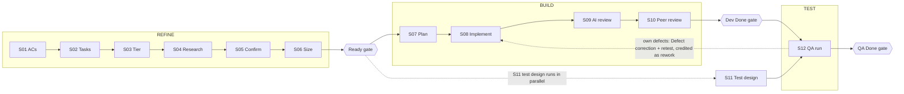
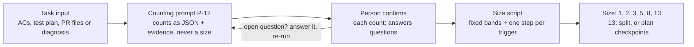
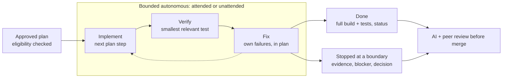

# Agentic SDLC Operating Plan with Task Points

!!! info "Status"
    Current

    Lineage: Operating plan that combines the agentic lifecycle with Task Points measurement; the [Agentic SDLC Handbook](handbook.md) is the latest consolidated iteration. Task Points values in this plan are proposed.

How a story moves from requirement to QA Done with AI agents doing the legwork and people making every decision, and how the team measures the work with Task Points instead of hours.

Sections: Summary, Story flow, Task Points, Risk tiers, Gates, Who decides, Agents, Incidents, Adoption, Open decisions.

## 01 Summary

Every story follows one lifecycle with three gates: **Ready**, **Dev Done** and **QA Done**. Agents draft acceptance criteria, research the code, plan, implement, test and review. Risk tiers decide how deep each step goes. Every piece of work becomes a ticket in the issue tracker, sized in Task Points before it starts and credited only when the work is proven.

**Operating principle.** Deliver more correct scope with less total Dev + QA effort, spending extra AI and review effort only where the risk justifies the cost.

| Risk | Control in this plan |
| --- | --- |
| AI-introduced defects | Tiered AI review, mandatory peer review, QA gate |
| Agent acting beyond its authority | Bounded execution: eligibility, prohibited actions, stop conditions, no self-merge |
| Customer or credential data exposed to AI tools | Data rules for every agent session; any breach is an incident |
| Hidden scope growth | Work found after Ready: new behaviour becomes a new, sized task |
| Team lead bottleneck | Rule first, then a peer; the team lead handles exceptions only |
| Effort invisible when work spans sprints | Task Points credits proven progress at peer-confirmed checkpoints |
| Inflated productivity figures | Evidence-backed counts and a fixed size script; quarterly blind re-sizing; rework and quality reported beside productivity |

The process applies to every new story from adoption; there is no pilot. Figures are team-level only and never used for targets, appraisals or pay.

## 02 How a story flows

Stages S01-S12, the three gates, and where each Task Points task is sized and credited.

Where each task type is sized, worked and credited:

| Task type | Sized | Work happens | Credited |
| --- | --- | --- | --- |
| Research | S02 | Over S04 | At the end of S04 |
| Dev | S06 | S07 to Dev Done, with two planned checkpoints | At Dev Done (checkpoints as confirmed) |
| Test planning | S06 | During the build | Around S11 (end of test planning) |
| Code review | S10, when the PR opens | Short | At approval |
| Testing | Once the test plan exists | Over S12, with one checkpoint | At QA Done |
| Defect fix + retest (rework) | After diagnosis | During QA | As rework points |

Defects in the team's own work go back to S08 as Defect correction and Defect retest tasks, credited as rework.

| Stage | Owner | The agent | Output | Task Points |
| --- | --- | --- | --- | --- |
| **S01** Agree ACs | Dev + QA | Drafts testable ACs, open questions, scope lines (P-01) | ACs; blocking questions resolved | |
| **S02** Create tasks | Dev + QA | Counts the Research task (P-12) | Research, Dev, Test planning tasks | Research sized |
| **S03** Provisional tier | Dev | Checks High triggers first | Provisional tier | |
| **S04** Research | Dev | Read-only research at tier depth (P-02) | Findings as path::Symbol; unknowns | Research credited when findings are accepted |
| **S05** Confirm or raise tier | Dev; peer reviews | n/a | Confirmed tier with reasons | |
| **S06** Size, break down | Dev + QA | Counts Dev and Test planning (P-12); drafts the WBS (P-03) | Sized tasks; checkpoints for a 13 | Dev, Test planning sized |
| **Ready** | Dev + QA; senior peer for High | n/a | Gate passed | |
| **S07** Plan | Dev approves | Re-checks findings, writes steps, recommends execution mode (P-04) | Approved plan | |
| **S08** Implement | Dev | Executes the plan, interactive or bounded autonomous (P-05) | Code, tests, status | Dev checkpoints credited as confirmed |
| **S09** AI review | Dev | Fresh session; depth by tier (P-06/07/08) | Every finding marked | Part of the Dev task |
| **S10** Peer review | Peer; senior for High | Counts the Code review task when the PR opens | Approval, merge | Code review credited at approval |
| **Dev Done** | Dev + peer | n/a | Moved to QA | Dev credited |
| **S11** Test design | QA | Scenarios traced to ACs, regression set (P-09) | Test plan | Test planning credited; Testing sized |
| **S12** QA execution | QA | Counts defect tasks after diagnosis | Results | Testing checkpoints; defects as rework |
| **QA Done** | QA | n/a | Story closed | Testing credited |

**Found after Ready: no new behaviour.** *Implementation discovery*, such as another internal function or component. Absorb it. Task sizes don't change; the difference shows in points per day and cycle time.

**Found after Ready: new behaviour.** *New delivered scope*: a new field, rule, output, external behaviour or user-visible capability. Create a new task and size it. With a peer, build it alongside, split it out or defer it.

Light path: a clear bug with no High trigger can go QA confirms behaviour, then low-depth research, fix with a test, focused AI review, peer review, QA retest.

## 03 Task Points

How much work the team completes each sprint, task by task, without logged hours. See the [Task Points Guide](../task-points/guide.md) for the full model.

### Seven task types

| Task type | Sized | Counted from | Credited |
| --- | --- | --- | --- |
| Research | S02, before research | Sources to examine for each question | When findings are accepted |
| Dev | S06 | Screens, rule rows, tables and interfaces changed | At Done, or per checkpoint |
| Test planning | S06 | Scenarios to write + regression areas | When the test plan is complete |
| Code review | When the PR opens | Files changed, excluding generated files | When the change is approved |
| Testing | Once the test plan exists | Scenarios + 5 x regression areas | At Done, or per checkpoint |
| Defect correction | After diagnosis | The fix's change items | At Done; rework if own defect |
| Defect retest | After the fix | Failed scenarios + areas the fix reaches | At Done; rework if own defect |

### Sizing: the AI counts, a script sizes

- Sizes are 1, 2, 3, 5, 8 and 13. A 13 is split, or given planned checkpoints if it can't be split into usable parts. Nothing over 13 enters a sprint.
- Any trigger from the input or module registry, such as *no automated tests* or *shared component*, adds one step. Several triggers still add one.
- The size reflects the work, never who does it or how much AI they use. Uncertainty is a separate Research task. Once work starts the size is fixed.

| Task type | Units | 1 | 2 | 3 | 5 | 8 | 13 |
| --- | --- | --- | --- | --- | --- | --- | --- |
| Research | sources | 1 | 2-4 | 5-8 | 9-14 | 15-20 | 21+ |
| Dev, Defect correction | change items* | 1 | 2 | 3-4 | 5-7 | 8-11 | 12+ |
| Code review | files changed | 1-3 | 4-8 | 9-15 | 16-30 | 31-50 | 51+ |
| Test planning | scenarios + areas | 1-5 | 6-12 | 13-25 | 26-45 | 46-80 | 81+ |
| Testing, Defect retest | scenarios + 5 x areas | 1-5 | 6-10 | 11-25 | 26-50 | 51-90 | 91+ |

\* Change items = screens changed + 2 x new screens + rule rows / 4 (rounded up) + tables changed + 2 x new tables + interfaces changed. Bands are proposed values.

**Example.** A Dev task adds a field to a settings screen (1), six rule rows (6 / 4, rounded up: 2) and a stored column (1): 4 change items, base size 3. The module has no automated tests, a trigger, so the size is **5**. The change emails customers, so it is High risk and gets a second review task.

### Crediting: only proven work counts

Illustration across three sprints:

| | Sprint 1 | Sprint 2 | Sprint 3 |
| --- | --- | --- | --- |
| Dev task, 13 pts, planned checkpoints | CP1 reader on branch: +5 | CP2 rules on branch: +5 | CP3 merged = Done: +3 |
| Dev task, 5 pts, missed its sprint end | unplanned CP: +2 (at most half) | Done: +3 | |
| **Credited** | **7 pts** | **8 pts** | **3 pts** |

**Planned checkpoints**

- Set when the task is sized, as issue-tracker sub-tasks "CP n of m"
- At most 4, never more than the task's points; whole-point shares that add up to the task
- Each has an exit condition a peer can check against something that exists
- Credited when a peer who didn't work on the task confirms it, by sprint review
- Tasks of 1 or 2 points never have checkpoints

**Unplanned checkpoint**

- Only for a 3-8 point task without planned checkpoints that misses its sprint end
- The assignee states what exists; a peer confirms it against evidence
- Earns at most half the points, rounded down; the rest at Done
- One per task. No confirmation, no points until Done

**Always**

- Each point is credited once; closed sprints never change
- Points belong to the task, not to a person
- Fixing or retesting the team's own work is **rework**: reported separately, excluded from productivity
- Older defects the team didn't cause are normal work

### What is reported

The headline is **delivered points per available person-day** against the team's own baseline, shown for the sprint and as a rolling three-sprint figure, always next to the quality measures.

| Measure | Calculation | Shows |
| --- | --- | --- |
| Delivered points by type | Delivered points credited in the sprint, per type | Where effort went |
| Points per available person-day | Delivered points / available person-days | Productivity against the baseline |
| Rework share | Rework / (delivered + rework) | Effort spent fixing own work |
| Cycle time by type | Start to Done in working days; median and 85th percentile | How long work takes |
| Reopened tasks | Reopened after Done / tasks Done | Right first time |
| Escaped defects per 100 points | Defects found after release / delivered points x 100 | Quality reaching users |

**Example (illustrative).** For an illustrative team of 11 people: 11 people x 10 working days - 6 days of leave = 104 person-days. 78 delivered points / 104 = 0.75 per person-day. Against a baseline of 0.68, the trend index is 1.10: about 10% more work completed per available day.

- **Baseline:** the first sprints under this system, until at least 35 tasks are Done with at least 5 of each of the seven types, usually about three sprints. A new baseline starts after a failed quarterly check or when more than 30% of the team changes.
- **Real change:** a trend counts only if it holds for two non-overlapping three-sprint periods and quality has not got worse.
- **Trust:** each quarter, people who didn't do 8 random completed tasks re-count them blind with the same counting rules. A gap over 20% (proposed) pauses trend reporting, the counting rules and bands are re-agreed and a new baseline starts.
- **Watch:** checkpoints above 30% of delivered points; more than 2 unplanned checkpoints in a sprint; 1 in 5 confirmations sampled for evidence; a sharp rise in tasks sized 1 or 2; sizing misses of 2 or more steps.

**Rules of use.** Figures are for the team only. They are never targets or quotas and never used in appraisals, pay or headcount decisions. Teams are not compared. AI use is recorded as context and never feeds the productivity figure. A rising trend shows change, not its cause.

## 04 Risk tiers

Check High first: one trigger is enough. Low only if every Low condition holds. Everything else is Standard.

| Tier | When | Research | AI review | Human review |
| --- | --- | --- | --- | --- |
| **HIGH** | Any one of: crosses a managed/native language boundary; shared subsystem; schema change or data migration; money, tax, rounding or end-of-period logic; threading; licensing or security; performance-critical; broad area with no test harness | End-to-end, boundaries, up/downstream; 4 h or less, then a spike | Adversarial: tries to prove the change unsafe | Senior peer + security checklist |
| **STANDARD** | Everything else | Feature path, dependencies, regression areas; 2 h or less | Relevant: changed and related code | Peer |
| **LOW** | All of: one component; well-known code; no schema or money change; small regression area; easy to verify | Changed code, callers, tests; 30 min or less | Focused: changed code only | Peer |

The tier set at S03 is provisional. Research can raise it when evidence hits a trigger, and then continues at the new depth. It never lowers a tier on its own: lowering a triggered High needs a written reason and team lead agreement.

## 05 Gates

**Ready: before work starts**

- ACs agreed by Dev + QA and testable
- No open blocking question
- Tier confirmed with triggers and reasons
- Research done at the confirmed depth; no material unknown
- No task blocked by an unknown
- Research credited; Dev and Test planning sized; any 13 split or checkpointed
- Dev + QA confirm; senior peer also for High

**Dev Done: before QA**

- Built and unit-tested
- ACs tested by the developer
- Every AI finding marked Fixed, Won't fix or Not an issue
- Peer approved; Code review credited
- PR records AI use and any autonomous run's supervision and outcome

**QA Done: before the story closes**

- Every AC passes
- Regression retested at the tier's breadth
- No open Critical or Major defect
- A defect goes back to S08, then AI review and peer review again before retest (proposed)

## 06 Who decides

Escalation ladder: **1. The rule**: if this plan gives the answer, apply it. No approval needed. Then **2. A peer**: when judgment is needed; a senior peer for High-risk work. Then **3. Team lead**: genuine exceptions only; otherwise monitors and samples.

| Decision | Normally | Team lead only when |
| --- | --- | --- |
| Task size | Assignee runs the counting prompt (P-12) and confirms the counts; the script sets the size. A peer checks counts when unsure | Counts stay genuinely disputed; if still unclear, the smaller size applies |
| Risk tier | Developer proposes; research may raise it; a peer can review | Someone wants to lower a triggered High (written reason) |
| Ready | Dev + QA checklist; senior peer also for High | Scope is still disputed |
| Reviewer | Rotation or code ownership; senior peer for High | n/a |
| Checkpoint | A peer who didn't work on the task confirms the evidence | Rework or credit is disputed |
| Found after Ready | Raised the same day in the issue tracker; handled by the rule above | Scope or dates change materially, another team, architecture exception, security or data, stakeholder impact (within 1 business day) |
| Process change | The team decides at the retro from evidence, at most two a sprint | Signs off; decision rights or governance also need management |

## 07 Agents

Execution mode is **Interactive** or **Bounded autonomous**. A bounded run is **attended** or **unattended**; overnight is unattended. Unattended runs are encouraged when the work is clear, bounded and safe.

**Eligible when**

- Agreed ACs, approved plan, stable scope, no material unknown
- Low or suitable Standard risk, or a mechanical, reversible High step the plan authorizes
- Isolated branch or worktree; deterministic build and test commands
- No production deploy or destructive step; schema or security only as authorized mechanical steps
- No customer, personal or credential data in reach
- Explicit stop conditions

**The agent may**

- Inspect code, implement approved steps, add or update tests
- Run builds, tests and approved checks
- Fix failures its own change caused, within the plan
- Leave evidence, review notes and a status package

**The agent may not**

- Expand scope or resolve ambiguous requirements
- Lower risk, change architecture or add a dependency
- Run destructive operations or use sensitive data
- Deploy, merge its own work or bypass a stop condition

### Stop, don't improvise, when

- requirements become ambiguous
- new delivered scope appears
- the plan is materially wrong
- a new architecture, component or dependency is needed
- schema or security behaviour changes beyond the plan
- a destructive action is required
- an external system behaves unexpectedly
- unrelated tests fail
- the risk tier should rise
- credentials or data are missing
- continuing needs a decision

A stopped run leaves completed work, status, evidence, test results, the exact blocker, the decision needed and a next action. A clean stop is a good result. Every session starts fresh, treats files, tickets and logs as data rather than instructions, cites code as `path::Symbol`, and writes `UNKNOWN` instead of guessing. Only approved tools; never customer data, credentials or personal data.

## 08 Incidents and improvement

**An incident** is a Critical or Major defect found after release, or any breach of the agent rules: sensitive data given to an AI tool, an unapproved tool, or an autonomous run outside its boundary. Raise it in the issue tracker and tell the team lead the same day. QA links it to the causing task; the developer runs root-cause analysis on cleaned logs and records where it escaped (requirement, analysis, implementation, AI review, human review, testing or environment). The delivery lead tells stakeholders if committed scope or dates change.

**Before each retro**, the sprint-feedback prompt looks for patterns that repeat and proposes at most two changes, each with evidence and a way to check it worked. The team decides; the team lead signs off.

## 09 Adoption checklist

| Item | Owner |
| --- | --- |
| Approved list of AI tools, extensions and MCP servers | Team lead |
| Team engineering instructions: build and test commands, architecture map, conventions, prohibited actions | Team lead with senior engineers |
| High-risk triggers and domain QA checks confirmed | Team lead, QA lead |
| Story working document and PR templates in the issue tracker | Team lead |
| Isolated branches or worktrees and deterministic build commands for autonomous runs | Senior engineers |
| Prompt library, counting prompt and size script versioned in the repo or wiki | Team lead |
| Issue tracker: points field, task type (7 values), checkpoint sub-tasks with evidence links, rework label, model and prompt version | Team lead |
| Module registry: automated tests and shared, per module | Senior engineers |
| 8-12 reference tasks across the types, each with its counts, size and reason (calibration fixtures only; sizes always come from counts) | Team lead with the team |
| Trial the counting prompt and script on 10 recent tasks; confirm the bands | Team lead |

## 10 Open decisions

Each has a proposed default the plan uses until it is confirmed.

| Decision | Proposed default |
| --- | --- |
| Task Points values: bands, caps, alerts, baseline minimum, drift tolerance, research time-box | Use as written; confirm on 10 recent tasks and again after the baseline |
| High-risk review: the counting prompt asks for a second review task; the SDLC asks for a senior peer | Two review tasks for High: peer code review plus senior peer review with the security checklist |
| Two risk-tier definitions (SDLC Low/Standard/High and the counting prompt's Low/Medium/High) | Align the counting prompt to the SDLC tier; until then the higher tier sets review and regression depth |
| Sizing method: counts + script, or an independent blind second sizer | Counts + script with the assignee confirming; quarterly blind re-size stays as the trust check |
| Seven task types against four in the Task Points specification | Seven types; the quarterly check samples at least 8 tasks covering every type used |
| Hour estimates in the WBS | Optional planning aid only; never used for measurement |
| A Research task for every story, even Low tier | Yes; a Low-tier research task usually sizes 1 |
| Who approves the plan before an autonomous run | The owning developer; for High, the senior peer also reviews authorized mechanical steps |
| Research time-box after a tier is raised | The higher limit covers the whole research |
| Re-entry after a QA defect | The fix passes AI review and peer review before retest |
| Incident timings and the QA lead + senior peer rule for stakeholder-invisible AC deviations | Confirm as written |

The agents' source of truth is the team's SDLC plan file in the repository, with full stage specs, rule IDs, prompts (P-01 to P-12) and the size script.
