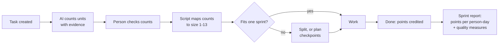

# Scopometry

**Open research on sizing engineering tasks and measuring productivity in AI-assisted, agentic software delivery.**

Teams adopting AI coding agents want to know a simple thing: *are we getting more done, and is it still good?*
Hours logged, story points and ticket counts all break once agents change how work is sliced and executed.
Scopometry collects a set of practical, testable answers:

- **Task Points** — size every engineering task (research, development, review, test planning, testing, defect work) from *counts of what the task involves*, not guesses of time, then credit points only when work is *proven*.
- **Agentic SDLC** — a delivery model in which people orchestrate AI agents through risk-tiered stages and explicit quality gates.
- **Dyno, Road & Destination** — a three-lens method for measuring the *causal* effect of AI on a team, without relying on any output count.

!!! info "Status"
    Working research, published for open review and collaboration. All numeric values are proposals to be calibrated, and every worked example uses illustrative figures.

## The core ideas

| Idea | In one sentence |
|---|---|
| Size before work starts | An AI assistant counts units in the task and quotes evidence; a fixed script turns counts into a size, so the same counts always give the same size. |
| Size ignores the worker | Who does the task, their seniority, how much AI they use and how hard it feels never change the size, so AI gains show up as more points per person-day. |
| Credit only proven work | Points count at Done, or at a checkpoint a peer confirmed against evidence. "About 60% done" earns nothing. |
| Rework is visible, not rewarded | Fixing the team's own earlier work is credited separately and never counts as productivity. |
| Read trends, never individuals | Delivered points per available person-day, against the team's own baseline, always beside quality measures. |
| Separate capability, time use and value | Measure AI's effect with randomised AI-on/AI-off replays (Dyno), where time goes (Road), and whether outcomes are met (Destination) — never merged into one score. |

## Where to start

- New to the idea: read the [Task Points quick guide](task-points/quick-guide.md), then follow [Life of a task](task-points/life-of-a-task.md).
- Running delivery with agents: start with the [Agentic SDLC handbook](agentic-sdlc/handbook.md).
- Measuring AI impact rigorously: read [Dyno, Road & Destination](measurement/dyno-road-destination.md) and its [worked example](measurement/worked-example.md).
- Interested in how the ideas evolved: see [Evolution of the models](research/evolution.md) and the earlier [Scope Points](scope-points/overview.md) model, including its [pre-mortem](scope-points/pre-mortem.md).

## Contributing

Critique, counter-examples, pilot data and replication reports are all welcome. See [Contributing](contributing.md).
