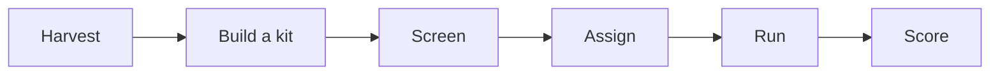

# Dyno, Road & Destination: a three-lens method

!!! info "Status"
    Status: Proposal.

    Lineage: Dyno, Road & Destination method proposal, reached by consensus after ten rounds of proposal and counter-example between independent AI reviewer agents. Succeeds the earlier [Productivity Measurement with Scope Points](productivity-measurement.md) iteration. A plain-language walk-through is in the [worked example](worked-example.md).

A method any software team can use to measure its productivity and the real impact of AI. It uses **three lenses, each with error bars, never merged into one score**. It needs no story points, no ticket counts and no estimates, and it never ranks individuals.

| Headline | Meaning |
|---|---|
| 3 lenses | Capability, time use, value and quality |
| Causal | AI effect from randomised AI-on / AI-off runs |
| 2% or less | Team capacity at full scale; 0.25% for the light mode |
| 53 to 0 | Major objections raised and resolved over 10 rounds |

## Executive summary

### Measure the engine, the driving and the destination, separately

Output counts such as points, tickets and lines of code break when AI changes how work is done. This method measures three things that do not depend on how work is sliced or estimated.

**Lens 1: Capability ("Dyno").** How fast and how well can we solve our own kind of problem, with and without AI?

- Short tasks rebuilt from the team's own closed tickets, replayed in a sealed sandbox.
- Each run is randomly AI-on or AI-off, so the difference is caused by AI.
- A hidden automatic check decides pass or fail, and a blind grader rates quality.

**Lens 2: Time use ("Road").** Where does the team's time actually go?

- One anonymous random ping per person per day: "Right now I am mainly...".
- Building, discovery, reviewing, interrupts, rework, waiting.
- Checked against existing signals (review queues, reopen rates, pages).

**Lens 3: Value and quality ("Destination").** Are we shipping the right things, without breaking more?

- 4-8 outcome statements per quarter, rated by the product owner and an outside rater.
- Escaped defects and incidents from existing processes.
- A short quarterly pulse, including "was any number misused?".

### The rule that holds it together

No gain is shown unless quality holds. Every figure carries a label saying how much it can be trusted: **[Causal]**, **[Model-based]**, **[Trend]** or **[Descriptive]**. A single frozen, open analysis package produces every label, so nobody can tune the result.

### What it will not do

It will not score individuals, compare teams in a league table, or turn a multiplier into headcount or price. These limits are built into the data design, the output validator and the use-of-results contract, not left to good intentions.

## Lens 1 in detail: how a Dyno run works

A test bench for the team's real kind of work. Because the same kinds of task are run with and without AI, the difference is caused by AI, even when the team has no history from before AI.



| Step | What happens |
|---|---|
| **Harvest** | Each month a script draws closed tickets 1-12 months old by category, before anyone is assigned. |
| **Build a kit** | The repo at the commit before the fix, the original ticket, frozen docs, no web. A hidden oracle: the old code fails it and the real fix passes it. |
| **Screen** | An outside rater checks difficulty. A recall probe drops tasks the AI appears to have memorised. |
| **Assign** | Runners who wrote, reviewed or later touched the fix are excluded. Familiar runners go first. |
| **Run** | Half a day each: task A in one arm and task B in the other, in random order. 100-minute limit, one oracle answer, one resubmission. |
| **Score** | Time, pass rate, edge-case checks and a blind quality grade go into a sealed store. Nothing per person ever leaves it. |

### Why the result can be trusted

- **Randomised arms** separate AI from other causes: new people, new tools, easier work.
- **Two independent estimators must agree** before anything is labelled Confirmed: a survival model and one that makes no distributional assumption.
- **Six frozen sentinel tasks** run every year to detect drift in the task mix.
- **Flags** for sandbagging, under-use of AI, recalled answers and graders who can tell the arms apart. Each flag blocks only the label it could bias.

### Adapted to every domain

| Domain | Replay | Oracle |
|---|---|---|
| Fintech | Synthetic fixtures, stubs | Tests + accounting invariants |
| Adtech | Anonymised request replays | Decisions + latency budget |
| Cloud / infra | Emulator, ephemeral account | Policy-as-code, plan diff |
| Desktop / mobile | Pinned build image, emulator | UI and instrumentation tests |
| Embedded | QEMU or simulator | Simulator assertions |
| Data / ML | Fixture data, fixed seeds | Reconciliation, tolerances |

Work that cannot be replayed is reported as "not measured" rather than estimated.

## What management receives: a four-line statement, once a year

There is no composite score. Each line comes from one lens and carries its own label. The team sees its figures first and more often; management sees only this statement.

!!! example "Productivity statement, cycle 2 (Q5-Q8). Example from the proposal, 14 runners"
    **Capability.** The AI toolchain was **1.4x faster** on bounded replay tasks over the past four quarters (90% interval 1.2-1.7x). [Confirmed gain] Real-work estimate 1.2x [Model-based]. Quality: not yet established.

    **Time.** Rework up 3 percentage points [No clear change].

    **Value.** Guardrail gate green. Outcome hit rate 0.62 (22 outcomes) [Trend].

    **Strengths and weaknesses.** Weakest area: data migration [Insufficient data].

Printed on every multiplier: "A ceiling for bounded tasks versus a well-equipped offline developer, for this runner mix, on the share of work that can be replayed, averaged over the year's toolchain versions. It cannot be converted to headcount, capacity or price."

### How the labels are decided

| Label | When (checked once, at the end of each 4-quarter cycle) | False-label rate |
|---|---|---|
| [Confirmed gain / slowdown] | Both estimators exclude "no effect", in the same direction, with no blocking flag, quality not worse and the guardrail gate green | about 2% per cycle |
| [Ruled out] | A gain of 1.3x or more is excluded under all three model families, and the time limit was not too short | about 2.5% at a true 1.3x |
| [Inconclusive] | Anything else. The previous label carries over for one cycle at most, dated. | n/a |
| [Trend] | Time-use, value and quality lines against the baseline cycle, 95% interval | about 5% per metric |

## Adoption: three ways to run it, depending on team size

A feasibility gate checks cost and precision before a team commits. Most teams will pool their Dyno with other teams on the same toolchain.

| Mode | Fits | What it gets |
|---|---|---|
| **Standalone Dyno** | About 15+ Dyno participants | The team runs its own Dyno each quarter (or every six months for regulated, device and embedded work), plus Road and Destination. Gets its own causal AI figure, with roughly a 40-60% chance of a decisive label each year. |
| **Pooled Dyno** | 3 or more teams on one toolchain | Teams share one statistical model. Each team sees its own figures internally; management sees only the pooled figure. Gets the strongest evidence, about 75% decision-grade at 40 runners. The recommended path for most teams. |
| **Road + Destination** | Any team, from day 1 | Time use, outcomes, defects and incidents only, at about 0.2-0.25% of capacity. Gets where time goes and whether quality holds. AI claims are limited to a pre-registered before/after trend. |

### Chance of a decisive yearly answer

Decision-grade by runners per quarter (N). The entry threshold is 40%.

| N | Decision-grade |
|---|---|
| 5 | 19% |
| 8 | 28% |
| 12 | 39% |
| 16 | 48% |
| 20 | 56% |
| 24 | 62% |
| Pool 40 | 75% |

From a 200,000-draw simulation of the decision rules, including toolchain drift, and re-checked independently by both critics.

### Cost per quarter

| Scenario | Person-days | Capacity |
|---|---|---|
| 16 people, standalone, quarterly | 19.0 | 2.0% |
| 30 people, regulated, twice a year | 24.8 | 1.4% |
| 6 people in a pool, twice a year | 6.7 | 1.9% |
| Road + Destination only | n/a | 0.2-0.25% |

Nothing is added per story. Most of the cost is building kits and running half-day sessions. The headcounts are illustrative scenarios.

## Safeguards: built so it cannot become an exam or a target

### Privacy by design

- **No per-person output exists.** An output validator, covered by the published hash, rejects any result indexed by runner or covering fewer than 3 people.
- **Split knowledge:** a data custodian outside the reporting line holds the token salt. The steward knows who attended, not how they did.
- **Sealed store** with no human query access. Raw records are deleted two cycles after the run.
- Privacy impact assessment (DPIA) and employee-representative review before start; participation is voluntary.

### Anti-gaming and misuse controls

- Tasks stay secret, are drawn by script and assigned afterwards; a failure counts as the full time limit.
- Effort is checked in both directions: sandbagging with AI off, under-use with AI on.
- Externally staffed teams need at least 25% of runs by non-contractor runners.
- **Use-of-results agreement:** no targets, appraisals, headcount decisions, pricing or league tables.
- **Stop rule:** any misuse, or any request for runner-level data, pauses the management readout for a quarter.

## Rollout: from approval to the first decision in four quarters

| When | Step | What happens |
|---|---|---|
| Month 0 | **Set up** | Privacy impact assessment and employee-representative review, custodian appointed, pings and outcomes for all teams, pilot kits, feasibility gate, pool decision. |
| Months 1-2 | **Build** | Sentinel kits, pipeline and output validator, practice sessions. |
| Q1-Q3 | **Run** | Sessions each quarter; interim readouts go to the team only. |
| Q2 | **Re-check** | Measured noise, cost and completion rate; the feasibility gate is re-run. |
| Q4 | **First decision** | Capability label and quality state; baseline cycle fixed; retrospective with developers. |
| Q8 | **Trends** | First capability-over-time and time-use trend labels. |

## Limitations (stated honestly)

- **Bounded tasks.** The Dyno probably overstates gains on large, less local work and misses review and long-horizon value. Only the Road and Destination trends see those.
- **Slow and deliberate.** Labels come once a year. A toolchain change mid-cycle is averaged in, and the current-version figure is descriptive only.
- **Scale.** A standalone Dyno needs about 15+ participants a quarter. Teams of 4-14 pool or run Road + Destination only.
- **Familiarity.** Where few runners know the module, the headline describes developers new to the module.
- **Residual risks.** Quietly ignoring AI suggestions goes undetected. Anyone with sealed-store access could compute per-person effects before the purge.
- **Judgement inputs.** Pings, outcome ratings and quality grades are human judgements. The method checks them against other signals but cannot remove the judgement.

## How this proposal was reached: ten rounds of proposal and counter-example

Four independent AI reviewer agents took part. Two proposers co-wrote each revision; two critics, working separately, tried to break it. The process stopped only when both critics reported no blocking or major objection and both proposers stood behind the text.

| Participant | Role | Final state |
|---|---|---|
| Proposer A | Revises the method each round | Ready |
| Proposer B | Strengthens and co-signs the joint text | Ready |
| Critic 1 | Practitioner and organisation lens | Agrees |
| Critic 2 | Measurement science and causality lens | Agrees |

### Major objections still open after each round

| Round | R1 | R2 | R3 | R4 | R5 | R6 | R7 | R8 | R9 | R10 |
|---|---|---|---|---|---|---|---|---|---|---|
| Open major objections | 11 | 8 | 7 | 6 | 7 | 6 | 3 | 3 | 2 | 0 |

53 major objections were raised in total and none were blocking. All were resolved or credibly rebutted by round 10.

### Turning points

| Round | Objection | Resolution |
|---|---|---|
| R1 | The first draft called replay tasks "representative" and allowed about 38% of quarters to produce a false headline. | Tasks are now drawn by script from frozen category weights before anyone is staffed, and each figure carries a label saying how much it can be trusted. |
| R2-R3 | The team could shift results as a group; the quality gate was green by default; small teams ran out of runners. | Arms are enforced in the sandbox, quality has to be shown rather than assumed, and a feasibility gate plus pooling were added. |
| R3, R9 | The run log was effectively a per-person coding exam, a privacy and employee-representation blocker. | No per-person output is possible: tokens are split between custodians, results live in a sealed store and are purged, and the contract bans runner-level requests. |
| R4 | The AI arm could see the answer through retrieval or training data. | Retrieval is limited to a snapshot index, a recall probe screens tasks, and git history is truncated at the parent commit. |
| R5-R6 | Per-team pool figures reached management and formed a league table; "Ruled out" was over-sold. | Management sees only pooled figures from 3 or more teams, and "Ruled out" covers bounded coding speed only. |
| R7-R8 | Timeouts and failed runs made the headline depend on one model assumption; AI tools change faster than 8 quarters. | A second estimator (Δ_box) that makes no distributional assumption must agree; the result measures the toolchain as deployed, averaged over each year. |
| R9-R10 | Decision looks at rolling windows inflated false labels. | Non-overlapping yearly cycles with one decision each; the power table was re-checked independently by both critics. |

### Minor points noted at consensus

Both critics recorded these as minor: none makes the results wrong or unusable. They are the first items for the next revision. (Some entries are abbreviated in the source record and end in an ellipsis.)

| ID | Point and suggested fix |
|---|---|
| C1-R10-1 | **Small teams without a pool get no credible AI answer, and R6 makes their fallback weak.** Add an explicit small-team option: a standalone Dyno at semi-annual cadence whose decision window spans 2 cycles (8 quarters) with the same error accounting, or joining a cross-organisation pool under the same toolchain family and privacy rules. Also state in ... |
| C1-R10-2 | **Nobody adjudicates the misuse stop rule.** Name the adjudicator (the data custodian together with an employee-representative or team delegate). Set an evidence threshold, such as a documented instance or a pulse share of 20% or more. Keep a logged decision record. Replace the full pause with a management-readout ... |
| C1-R10-3 | **A 1-year window with about 50% odds of a decision creates abandonment pressure.** At the feasibility gate, show management the probability of each end-of-cycle outcome for their N (Confirmed, Ruled out, inconclusive), and get a written commitment to the full cycle. Add a pre-agreed "what we do if inconclusive" decision, such as keeping the ... |
| C2-R10-1 | **The pool warning about differing effects has low power in both directions.** Base the rule on the upper bound, not the median: if the 90% upper bound of ω is above 0.2, print "cannot exclude a material difference between teams". In practice this is always the case for J<8, so print the sentence unconditionally for small pools. Keep the ... |
| C2-R10-2 | **The real-work M_AI line is printed without an interval, and its extrapolation adds a lot of width.** Always print the 90% interval for the real-work line. Suppress the point estimate when the interval spans 1, or when it is more than 1.5 times as wide as the headline interval. |
| C2-R10-3 | **The feasibility threshold counts participants, not team size, under voluntary participation.** State the threshold as team size >= 15 / expected participation (about 20+ at 75%). Show one cost example at realistic participation with some headroom under the cap. |
| C2-R10-4 | **The Road + Destination ITS has no intervention point for teams that already use AI.** Say explicitly that without a pre-registered change event (a tool rollout, a version change, or a deliberate AI-off pilot week), Road + Destination mode makes no AI claim. Optionally allow a descriptive-only Dyno with interval and no label for small teams that ... |
| C2-R10-5 | **Arms assigned from the token can leave kits with runs in only one arm.** Use blocked randomisation within each kit (balanced arms per kit), while keeping the crossover and the token-based split of knowledge. |

## Appendix: full technical specification

The final joint text agreed by all four agents. It is the reference for implementers and statisticians.

### 1. Core idea

Three lenses, each with error bars, never merged into one score.

1. **Dyno (controlled capability).** Short tasks from the team's own closed work are replayed in a sealed sandbox. Each run is randomly AI-on or AI-off, which gives a causal AI contrast without any pre-AI history. For most teams the Dyno runs as a *pool* instrument (section 4.5).
2. **Road (time use).** One anonymous random ping per person per day, checked against passive data.
3. **Destination (value and quality).** Outcome hit rate, escaped defects, incidents.

**Principles.**

- No gain counts unless quality holds.
- Every figure is graded *causal*, *model-based*, *trend* or *descriptive*.
- One frozen, open analysis package produces every label.
- Decisions are made once a year on non-overlapping cycles, and power and error are counted the same way.
- The method uses no ticket, point or line counts, never scores individuals and never compares teams.
- No per-person quantity is ever output, and run-level data is purged on a fixed schedule.
- Every team runs Road and Destination from day 1. The Dyno is an add-on that a team adopts only after passing a feasibility gate, and the gate checks cost first.

### 2. Components

#### 2.1 Dyno

**Replay kit** (pinned container, emulator or simulator):

- the repo at the parent commit, with history truncated and the live repo and tracker blocked;
- the same frozen resources in both arms: bundled docs, an offline Q&A mirror, the wiki as of the ticket date, no web;
- the unedited ticket as the brief, with questions answered from its real comments;
- a hidden oracle of behaviour checks plus 3-5 edge checks (the parent commit fails all of them, the original fix passes all of them);
- a 100-minute box.

AI-on adds approved endpoints through a sandbox proxy, with retrieval limited to a snapshot index.

**Harvest (monthly, scripted).**

- *Draw first, staff second.* Closed tickets 1-12 months old are drawn by category using frozen weights. Runner availability never affects the draw. A ticket can be rejected only for a reason on a fixed list. If more than 20% of a category's tickets are rejected, that category reads *not measured*.
- *Recall probe.* The AI makes 3 patch attempts. The task is rejected if their overlap with the original diff exceeds the 95th percentile seen on changes made after the model's training cutoff.
- *Difficulty and cost.* An outside rater scores difficulty 1-5 against frozen anchors, and only levels 2-4 are eligible. If AI-off runs at a level hit the box more than 40% of the time over a cycle, that level is dropped at the next protocol version. Kit cost *c* (person-days) is logged.
- *Pre-run features* (tracker type, brief length, files and modules touched) are recorded for every eligible closed ticket. They are used only as covariates and to check for drift.

**Runners (determined from git, at hunk level).**

- *Ineligible:* the change's authors, co-authors, pair members and approving reviewers, and anyone who later authored or approved a commit touching the fixed lines (hunks +/- 3 lines).
- *Familiar:* changed the module in the 6 months before the ticket. *f_real* is the same share measured on merged work.
- *Assignment order:* eligible familiar runners first, then other team members, then borrowed pool runners.
- *Recognition check* before the run: the run is void if the runner wrote, paired on, approved or later edited the fixed lines. Otherwise the runner is recorded as *recognised* or *aware*. If more than 25% of runs are *recognised* for 2 quarters, the harvest age rises by 3 months (cap 18 months).

**Session.**

- Each runner gives half a day to a randomised crossover: task A in one arm, task B in the other, in random order.
- The sandbox assigns kit and arm from the runner's token (section 7.1).
- AI-off means the same IDE with AI blocked.
- The oracle answers once, one resubmission is allowed, and the run stops hard at 100 minutes.
- New runners first do 2 practice sessions, used only to estimate the practice slope ψ.

**Recorded per run (token-keyed, sealed; section 7.1).**

- time, pass, and the share of edge checks passed;
- a blind grade (2 mergeable, 1 with changes, 0 not), plus the grader's guess of the arm;
- status flags and the number of prior sessions;
- similarity to the original diff, dead time and AI engagement.

**Sentinels.** Six frozen kits are kept out of rotation. They are run 6 times per arm per team per year inside normal sessions, and they also feed M_AI.

**Estimand.** *Access to the organisation's approved AI toolchain as deployed*, averaged over the cycle (section 4.1). This is an intention-to-treat contrast. It is never reset when the provider, model or mechanism changes. Model updates enter the model as γ_v and provider changes as γ_c, and both are printed as events. Teams may pre-register optional extra arms, one at a time:

- a candidate tool;
- the previous toolchain (for teams already using AI);
- a yearly delegation probe (descriptive only).

#### 2.2 Toolchain pools

Teams that share a toolchain family are fitted in one hierarchical model. Management sees only:

- pooled, FTE-weighted M_AI, quality state and S (interval, Kish effective size, MDC);
- and only when at least 3 teams were present for the whole cycle.

The between-team spread ω has a half-normal(0.3) prior. If its median exceeds 0.2, the readout adds *"effect differs materially between teams; the average is not a per-team figure."* Per-team estimates stay inside the team.

#### 2.3 Road

One ping per working day at a random time, with 10 minutes to answer: "Right now I am mainly:"

| Category | Passive check |
|---|---|
| Building: a change you own, including steering an agent | none |
| Discovery: exploring before building | none |
| Reviewing: someone else's change | reviews on others' changes |
| Interrupt: unplanned defects, incidents, support | pages, support tickets |
| Rework: your change returned or reopened | review-return and reopen rates |
| Coordinating / Waiting / Other | calendar / first-review and CI queue times / none |

An optional second tap records the kind of work. Answers are anonymous. A quarterly token is used to estimate the design effect. Non-response rates and MDCs are published. A share that diverges from its passive signal is marked *unverified*.

#### 2.4 Destination

- **Outcome declarations:** 4-8 per quarter ("Succeeds if ..., observable by ... (date)"), rated by the product owner and an outside rater (for externally staffed teams, the customer's acceptance testing). Two are audited each quarter. If most were near-certain to succeed, H is marked *soft*.
- **Escaped S1-S3 defects** by category, and **incidents**, taken from existing processes.
- **Pulse:** 4 quarterly questions, including "Was any number here used as a target or compared across teams?" and "Do you believe Dyno results could be traced to you?"

### 3. Metrics

**Primary model:** a Bayesian log-normal accelerated failure time (AFT) model, censored at 100 minutes:

```text
log t = μ + α_k + ρ_r + β_q + π·period + ψ·e_r + A·(γ + γ_v + γ_c) + λ·A·fam + κ·A·borrowed + θ·X + ε
```

A = 1 for AI-on. ρ_r is a **nuisance** runner effect: it is marginalised and never written out. e_r = min(log(1 + prior sessions), log 7). X holds pre-run features, category, *recognised* and post-fix exposure.

**Companion estimators:**

- log-logistic and Weibull AFTs;
- **Δ_box:** least squares on log min(t, 100) with task and runner fixed effects, with a 90% interval by randomisation inference. The runner effects are nuisance terms and are never output. Δ_box needs no distributional assumption.

Each package release is calibrated on five fixture generators, with and without practice effects.

| Metric | Definition | Grade |
|---|---|---|
| **M_AI** (headline) | exp(γ̂) over the cycle; categories post-stratified to Road effort shares; printed with % familiar, % borrowed, the range across model families, exp(Δ_box) and the AI-off box-hit rate | Causal |
| Real-work M_AI | At fam = f_real, borrowed = 0, no post-fix exposure; only if at least 30% of runs were familiar | Model-based |
| Current-version M_AI | At current γ_v + γ_c | Descriptive |
| ΔP, ΔG, ΔE | AI-on minus AI-off within task: pass rate, blind grade, edge-check share | Causal |
| **S** (assisted capability) | 100·exp(−[(β̄+γ̄)_cycle − (β̄+γ̄)_B]) at plateau experience, with MDC_S | Trend |
| U (unassisted) | The same without γ, plus the AI-off box-hit rate | Trend |
| ψ; S_sent, U_sent; stayer panel | Practice slope; same-kit sentinels; matched stayers (within the retention period) | Descriptive / check |
| D, R, W, I, F | Ping shares: Building + Discovery, Reviewing, Rework, Interrupt, Waiting + Coordinating | D descriptive; others trend |
| H (hit rate) | (Hit + 0.5·Partial) ÷ (rated − Unknown), per cycle, n >= 16 | Trend |
| Q (harm load) | (10·S1 + 3·S2 + S3) ÷ FTE, and (S1 + S2) ÷ releases | Trend |

**Productivity statement** (four lines, no composite):

1. **Capability:** M_AI with its label, cycle, runner mix and quality state.
2. **Time:** the D/R/W/I/F bar.
3. **Value:** gate state and H.
4. **Strengths and weaknesses:** the category table.

!!! example "Example (14 runners, decided at Q8, cycle 2 = Q5-Q8)"
    "Runs 34% familiar with the module (real work 78%): the AI toolchain was 1.4x faster on bounded replay tasks over the past four quarters (90% 1.2-1.7; models 1.35-1.45x; within-box 1.25x; **Confirmed gain, cycle 2**; 2 toolchain changes; current version 1.6x, descriptive). Real-work line 1.2x (model-based). Quality not yet established."

    "Rework up 3 pp (no clear change)."

    "Gate green; H = 0.62 (n = 22)."

    "Weakest area: data migration (insufficient data)."

### 4. Decision rules

#### 4.1 Cycles and labels

- **Cycle.** A cycle is 4 consecutive quarters, and cycles never overlap (Q1-Q4, Q5-Q8, ...). Each cycle has **one decision look**, at its end, using all of that cycle's data. There are no interim decisions and no rolling windows.
- **Sticky label with expiry.** A decided label stands until the next cycle decides. If the next cycle is inconclusive, the old label is shown as *"carried from cycle n (dated); current cycle inconclusive"*, and it expires after being carried for one cycle. If the next cycle decides the other way, the label is replaced and marked *"reversed"*.
- **Interim readout.** Each quarter the team (never management) sees the cumulative estimate for the cycle so far, marked *"interim, not a decision."*

| Kind | *Confirmed* when (at cycle end) | *Ruled out* when | False labels |
|---|---|---|---|
| Arm contrasts (M_AI, ΔP) | Log-normal AFT 95% interval excludes 1 **and** Δ_box 90% interval excludes 0, in the same direction. The label says *gain* or *slowdown* | Upper 95% bound below 1.3x under all three families **and** AI-off box-hit <= 40% (else *"box too short"*) | False Confirmed gain: about 2% per cycle (the same for slowdown), about 4% ever by Q8, about 3% held at Q8. If every AFT family is wrong, Δ_box still bounds it at <= 5% per direction per cycle. False Ruled out at a true 1.3x: about 2.5% per cycle |
| Trends R, W, I, H, Q | 95% interval of the cycle vs baseline cycle B excludes 0 | n/a | about 5% per metric per cycle, so about 0.25 false trend labels expected per cycle (printed) |
| Trends S, U | Trend rule **and** sentinel (90%, same direction), harvest-mix check (all features \|SMD\| <= 0.2) and practice-bound check (passes with ψ at the weak end of its 90% interval) | n/a | about 2.5% per direction; <= 5% under undetected drift |

- **Current-version note.** If current-version M_AI differs from the cycle estimate by more than its 90% interval, the statement adds *"current toolchain behaves differently: Xx (descriptive)."* The note does not block the label: in simulation, a blocking cap cost 10-40 points of power. The next cycle measures the new version.
- **Mechanism gate.** *Ruled out* covers only bounded coding speed. A tool that claims value elsewhere gets at most *"no bounded-task effect; claimed value lies outside what the Dyno measures,"* and the claim moves to a pre-registered interrupted time series (ITS) on R, W, I, H or Q.
- **Externally staffed teams.** A label needs all three of:
    - at least 25% of runs by customer-side, third-party or pool runners;
    - a contractor x arm 90% interval that includes 0;
    - a non-contractor point estimate on the same side of 1.

  Otherwise the result is *inconclusive*.

#### 4.2 Quality state (per cycle)

ΔG and ΔE are co-primary.

- **Established:** 90% lower bounds ΔG > −0.25 and ΔE > −10 pp.
- **Worse:** upper 95% bound ΔG < −0.125 or ΔE < −5 pp. The gain is withheld and the gate is breached.
- **Not yet established:** otherwise. The statement reads *"benchmark too small to exclude a quality loss of the margin size; not evidence of a loss."*

If the grader-could-tell flag fires, quality uses ΔE and ΔP only.

#### 4.3 Flags

Each flag fires falsely in <= 5% of cycles and blocks only what it could bias:

- **AI-off withdrawal** (dead time more than 10 pp above the anchor): blocks a Confirmed gain.
- **AI-on under-use** (more than 25% of runs below the engagement floor): blocks both Confirmed and Ruled out.
- **Estimator-sensitive:** blocks M_AI labels.
- **Grader could tell arms** (arm-guess accuracy, 90% lower bound above 60%): blocks ΔG.
- **Possible recall:** blocks a Confirmed gain.

#### 4.4 Projected outcomes

N is the number of runners completing a crossover per quarter (for semi-annual cadence, half of participants). The precision figures include 15% information loss and a design effect of 1.2.

**Decision-grade** is the mean of two terms, and carried labels are not counted:

- P(gain Confirmed in the current cycle at Q8 | true 1.5x) x gate 0.9 x flags 0.88;
- P(Ruled out in the current cycle at Q8 | true 1.0x) x flags 0.88.

The figures come from a 200k-draw simulation of the section 4.1 rule (model drift SD 0.15 every 2 quarters, AI-off median 50 minutes, Δ_box correlation about 0.9). A drift-free re-check reproduces them within 2 points.

| N | 90% interval, per quarter / per cycle | Gain shown at Q8 (1.5x) | Ruled out at Q8 (1.0x) | **Decision-grade** | False Confirmed gain ever by Q8 |
|---|---|---|---|---|---|
| 5 | x/÷2.36 / 1.54 | 29% | 17% | **19%** | 3.9% |
| 8 | 1.97 / 1.40 | 44% | 24% | **28%** | 3.9% |
| 12 | 1.74 / 1.32 | 61% | 34% | **39%** | 3.9% |
| 16 | 1.62 / 1.27 | 74% | 43% | **48%** | 3.9% |
| 20 | 1.54 / 1.24 | 83% | 52% | **56%** | 3.9% |
| 24 | 1.48 / 1.22 | 89% | 60% | **62%** | 3.9% |
| Pool, 40 | 1.35 / 1.16 | 98% | 81% | **75%** | 3.9% |

- One provider change a year (jump SD 0.3) leaves these figures unchanged under the cycle-average estimand. It widens only the current-version line.
- At an AI-off median of 80 minutes, subtract about 10 points, because *Ruled out* is often blocked by the box rule.
- Quality *Established* and S *Confirmed* rates keep the values from the previous revision (N = 12: 25% and <= 8%; pool 40: 82% and <= 30%). They are upper bounds until the package is re-simulated.

#### 4.5 Feasibility gate

1. **Pilot.** Time 5 pilot kits to measure c and the AI-off box-hit rate. Use git ownership to simulate P(Real-work line shown).
2. **Cost per quarter:** `C ≈ f·P·(0.61 + k·c) + 0.08·P + a` person-days, where:
    - f = 1 (quarterly) or 0.5 (semi-annual);
    - k = 0.5 if P >= 8, else 1;
    - a = 0.5-1.6, including about 0.1 for the data custodian.

    The cap is 2% of capacity, i.e. 1.2 x team size person-days.
3. **Rule.** Expected N = 0.9·f·P (0.9 is the completion rate, re-measured at Q2). A team runs the Dyno standalone at the cheapest cadence under the cap if decision-grade at expected N is >= 40%. Otherwise it joins a pool or runs Road + Destination only. If P(Real-work line shown) is below 50%, management is told in advance that the headline will usually be the *new-to-module* figure.
4. **Q2 re-check** with measured σ, c, box-hit rate, completion rate and familiar share. Below 30%, the team leaves standalone mode.

**Result:**

- Standalone needs expected **N of about 13+**, which means about **15+ participants** for quarterly runs (about 17+ when tasks run long).
- Semi-annual teams (regulated, device, embedded) need about 29+ participants.
- A 12-person team pools, and so do most teams.

**Road + Destination mode** gives evidence on time allocation and guardrails, not a productivity estimate. Its AI claim is a pre-registered ITS, graded *trend*.

#### 4.6 Category table and gate

- **Category table.** Every cell has an interval and a label, decided per cycle. Dyno cells with fewer than 8 kits read *insufficient data*. The expected number of false labels (about 0.5 a year) is printed.
- **Drift.** Protocol parameters are versioned, and each change is bridged for a quarter. If churn exceeds 30%, S and U are re-based.
- **Gain display.** A gain is shown only if it is *Confirmed*, quality is not *Worse*, the gate is green and no flag blocks it. A *Confirmed slowdown* is always shown.
- **Guardrail gate.** It is checked quarterly as an alarm, not a label. It is advisory in year 1, with false holds <= 10% a quarter. It is breached by any of:
    - Q above its 95% negative-binomial limit;
    - H falling (*Confirmed*);
    - quality *Worse*;
    - W or I up >= 5 pp (*Confirmed*);
    - at least 2 S1 incidents from recent code in a quarter.

### 5. Roles, process and overhead

**Roles.**

- *Platform steward:* harvest, kits, attendance.
- *Data custodian:* the data-protection owner, or a person nominated by employee representatives, outside the reporting line. Holds the token salt.
- *Oracle custodian.*
- *Blind grader and rater:* outside the team's line.
- *Analysis owner:* runs the package unmodified, with published hashes.
- *Engineering lead:* reviews results with the team first.

**Who sees what.**

- The team sees all aggregates.
- Management sees the four-line statement, labels, pooled figures with ω, toolchain events and gate state.
- Nobody sees run-level data.

**Cadence.** Monthly harvest; quarterly or semi-annual sessions; daily ping; a 45-minute quarterly review; a yearly decision review.

**Cost per quarter** (person-days; 60 working days per person per quarter; illustrative scenarios):

| Item | 16 people, c = 0.85, quarterly, standalone | 30 people, regulated, c = 1.55, semi-annual | 6 in a pool, c = 1.25, semi-annual |
|---|---|---|---|
| Sessions and grading | 9.8 | 9.2 | 1.8 |
| Kits | 6.8 | 11.6 | 3.8 |
| Pings, outcomes, onboarding | 1.3 | 2.4 | 0.5 |
| Analysis and custodian | 1.1 | 1.6 | 0.6 |
| **Total** | **19.0 (2.0%)** | **24.8 (1.4%)** | **6.7 (1.9%)** |

Road + Destination alone costs 0.2-0.25% of capacity. Nothing is added per story.

**Stop rules.**

- Overhead above 2.5%, or Dyno participation below 70%: fall back to Road + Destination.
- Ping response below 60%: Road is suppressed.
- Any number used as a target or compared across teams, or any request for runner-level Dyno data: the management readout and further Dyno sessions pause for a quarter.

### 6. Domain adaptation

| Domain | Replay environment | Oracle |
|---|---|---|
| Fintech | Synthetic fixtures, stubs | Behaviour tests plus accounting invariants |
| Adtech | Anonymised request replays | Decisions plus latency budget |
| Cloud/infra | Emulator or ephemeral account | Policy-as-code, plan diff, re-injected faults |
| Desktop/mobile | Pinned build image, emulator | UI and instrumentation tests |
| Embedded | QEMU or simulator | Simulator assertions |
| Data/ML | Fixture data, fixed seeds | Reconciliation and tolerance checks |

Categories that cannot be replayed read *not measured*. A team with fewer than 2 covered categories runs Road + Destination only.

### 7. Safeguards

#### 7.1 Data minimisation: the Dyno cannot become an exam

1. **Nothing per person is output.** ρ_r and the runner effects in Δ_box are nuisance parameters. A frozen output validator, covered by the published hash, fails the run if any output is indexed by runner or reports a cell with fewer than 3 distinct runners. The smallest reported cell is arm x category x cycle.
2. **Split knowledge.** Runner tokens are salted hashes issued by the data custodian. The sandbox assigns kit and arm from the token, so the steward learns who attended, not what they ran or how they did. Graders and the analysis owner see tokens only. For externally staffed teams the custodian sits with the data-protection owner of the runner's own employer, never with the customer.
3. **Sealed store with retention.** Run records live in a store that only the pipeline reads. There is no human query interface, and access is logged and reviewed by the data-protection owner. Raw records are deleted 2 cycles after the run, because the practice and runner adjustments need links across quarters. After that only token-free kit x arm x cycle summaries and fitted cycle-level posteriors remain, and these carry the sentinel baseline.
4. **Contract.** The use-of-results agreement, and the contract for externally staffed teams, forbid requests for runner-level Dyno data, including "just the runner effects" and requests to swap slow runners. Any such request is logged, reported to the team and triggers the stop rule.
5. **Plain-language briefing** at onboarding. The result of the traceability pulse question is printed with the opt-out rate. If more than 25% believe results are traceable, the retrospective reviews the safeguards before the next cycle.

#### 7.2 Other safeguards

- **Use-of-results agreement:** no targets, appraisals, headcount decisions, pricing, marketing or league tables; no per-team pool figures.
- **Misreading line** on every multiplier: *"Bounded-task ceiling versus a well-equipped offline developer, for this runner mix, on the replayable share of effort, averaged over the cycle's toolchain versions; not convertible to headcount, capacity or price."*
- **Gaming controls:**
    - tasks are secret and drawn by script, then staffed;
    - the oracle answers once, and failures count as the full box;
    - arms are enforced, and effort is flagged in both directions;
    - recall probe and hunk-level runner rule;
    - labels for externally staffed teams need non-contractor runs;
    - Road is triangulated against passive data, and pools have at least 3 teams.
- **Privacy:** privacy impact assessment, voluntary participation, cells under 3 people suppressed.

### 8. Rollout

- **Month 0:** privacy impact assessment and employee-representative review (with section 7.1 as the central exhibit); pings and outcomes for all teams; pilot kits and feasibility gate; custodian appointed; pool decision.
- **Months 1-2:** sentinels, pipeline and output validator, onboarding practice.
- **Q1-Q3:** interim readouts to the team only.
- **Q2:** measured σ, box-hit rate and completion rate, first ψ, gate re-check.
- **Q4:** first cycle decision (M_AI, quality state); baseline cycle B fixed; retrospective with developers.
- **Q8:** first S, U and trend labels.
- **Yearly:** anchor re-rating, protocol review, retention purge audit.

### 9. Limitations

- **Bounded tasks.** M_AI likely overstates gains on less local work and misses review and long-horizon value. Only the trend lenses and the ITS see those.
- **Slow decisions.** Labels come yearly, and interim readouts are not decisions. A large toolchain change mid-cycle is averaged in, and the current-version note is only descriptive.
- **Scale.** Standalone needs about 15+ participants per quarter, so teams of 4-14 pool or run Road + Destination. Confirmed S is pool-only in practice. The simulation inputs must be re-measured at Q2.
- **Familiarity.** Where familiar runners are scarce, the headline is a new-to-module figure.
- **Residual risks.**
    - Ignored AI suggestions, and slowing down without idle gaps, go undetected.
    - Anyone with sealed-store access could compute runner effects before the purge. Only access logging, the data-protection owner and the retention period mitigate this.
    - Differencing pooled figures can recover a noisy per-team figure.
- **Judgements.** U cannot separate lost skill from an unrealistic AI-off arm. Pings, ratings and grades are judgements.
