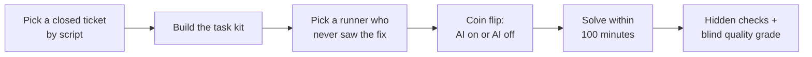
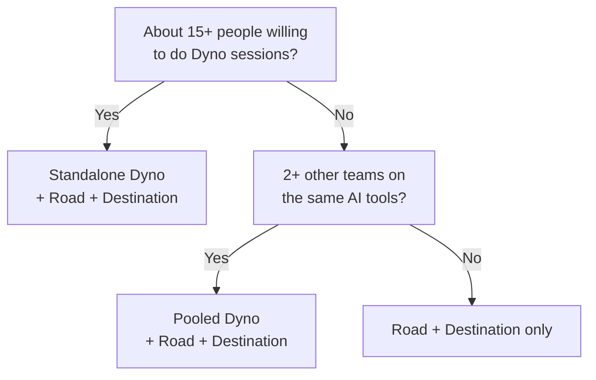

# Dyno, Road & Destination: worked example

!!! info "Status"
    Status: Proposal.

    Lineage: plain-language companion to the Dyno, Road & Destination method proposal (see [Dyno, Road & Destination: a three-lens method](dyno-road-destination.md)). All names and numbers in the example are illustrative.

## The idea in one minute

We judge the team the way you would judge a car: test the engine on a bench, log how it is driven, and check it reached the right place. Each is a separate reading, and they are never added into one score.

| Lens | Car analogy | Question it answers | What the team does |
|---|---|---|---|
| **Dyno** (capability) | Engine on a test bench | How fast and how well do we solve our kind of problem, with AI and without it? | Twice a year or each quarter, people replay a few old tickets in a sandbox. |
| **Road** (time use) | The driving log | Where does our time actually go? | Tap one answer when a random ping arrives, once a day (5 seconds). |
| **Destination** (value and quality) | Did we arrive? | Are we delivering what was needed, without breaking more? | Write 4-8 outcome statements per quarter; defects and incidents come from existing tools. |

The key trick is in the Dyno. The same kinds of old task are solved sometimes *with* AI and sometimes *without* it, decided by a coin flip. The difference between the two groups is therefore caused by AI, not by new people, easier work or a lucky quarter.

No story points, ticket counts or estimates are involved. No one is ever scored as an individual.

## Meet the example team

**Team Alpha** is an illustrative team of 14 people: 12 developers and 2 testers. They maintain a desktop business application (a managed UI layer, a native core and a SQL database) and have used AI coding agents for about a year. Two other teams in the same organisation use the same AI tools.

With only 12 developers, a Dyno of their own would give a clear answer too rarely. So they **pool** their Dyno with the two other teams: all three run the same kind of sessions, and the results are analysed together. Road and Destination run inside Team Alpha alone.

Everything below follows Team Alpha through one year. All numbers are illustrative.

## Dyno: one old ticket becomes a test

The Dyno replays small, real, already-solved tickets under fair conditions. Here is one, end to end.

Each run goes left to right. Nobody can choose an easy task or a favourite runner.

**1. Pick the ticket.** Each month a script draws closed tickets that are 1-12 months old. This month it draws *EX-101: sales tax is rounded twice on refunds with several lines*, fixed 5 months ago.

**2. Build the kit.** The platform steward packs:

- the code as it was **just before** the fix;
- the original ticket text;
- frozen docs and no internet;
- a set of **hidden checks**: the tests from the real fix plus 4 edge cases (a zero-rated line, a negative quantity, a foreign-currency refund, a single-line refund). The old code fails them all and the real fix passes them all.

**3. Pick the runner.** Dev A wrote the original fix, so Dev A is excluded. Dev B has never touched that code, so Dev B can run it.

**4. Run it.** Dev B gives half a day and gets two tasks: the sales-tax ticket and a CSV import crash. A coin flip decides that the sales-tax task is **AI on** and the CSV task is **AI off**. Dev B has 100 minutes per task, one answer from the checks, and one resubmission.

**5. Score it.** Time and check results are recorded automatically. A grader outside the team rates the code (mergeable / needs changes / not mergeable) without knowing whether AI was used.

### One quarter of runs, across the pool

| Task | AI | Time (min) | Hidden checks | Edge cases passed | Blind grade |
|---|---|---|---|---|---|
| Sales-tax rounding on refunds | On | 34 | Pass | 4 of 4 | Mergeable |
| Sales-tax rounding on refunds | Off | 61 | Pass | 3 of 4 | Needs changes |
| CSV import crash | On | 22 | Pass | 3 of 3 | Mergeable |
| CSV import crash | Off | 47 | Pass | 3 of 3 | Mergeable |
| Report totals mismatch | On | 100 (time up) | Fail | 1 of 4 | Not mergeable |
| Report totals mismatch | Off | 71 | Pass | 4 of 4 | Mergeable |
| Customer grid lag | On | 41 | Pass | 2 of 3 | Needs changes |
| Customer grid lag | Off | 58 | Pass | 3 of 3 | Mergeable |

### How the numbers roll up

- **Speed.** Compare the same task with and without AI: sales tax 61 / 34 = 1.8x, CSV 2.1x, report totals 0.7x (AI was slower and failed), grid 1.4x. The typical figure (a geometric mean) is about **1.4x faster with AI**.
- **Quality.** With AI on, 10 of 14 edge cases passed (71%). With AI off, 13 of 14 passed (93%). AI was faster but **sloppier on edge cases**.
- **Rule:** a speed gain is never shown while quality is worse. This quarter's 1.4x would stay unconfirmed until quality holds.
- **Insight:** AI shone on self-contained bugs (CSV import) and struggled with cross-module money logic (report totals). That is exactly where Team Alpha should invest in better prompts, context and review.

Eight runs is far too few to decide anything. The real verdict comes once a year, from every run by all three pooled teams (roughly 40 people x 2 tasks x 2 sessions a year, about 160 runs), with a margin of error attached.

## Road: a 5-second ping, once a day

Road showed Team Alpha that AI moved its bottleneck from writing code to reviewing it.

Once a day, at a random time, each person gets a chat message: *"Right now I am mainly..."* and taps one answer: Building, Discovery, Reviewing, Interrupt, Rework, Coordinating, Waiting or Other. Answers are anonymous and only counted for the whole team. With 14 people and about 85% answering, that is roughly 240 answers a month: enough to see the pattern.

**Where Team Alpha's time went** (share of ping answers; illustrative example, Q1 vs Q3):

| Activity | Q1 share | Q3 share |
|---|---|---|
| Building | 40% | 38% |
| Discovery | 8% | 7% |
| Reviewing | 12% | 20% |
| Interrupt | 12% | 11% |
| Rework | 6% | 9% |
| Coordinating | 14% | 11% |
| Waiting | 8% | 4% |

What Team Alpha learned between Q1 and Q3:

- **Reviewing** rose from 12% to 20% of time. AI agents produce more code, and people now spend more time checking it.
- **Rework** crept up from 6% to 9%, matching the sloppier edge cases seen in the Dyno.
- **Waiting** halved, because builds and answers come faster.

The action it triggered: smaller pull requests, an AI first-pass review, and an edge-case checklist for money logic. None of this would show up in points or ticket counts.

The answers are also checked against data the team already has, such as review queue times, reopened tickets and support pages. If the ping says one thing and the data says another, that share is marked *unverified*.

## Destination: did we deliver what mattered?

In Q3, Team Alpha hit 4 of its 6 outcome statements, with 1 partly met, and escaped defects held steady.

At the start of each quarter, the product owner and the tech lead write 4-8 short **outcome statements** in the form *"Succeeds if ..., observable by ... (date)"*. At the end of the quarter, the product owner and an outside rater mark each one. If work is delivered for an external customer, the outside rater can be the customer's acceptance testing.

| Outcome statement (Q3) | Result |
|---|---|
| End-of-period processing runs under 10 minutes for a company with 50,000 orders, observable in the September release | Hit |
| No sales-tax rounding complaints from customers for 6 weeks after release | Hit |
| Customer form migrated to the new UI framework with no change in behaviour, observable by passing the regression pack | Hit |
| Payment-file import accepts the 3 new file formats by 30 September | Partial (2 of 3) |
| Installer upgrade works on the 5 most common customer setups | Hit |
| Report designer opens in under 2 seconds | Miss |

Hit rate = (4 + 0.5) / 6 = **0.75**. Two statements are audited each quarter. If the team keeps writing statements that were certain to succeed anyway, the hit rate is marked *soft*.

Alongside the outcomes, two numbers come straight from existing tools:

- **Escaped defects**: bugs found by customers, weighted by severity (a severity-1 bug counts 10, severity-2 counts 3, severity-3 counts 1).
- **Incidents**: production or customer-site outages.

These act as the **guardrail**. If defects or incidents rise clearly, any speed gain from the Dyno is held back, however good it looks.

## The yearly result

After four quarters, management receives four lines. There is no single score. For Team Alpha's first year it read:

| Line | What it said |
|---|---|
| **Capability** (Dyno, pooled across 3 teams) | With AI, bounded tasks were solved **1.4x faster** (likely between 1.2x and 1.7x). **Confirmed gain.** Quality held: after the edge-case checklist, AI-on edge cases matched AI-off. |
| **Time** (Road) | Reviewing up from 12% to 20% of time. **Confirmed trend.** Rework up 3 points, no clear change yet. |
| **Value** (Destination) | Guardrail green. Outcome hit rate 0.72 over the year (22 statements). |
| **Strengths and weaknesses** | Strongest: self-contained bug fixes. Weakest: cross-module money logic. |

Every speed figure also carries a warning line: *it is the speed-up on small, replayable tasks, not a headcount, capacity or pricing figure*.

### What the labels mean

| Label | Plain meaning |
|---|---|
| Confirmed gain | Two independent calculations agree AI made us faster, quality held, and the guardrail is green. Safe to report. |
| Confirmed slowdown | Same test, other direction: AI is making us slower. Always shown. |
| Ruled out | We can say with confidence that the gain is below 1.3x. Useful before renewing an expensive tool. |
| Inconclusive | Not enough evidence either way this year. A normal outcome, not a failure. |
| Trend | A change in time use, outcomes or defects compared with the baseline year. It shows *what* changed, not *why*. |

The chance of a false "Confirmed gain" is about 2% per year. Labels are decided once a year, never mid-way. The team sees its interim figures each quarter; management does not.

## How it plays in a project

For Team Alpha, the method costs about 10 person-days a quarter, roughly 1.2% of capacity, and adds nothing to any story.

| When | What happens | Who | Time |
|---|---|---|---|
| Every day | Answer one random ping | Everyone | 5 seconds |
| Every month | Script draws closed tickets; kits are built for the next session | Platform steward | About 1 day per kit |
| Every quarter | Write outcome statements at the start, rate them at the end | Product owner, tech lead | About 1 hour |
| Every quarter | Review the interim figures together (team only) | Whole team | 45 minutes |
| Every six months | One half-day Dyno session each: two tasks, one with AI and one without | Each developer | Half a day |
| Once a year | Decide the labels; send the four-line statement to management | Engineering lead, analysis owner | Half a day |

The three pooled teams stagger their sessions, so the pool gets fresh runs every quarter.

### The roles

- **Platform steward:** builds kits, schedules sessions, keeps the sandbox running.
- **Data custodian:** someone outside the reporting line, such as the data protection officer. They keep names separate from results, so nobody can see an individual's runs.
- **Blind grader:** a developer outside the team who rates code without knowing whether AI was used.
- **Analysis owner:** runs the frozen analysis package unchanged, so nobody can tune the result.
- **Engineering lead:** reviews every result with the team first, then with management.
- **Product owner:** writes and rates the outcome statements.

## Which mode fits your team

Most teams of fewer than about 15 people should pool their Dyno with other teams, or run Road and Destination only.

Start at the top. Participation is voluntary, so count the people who will actually take part, not the headcount.

| Mode | Fits | What you get | Cost |
|---|---|---|---|
| Standalone Dyno | About 15+ participants | Your own AI speed figure, with about a 40-60% chance of a clear yearly label | Up to about 2% of capacity |
| Pooled Dyno | 3+ teams on the same AI tools | The strongest evidence: about a 75% chance of a clear label with 40 runners. Management sees only the pooled figure. | About 1-2% of capacity per team |
| Road + Destination only | Any team, from day 1 | Where time goes, whether outcomes are hit, whether quality holds. The AI claim is only a before/after trend, which is much weaker evidence. | About 0.25% of capacity |

**Example:** a 9-person team with no other teams on the same tools would run Road and Destination only. It would see clearly where its time goes and whether quality holds, but could not prove how much of any change came from AI.

## Common questions

**Isn't the Dyno just an exam?** No. It is designed so that no individual result can come out. A data custodian outside the reporting line holds the only link between names and runs, the output rejects any figure covering fewer than 3 people, and raw run data is deleted after two years. The contract bans requests for per-person results.

**Why not just count tickets or story points?** When AI changes how work is done, those counts move for the wrong reasons. Estimates shrink, stories get split differently, and more code gets written for the same result. The Dyno keeps the task fixed, so only the way it is solved can change.

**Our work cannot be replayed: regulated data, live traffic, devices.** The method uses a stand-in for each case: synthetic data for fintech, recorded and anonymised traffic for adtech, emulators or throwaway cloud accounts for infrastructure, and simulators for embedded work. Work that still cannot be replayed is reported as *not measured*, never guessed.

**Can people cheat?** It is hard. Tasks stay secret and are drawn by a script. A failed run counts as the full 100 minutes. Anyone who worked on the original fix cannot run it. Effort is checked in both directions: slacking with AI off, and ignoring AI with AI on.

**What if the AI tool changes during the year?** The yearly figure measures "our AI tools as we actually used them this year". Tool changes are listed as events on the report, and the new version is shown as a separate, descriptive figure.

**How long until we get an answer?** About one year: set-up in month 0, sessions over four quarters, and the first labels after quarter 4. Road and Destination give useful team-internal insight from the first month.

## Glossary: the full specification in plain words

| Term in the specification | Plain meaning |
|---|---|
| Kit | One packaged task: old code, ticket text, hidden checks, a sandbox |
| Oracle | The hidden checks that decide pass or fail automatically |
| Box | The 100-minute time limit per task |
| Runner | The developer solving a task in a session |
| Arm (AI-on / AI-off) | Whether AI tools are allowed for that run, decided by coin flip |
| Harvest | The monthly script that picks closed tickets to become kits |
| Recall probe | A check that drops tasks the AI seems to have memorised |
| Sentinel | Six fixed tasks re-run every year to catch drift in difficulty |
| Pool | Several teams on the same AI tools analysed together |
| Cycle | One year (4 quarters). Labels are decided once, at its end |
| M_AI | The headline AI speed-up on Dyno tasks (e.g. 1.4x) |
| ΔG, ΔE, ΔP | AI-on minus AI-off: blind grade, edge cases passed, pass rate |
| S / U | Team capability over time, with AI (S) and without AI (U) |
| D, R, W, I, F | Road shares: building, reviewing, rework, interrupts, waiting |
| H | Outcome hit rate from Destination |
| Q | Weighted escaped-defect load |
| Guardrail gate | The check that holds back any gain when quality slips |
| Decision-grade | The chance of reaching a clear label in a year |
| Data custodian | The person outside management who keeps names separate from results |

The full specification, with the statistical model and cost formula, is in the method page, [Dyno, Road & Destination: a three-lens method](dyno-road-destination.md).
