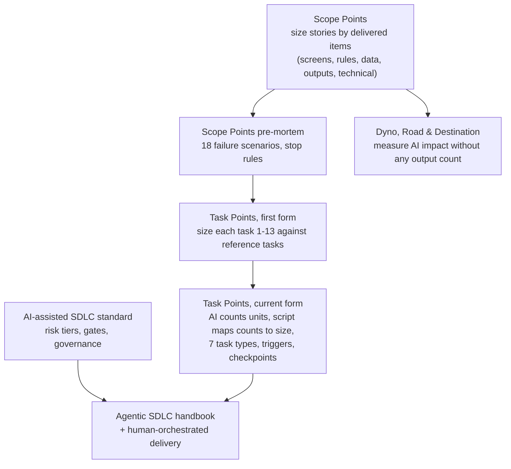

# Evolution of the models

The work went through several iterations in a short period. Each was stress-tested (by pre-mortem, simulated adversarial review or requirement mapping) and the findings shaped the next. Earlier iterations are kept on this site because the reasons they changed are part of the research.

## 1. Scope Points (earlier sizing model)

Sizes a *story* by what it delivers: each delivered item (screen, rule, data store, output, technical item) earns 1, 3 or 5 points. Points are credited at completion and split between development and QA by a fixed share. Productivity is read every few sprints as a work-mix-adjusted gain against a baseline, with a capacity check.

Pages: [Overview](../scope-points/overview.md) · [Proposal](../scope-points/proposal.md) · [Sizing and crediting](../scope-points/sizing-and-crediting.md) · [Measurement](../measurement/productivity-measurement.md)

**Why it changed.** The [pre-mortem](../scope-points/pre-mortem.md) and later requirements showed that:

- crediting only whole stories hides research, code review and testing effort, which then earn zero;
- a fixed Dev/QA share is arbitrary once testing is its own work;
- deriving gains from timesheet hours re-introduces the very effort data the method wanted to avoid;
- story-level crediting produces jumpy sprint figures when stories span sprints.

## 2. Dyno, Road & Destination (parallel line of work)

A deliberately different answer: drop output counts altogether. Estimate the causal effect of AI with randomised AI-on/AI-off replays of the team's own past tasks (Dyno), track where time goes with random time-use pings (Road), and judge value and quality by outcome statements and escaped defects (Destination). The three lenses are never merged into a single score.

Pages: [Method](../measurement/dyno-road-destination.md) · [Worked example](../measurement/worked-example.md)

## 3. Task Points

Moves the unit of sizing from the story to the **task**, so research, review, test planning, testing and defect work all earn points. The first form sized each task 1-13 by comparison with written reference tasks ([specification](../task-points/specification.md)). The current form replaces comparison with **counting**: an AI assistant counts units with quoted evidence, the person doing the task verifies the counts, and a fixed script maps counts to a size, with one-step triggers and planned or unplanned checkpoints ([guide](../task-points/guide.md)).

What carried over and what was dropped is listed in the [requirements synthesis](../task-points/requirements-synthesis.md#what-carries-over-from-scope-points).

## 4. Agentic SDLC

The delivery model evolved alongside the measurement: from a governance-heavy [AI-assisted SDLC standard](../agentic-sdlc/ai-assisted-sdlc-standard.md) to a leaner [handbook](../agentic-sdlc/handbook.md) and [operating plan](../agentic-sdlc/operating-plan.md) with Task Points built in, plus a variant for products without test automation ([human-orchestrated delivery](../agentic-sdlc/human-orchestrated-delivery.md)).
