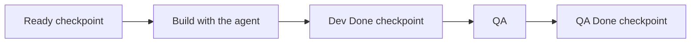

# Overview: Scope Points, Agentic SDLC and Metrics

!!! info "Status"
    Superseded by Task Points; kept for research history.

    Lineage: Scope Points (earlier sizing model), one-page overview joining sizing, the agentic delivery workflow and measurement.

Every story is **sized** in Scope Points, **built** through one agentic workflow (AI agents do the steps, people check and decide) with three checkpoints, and **measured** every three sprints against the team's own first three sprints. Size says what a story delivers; hours say what it cost; points per day is the team's productivity.

All figures are team-level. They are never used to rate, rank, pay or appraise a person, and never compared between teams.

## 1. Size: Scope Points

A story's size is the sum of the items it adds or changes. Complexity, risk, investigation, code review and testing never add points; they show in hours. Sprint estimates stay in hours, as before.

| Item | Count | Small = 1 | Medium = 3 | Large = 5 | Split above |
| --- | --- | --- | --- | --- | --- |
| **Screen** (form, dialog, menu) | Fields, buttons, grid columns | 1-4 | 5-15 | 16-30 | 30 |
| **Rule** (validation, calculation, logic) | Conditions or calculated values | 1-3 conditions | 4-8 conditions, or 1-2 values | 9-16 conditions, or 3-5 values | 16 conditions or 5 values |
| **Data** (stored columns, upgrade scripts) | Columns and tables | 1-4 columns in 1-2 tables | 5-15 columns; columns in 3-5 tables; a new table; or data converted in 1 table | 16-30 columns, or data converted in 2-5 tables | 30 columns or 5 tables |
| **Output** (report, print, import, export) | Fields | 1-5 | 6-19 | 20-40 | 40 |
| **External call** (another system) | Operations | 1 | 2-3 | 4-6 | 6 |
| **Technical** (migration, refactor, crash, speed, security) | Settings or error cases; screens or functions affected | 1 setting or error case | 2-5 settings, or 1 screen or function | 2-5 screens or functions | 5 screens or functions |

1. **Count only what changes.** New screen or report: every field. Existing one: only added, changed or removed fields.
2. **Tables used.** A Screen or Output using one business table goes one size down; Screen with 3+ or Output with 4+ goes one size up.
3. **Where the code sits does not matter.** A query that fills a screen is part of the Screen; logic in a stored procedure is a Rule; a faster query with the same result is Technical.
4. **Split, do not cap.** An item over its limit is split. A story over **13 points** is split along its items; the total stays the same.
5. **Fixed at Ready.** New scope is a new story; a dropped item is subtracted, a partly dropped item is re-counted; a cancelled story scores 0.
6. **Bugs.** A bug found after QA pass and caused by the team's own change scores 0; its hours are rework (the team lead decides with QA). Every other bug is sized like a normal change.

**Who sizes.** The AI sizer prompt drafts from the title, description and acceptance criteria (ACs) only, on a large frontier model (never a small, fast model). The developer accepts or flags it; the team lead settles flags, and the smaller size wins if still unsure. A sizer question that could change the points blocks Ready.

**Credit.** Points are counted once, in two shares: the development share at Dev Done (code merged, moved to QA) and the QA share at QA Done (QA passed). QA share = QA members / (developers + QA members), fixed. With 3 developers and 2 QA, a 10-point story credits 6 at Dev Done and 4 at QA Done. A story returned by QA earns nothing new.

*Example:* a discount on sales orders = discount field (Screen, 1) + discount, net, sales tax and total recalculated (Rule, 4 values, 5) + discount column (Data, 1) + discount on the print (Output, 1) = **8 points**.

## 2. Build: the agentic workflow

The workflow has 7 steps and 3 checkpoints, with a light path for clear bugs. Agents do the legwork; people own every decision. Each step has a standard prompt in the repo under `.agents/skills/` (for example requirements, scope sizing, and three review levels L1 to L3). A clear bug with no High trigger takes the light path: no story files, but it is still sized.

| Tier | When | Research | AI review | Human review |
| --- | --- | --- | --- | --- |
| **High** | Any one: crosses a language or runtime boundary, shared subsystem, schema change or data migration, money, tax, rounding or end-of-period logic, threading, licensing or security, performance-critical, broad area with no test harness | up to 4 h, then a spike | Deep, looks for failure cases | Senior reviewer + security checklist |
| **Low** | All of: one component, well-known code, no schema or money change, small regression area, easy to verify | up to 30 min | Changed code only | Peer |
| **Standard** | Everything else | up to 2 h | Changed code and related code | Peer |

**Checkpoints** (a checkpoint is a condition, not a meeting):

- **Ready (before work starts):** ACs agreed; tier recorded with reasons; research done; estimate backed by findings; sized, 13 points or less, no open sizer question. Low: Dev + QA confirm. Standard or High: the team deputy confirms (a peer, for the deputy's own story).
- **Dev Done (before QA):** built and unit-tested; ACs tested by the developer; every AI review finding marked Fixed, Won't fix or Not an issue; peer approved; PR records AI use (None, Assisted, Agent-led).
- **QA Done (before the story closes):** every AC passes; regression retested; no open Critical or Major defect.

**Agent rules:**

- A new AI chat for each stage. Load only `AGENTS.md` (the repo rules file), the two story files and the code needed; never load the sizing reference into research, build or review.
- Approval prompts stay on; no unattended runs. Use only approved tools, extensions and MCP servers.
- Never give an AI tool customer data, credentials or personal data; remove such data from logs first.
- Merge only code you can explain.
- A surprise after the sprint starts is raised the same day to the team deputy, team lead copied. New scope becomes a new story.

## 3. Measure: is the team doing better?

One result, read every three sprints against sprints 1-3 (the baseline). The other measures say whether to trust it and where to look. There are no targets.

| Measure | How it is calculated | Good sign |
| --- | --- | --- |
| **Productivity gain** (the result) | Points credited / (Dev + QA delivery days), per work type (Feature, Bug, Modernization, Data), compared with the baseline and combined on the baseline mix | Above 1.0x. 1.6x means the same work takes about 63% of the time |
| Capacity check | (Points / (available Dev + QA days)) now / the same in the baseline; needs no ticket hours | Moves with the gain |
| Own bugs | Bugs found after QA pass, caused by the team's change / points x 100, by severity | Not rising |
| Rework share | Rework hours / all ticket hours | Not rising |
| First-pass QA | Stories passing their first QA cycle / stories entering QA | Rising |
| Cycle time | Days from sprint commitment to QA Done, per tier | Falling |
| Surprise rate | Stories with a material discovery after the sprint started / committed stories | Falling |
| Planning accuracy | (Actual - estimated hours) / estimated hours, per story | Spread narrowing |
| Release health | Per release: testing hours and days, share of regression automated, defects found after release / points released x 100 | Hours falling, defects not rising |
| Team pulse | 1-5 rating at each retro, plus the top friction point | Steady or rising |

**Reading the result.** The gain comes with a likely range: the middle 90% of 2,000 re-samples of the period's stories.

- **Confirmed:** the whole range is above 1.0x two periods in a row. Only this goes to management.
- **Early signal:** above 1.0x this period only; shared with the team.
- **No clear change:** the range includes 1.0x; keep measuring.
- **Decline:** the whole range is below 1.0x; look at quality, rework and blockers.
- **Insufficient data:** fewer than 30 stories in the period.

**Stop and fix before reporting** if measurement takes more than 2% of team time, the hand re-size (2 people re-count 2 random finished stories a sprint, without the AI draft) is off by more than 20% two sprints running, more than 15% of hours have no ticket, or more than 30% of the team has changed (new baseline).

**Timeline.** Week 1: sizer check (at least 8 of 10 recent stories match a hand count). Sprints 1-3: baseline, at least 30 stories and 5 per work type. Sprints 4-6: first comparison. Sprints 7-9: second comparison. The sizer, prompt and rules stay frozen until the review after sprint 9.

**When something goes wrong (incident).** An incident is a Critical or Major defect found after release, or any breach of the agent rules in section 2. Raise it the same day to the team lead. QA links it to the story that caused it, the developer runs root-cause analysis with the root-cause prompt on logs cleaned of customer data, and it is counted in the release report by severity. If the cause is the team's own change, the fix scores 0 and its hours are rework. The same cause twice means a process change at the next retro.

**How much code AI writes.** Two figures, read beside the gain and own bugs. They describe adoption; they never prove AI caused a gain and are never targets.

- **AI-use mix:** share of credited points by the AI use recorded on each PR (None, Assisted, Agent-led). Available from sprint 1.
- **AI code share:** lines written by an agent and still in the merged code / all lines added in merged code, per period. Source: [git-ai](https://github.com/git-ai-project/git-ai), a free, local Git extension. Each coding agent reports the lines it wrote, the record survives rebase and squash, and `git ai stats` reports the share. Until it is installed, report the AI-use mix only. An IDE assistant's own usage dashboard is not used: it counts suggested and accepted lines, not merged code.

A rising AI share with a flat gain or rising own bugs is a signal to review how agents are used.

## 4. Who does what

| Role | Your part | Read |
| --- | --- | --- |
| Dev engineer | Agree ACs with QA; run the AI sizer, accept or flag; set the tier; research, build with the agent, review; record AI use on the PR; log every hour to the ticket; join a hand re-size when asked | 1, 2 |
| Team deputy (named by the team lead) | Confirm Ready for Standard and High; decide routine surprises the same day; assign reviewers | 2 |
| Senior reviewer | Review High stories with the security checklist | 2 |
| QA engineer | Co-write ACs; design and run tests; confirm QA Done; log hours to the ticket, release testing to its own code; link bugs found after QA pass to the story that caused them | 1, 2 |
| QA lead | Decide own bugs with the team lead; accept AC deviations at QA Done with the deputy; release report each release | 3 |
| Team lead | Settle sizing flags and work types; run the hand re-size; keep the points register; period report, reviewed with the team first; sample decisions; approve process changes | All |
| Management | Receive Confirmed results; hold the team-level-only rule | Lead, 3 |

**Do:** size before Ready; log every hour to a ticket or its code; raise surprises the same day; change the process only on repeated evidence, at most two changes a sprint.

**Don't:** add points for effort or difficulty; re-size after Ready; merge code you cannot explain; give an agent anything you would not give a new contractor.

## Full references

These pages hold the detail behind each section:

- [Scope Points: Sizing and Crediting](sizing-and-crediting.md)
- [Productivity Measurement with Scope Points](../measurement/productivity-measurement.md)
- [AI-Assisted SDLC Standard](../agentic-sdlc/ai-assisted-sdlc-standard.md)
- [Scope Points Team Guide](team-guide.md)
