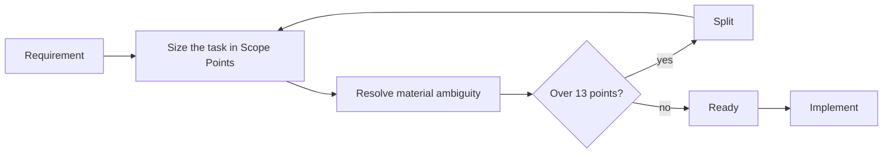

# Scope Points Proposal

!!! info "Status"
    Superseded by Task Points; kept for research history.

    Lineage: Scope Points (earlier sizing model), full proposal iteration.

## Contents

1. [Purpose and principles](#1-purpose-and-principles)
2. [Developer workflow and sizing](#2-developer-workflow-and-sizing)
3. [What we measure](#3-what-we-measure)
4. [How to interpret results](#4-how-to-interpret-results)
5. [Roles, rollout and use](#5-roles-rollout-and-use)
6. [FAQ](#6-faq)
7. [Appendix A.1 to A.7](#appendix)

## 1 Purpose and principles

Time-based estimates fall as AI shortens the work, and velocity cannot show a productivity change. This proposal separates size from effort: developers size the scope of each task in Scope Points from its requirement, effort comes from existing timesheets, and productivity is Scope Points delivered per developer day, compared with the team's first three sprints.

### The process in five lines

1. **Developer:** size the task's scope in Scope Points before work starts.
2. **During delivery:** log developer effort to the ticket as usual.
3. **Team lead:** collect points, effort, rework and quality in the register.
4. **Every three sprints:** compare like-for-like work with the baseline.
5. **Trust the result** only while sizing, quality and data checks stay healthy.

### Why effort estimates cannot show the change

| Same story | Current: estimate (days) | Actual (days) | Current: estimate / actual | Proposed: Scope Points | Proposed: points per day |
|---|---|---|---|---|---|
| Before AI | 10 | 10 | 1.0 | 10 | 1.0 |
| With AI, current use | 4 | 4 | 1.0 | 10 | 2.5 |
| With AI, mature use | 2 | 2 | 1.0 | 10 | 5.0 |

Under the time-estimate method, output per person-day (estimate / actual) is 1.0 in all three rows, so no change is visible. Under the proposed method the size stays at 10 points and the productivity change is visible. What is needed is a measure of size that does not depend on how the work is done and that adds up exactly when a story is split.

### Principles

- Scope Points size delivered scope, not effort. Difficulty, risk and investigation show up in hours, not in points.
- Results are team-level and compared with the same team's own baseline.
- The rules are frozen for the trial and reviewed at its end, based on what the pilot shows.

Sections 1 to 6 describe the process. The appendix holds the exact formulas, edge cases, statistics and the sizing prompt for whoever builds the report. The trial runs for nine sprints, needs no change to the issue tracker, and is estimated to use about 0.3% of developer and team-lead time (for the illustrative team in section 5).

## 2 Developer workflow and sizing

### Developer workflow



Where sprint planning needs effort estimates, they are made separately. This section is all developers need for task sizing; sections 3 and 4 and the appendix are for the team lead.

In this proposal, story, task and ticket mean the same unit: one ticket that is sized and delivered. Hours logged to its sub-tasks count towards it.

A task is sized in Scope Points by listing the items it changes and giving each item a size. The story's points are the sum.

To size an item: find its row, count what the **Count** column names, read the size from the next three columns, for Screen and Output move the size up or down for the number of tables used, and split the item if the count is above the **Split** limit.

| Item | Count | Small (1) | Medium (3) | Large (5) | Split above, along |
|---|---|---|---|---|---|
| **Screen**: form, dialog, menu, and the queries that fill it | Fields, including buttons, menu entries and grid columns. Then adjust for the business tables (entities such as customer or order) the screen uses: only 1, one size smaller; 3 or more, one size larger (rule 2) | 1-4 | 5-15 | 16-30 | More than 30, by tab, panel or grid |
| **Rule**: validation, calculation, logic, including logic in stored procedures | Condition rows and calculated values; the larger size applies | 1-3 rows | 4-8 rows, or 1-2 values | 9-16 rows, or 3-5 values | More than 16 rows or 5 values, by outcome or value group |
| **Data**: stored structure and values, upgrade scripts | Columns and tables | 1-4 columns in 1-2 tables | 5-15 columns, columns in 3-5 tables, a new table, or values converted in 1 table | 16-30 columns, or values converted in 2-5 tables | More than 30 columns or 5 tables, by table group |
| **Output**: report, print, file import or export, and the queries that feed it | Fields. Then adjust for the business tables (entities such as customer or order) the output uses: only 1, one size smaller; 4 or more, one size larger (rule 2) | 1-5 | 6-19 | 20-40 | More than 40, by section or record type |
| **Output: external exchange**: data sent to or received from another system | Operations (one request and its response) | n/a | 1 | 2-5 | More than 5, by operation group |
| **Technical**: migration, refactoring, crash fix, speed-up, security; intended behaviour kept or restored | Settings or error cases; screens or functions affected | 1 setting or error case | 2-5 settings or error cases, or 1 screen or function | 2-5 screens or functions | More than 5 screens or functions, in groups of up to 5 |

### Counting rules

1. Count only what the requirement adds or changes. On a new screen or output, every field counts. Fields include buttons, menu entries and grid columns; the options of one dropdown are one field; a chart counts one field per plotted series. A field whose content, data source or availability changes counts as changed. A button or menu entry that only starts a scored export, import or external exchange is part of that item, not a Screen field. Showing, hiding or enabling a field is part of the Screen, not a Rule.
2. **Tables used (Screen and Output, except external exchange).** The sizer names the business entities whose data the fields need, such as customer, order or product, and counts each as one table. Physical, join, lookup and audit tables are not counted. If none is named, one is assumed. With one table, the item moves one size down (Small stays Small). A Screen with 3 or more tables, or an Output with 4 or more, moves one size up (Large stays Large).
    - *Example:* a dialog with 10 fields is Medium by its field count; if all 10 fields come from one table (such as a customer record) it becomes Small; if they combine customer, order and tax-code tables (3 tables) it becomes Large.
    - *Why:* the number of fields alone misjudges size. A form that reads and writes one table is simpler in scope than one with the same fields drawn from several tables, and this adjustment is also how reading data through queries and stored procedures is counted (rule 5). It follows the IFPUG complexity tables (A.5).
3. **Rule.** A condition row is one combination of conditions with one fixed outcome, as in a decision table. A stated limit or selection condition is a condition row (for example "up to 5 images" or "only open shipments"); reusing an existing filter unchanged is not. A total, count, average or ranking shown or stored is a calculated value, counted once, not once per line or per tax rate. A message or summary that only reports a rule's result belongs to that Rule. If rows and values point to different sizes, the larger applies.
4. **External exchange.** An exchange with an external system is one Output item per system, sized by operations. An operation is one request and its response; its fields are not counted again.
5. **Database work** is sized by what it delivers, not by where the code sits (query, view or stored procedure):
    - Reading data to show or produce it is part of the Screen or Output that uses it, through its fields and tables used.
    - Conditions or calculations, including those inside a stored procedure, are a Rule.
    - Data supplied to another system is an Output (external exchange).
    - Making an existing query faster with the same result is Technical.
    - Data covers only what is stored: structure and stored values. Where the requirement does not say how data is stored, a single value is a column on its entity, and a repeating list or history (such as password history or product images) is a new table, which is Medium at minimum.

    The same requirement therefore scores the same whether it is built as inline SQL or as a stored procedure.
6. **Scheduled and background jobs** are not items in themselves. What the job does is sized under the usual kinds; a selection condition stated for the job is a condition row.
7. **Split above.** An item over the limit is not accepted as Large. It is split along the named line, and each part is sized. If one part is still over the limit, Large items are filled up to the limit and the remainder is sized as its own item.

Sizes count what the requirement delivers. They do not reflect difficulty, risk, importance, data volume or the amount of code. Those factors show up in hours, which is where productivity is measured; if they were added to the size, AI gains on hard work would be absorbed into the size and not shown. All kinds use the same values; the ranges are what make a Medium Screen and a Medium Output comparable. Section A.5 gives the basis for the ranges and values.

### Examples

??? example "Story: add a discount to sales orders, applied before sales tax and shown on the print (8 points)"

    | Item and size | Points |
    |---|---|
    | Discount field on the order form (1 field, 1 table): Screen, Small | 1 |
    | Discount applied to totals and sales tax (4 calculated values: discount, net, tax, total): Rule, Large | 5 |
    | Discount column in the order table: Data, Small | 1 |
    | Discount on the printed order: Output, Small | 1 |
    | **Story size** | **8** |

??? example "Story: connect the app to a third-party cloud service so users can use its extra features from inside the app (12 points)"

    | Item and size | Points |
    |---|---|
    | Settings dialog to connect or disconnect the account and show its status (about 6 fields, 1 table: one size down): Screen, Small | 1 |
    | Menu entry that opens the service's features in the app: Screen, Small | 1 |
    | Features shown only when the account is connected and the licence allows it: Rule, Small | 1 |
    | Connection settings stored in the company settings table (about 4 columns): Data, Small | 1 |
    | Calls to the service: sign-in, send data, receive data (3 operations): Output (external exchange), Large | 5 |
    | Access key encrypted when stored (security, 1 function affected): Technical, Medium | 3 |
    | **Story size** | **12** |

??? example "Story: add user accounts with sign-in, roles and permissions, and an audit log of changes (28 points, split into three stories)"

    | Item | Count | Item and size | Points |
    |---|---|---|---|
    | A. Sign-in screen: user name, password, remember me, sign-in button, forgot-password link | 5 fields; 1 table (users): Medium, one size down | Screen, Small | 1 |
    | B. User management screen: list of users and an edit panel | 12 fields; 2 tables (users, roles) | Screen, Medium | 3 |
    | C. Role screen: roles, a grid of permissions to tick, and the users assigned to each role | 8 fields; 3 business tables (role, permission, user): Medium, one size up | Screen, Large | 5 |
    | D. Sign-in rules: wrong password, lock after 5 failures, inactive account, expired password, first sign-in, success | 6 condition rows | Rule, Medium | 3 |
    | E. Menus and actions shown or blocked by role permission | 12 condition rows | Rule, Large | 5 |
    | F. New tables for users, roles, permissions, role permissions and the audit log | 22 columns in 5 tables | Data, Large | 5 |
    | G. Audit log report: date, user, action, record, old value, new value | 6 fields; 2 tables (audit log, users) | Output, Medium | 3 |
    | H. Password-reset email sent through the email service | 1 operation | Output (external exchange), Medium | 3 |
    | **Total: above the 13-point limit, so the story is split** | | | **28** |

    Split along the items (story rule 6); no item is re-sized:

    | New story | Items | Points |
    |---|---|---|
    | Story 1: accounts and sign-in | F + A + D + H = 5 + 1 + 3 + 3 | 12 |
    | Story 2: user and role administration | B + C = 3 + 5 | 8 |
    | Story 3: permission checks and audit log | E + G = 5 + 3 | 8 |
    | Total after the split, unchanged | | 28 |

    Each new story is a usable part that can be delivered in order, and each is within 13 points. Story 2 needs story 1, and story 3 needs story 2.

### Story rules

1. Size from the requirement, not from the code. The amount of code changed does not affect points.
2. An AI sizer drafts the items and sizes using the sizing prompt below. The developer accepts the draft or flags it. The team lead settles flags; if still uncertain, the smaller size applies.
3. A story is sized before it is marked Ready, and so before it moves to In Progress.
4. The size at Ready is the baseline for the story. Added scope never increases it; it is raised and sized as a new story. Scope that is not delivered is removed from the credited points: whole items removed subtract their points, and an item partly removed is re-counted from what remains and its size read again from the table. A replacement counts as a removal plus a new story. A cancelled story scores 0, and the team lead records why: if the business cancelled it (priority or direction changed), its hours are left out of productivity and reported separately; if the team abandoned it because the implementation failed or must be redone, its hours count as rework under its work type.
5. If the sizer lists a question whose answer could change an item, a size or the points, the story cannot be marked Ready until the question is answered and the story is sized again.
6. A story may total at most 13 points, for example two Large items and one Medium item (5 + 5 + 3). A larger story holds too much delivered scope to plan and review well, so it is broken into clearer stories that can each be delivered on their own, split along its items; the total points do not change. It also stops one very large story, which counts in full in the period it finishes, from distorting that period's result. The value 13 is a common agile convention rather than a derived figure. At the end-of-trial review it is checked against real story sizes, so that it applies only to the largest 5-10% of stories.
7. Temporary work that exists only because a story was split (a feature switch, a stub) scores 0.
8. Points are reported at team level.

### Sizing prompt

The prompt defines how stories are sized. It runs on a mid-tier frontier model or better; the exact model and version are recorded in the register and fixed for the trial (A.1, sizing instrument). The template is in A.6 and contains:

- the item kinds and size table in this section;
- the rules for breaking down large items and for splitting;
- built-in reference stories: the three worked examples above, used only to check consistency. They are part of the prompt, so they change only when the prompt does;
- a fixed output format: each item with its kind, count, business tables, size, points and the requirement it comes from, then the total, a reference check, assumptions, questions and any split recommendation.

### Splitting

When a story is split, its items move to the new stories without being re-sized, so the totals are unchanged. When a single item is delivered across two stories, its points are divided between them in whole numbers in proportion to the delivered count (fields, condition rows, columns or operations), not the work done. Whole points are allocated by largest remainder, and ties go to the part delivered last; for example, a 5-point item delivered as 5, 5 and 5 fields becomes 1, 2 and 2. The parts are not sized again. An item worth 1 point goes to the story that completes it.

| Medium Rule (3 points), six condition rows, delivered in two stories (2 and 4 rows) | Story 1 | Story 2 | Total |
|---|---|---|---|
| Incorrect: each part sized again | 1 | 3 | 4 |
| Correct: the item's points divided | 1 | 2 | 3 |

### Check sizing

Each sprint, a sample of stories is sized again by hand to confirm that recorded sizes stay consistent.

- **Which stories:** 2 finished stories, picked at random.
- **Who:** 2 or 3 team members, each sizing on their own from the requirement, without the AI draft and without seeing the recorded size. Their totals are averaged.
- **Result:** the difference between the recorded total and the check total, as a percentage of the recorded total.
- **If the difference is over 20%:** the AI sizer is re-run on the same stories. This shows whether the gap comes from the AI draft or from changes made to it at refinement.
- **Agreement between reviewers:** the range between the highest and lowest independent total is also reported, as a percentage of their average. If it is over 30% in two sprints in a row, the sizing guidance is revised, even when the average matches the recorded size.

| Stories checked | Recorded size | Check size (average) | Difference | Outcome |
|---|---|---|---|---|
| 2 stories, sprint 5 | 25 | 23 | 8% | Within 20%: no action |
| 2 stories, sprint 6 | 25 | 19 | 24% | Over 20%: if repeated next sprint, reporting pauses |

### Bugs and non-delivery work

| Case | Points |
|---|---|
| Bug caused by a change the team delivered during the trial, linked to the ticket that introduced it (decided by the team lead with QA) | 0; its hours count as rework under the work type of the ticket that introduced it (A.1); severity recorded |
| Any other bug, including bugs in existing code the team has worked in | Sized as a normal change |
| Bug whose cause is unclear | Sized as a normal change and listed on the report for review |
| Case the requirement did not cover, or a changed requirement | Raised and sized as a new story |
| Investigation, meetings, code review, writing tests | 0; their hours are logged to the task |

## 3 What we measure

One primary result and six checks. The checks show whether the result can be trusted; they are not targets. Exact formulas are in A.1.

| Measure | What it tells us | Healthy when |
|---|---|---|
| **Productivity gain** (primary) | How much faster the team delivers the same kind of work than in the baseline, adjusted for the mix of work. 1.6x means the same work takes about 63% of the baseline time. | This is the result |
| Quality | Own bugs per 100 points, and the share of hours spent on rework. | Not rising compared with the baseline |
| Sizing consistency | Two stories a sprint are sized again by hand and compared with their recorded size. | Within 20%, and reviewers within 30% of each other |
| Capacity check | Points per available developer day: a cross-check that does not depend on timesheets. | Moves in the same direction as the gain |
| Data quality | Hours with no ticket, work carried over between periods, and how much of normal work the result covers. | Hours with no ticket under 15% |
| Process overhead | Time spent on Scope Points work. | Under 2% of developer and team-lead time |
| AI use | Each ticket is tagged when merged: no AI, AI-assisted, or mostly written by an AI agent. Points per developer day are then compared between these three groups for similar tickets (same work type and size), to see where AI seems to help most. | Read as a hint, not proof: AI tends to be used first on easier tasks |

## 4 How to interpret results

1. **Baseline:** sprints 1-3 set the starting point, including current AI use.
2. **Every three sprints:** the productivity gain is compared with the baseline, with a likely range that shows how far it could move through normal variation between tasks.
3. **Verdict:** read from the table below.

| Verdict | Meaning | Use |
|---|---|---|
| **Confirmed** | Better than the baseline, beyond normal variation, in two periods in a row | May be reported to management |
| Early signal | Better than the baseline, beyond normal variation, in the current period only | Shared with the team; reported once confirmed |
| No clear change | Within normal variation | Keep measuring |
| Decline | Worse than the baseline, beyond normal variation | Look at quality, rework and blockers |
| Insufficient data | Fewer than 30 comparable tickets in the period | Keep measuring |

A result is trusted only while the checks in section 3 are healthy. If they are not, these rules apply:

### Pause rules

| Condition | Action |
|---|---|
| Measurement overhead exceeds 2% of developer and team-lead time | Simplify before continuing |
| Check sizing (section 2) is more than 20% off, two sprints in a row | Suspend reporting; the team reviews the size table together and agrees how to apply it |
| Developer hours with no ticket exceed 15%, not counting planned non-delivery work logged to its own codes (support, incidents, training, meetings, onboarding) | Correct logging; report only the capacity check for that period |
| More than 30% of the developers have changed since the baseline | Set a new baseline |

How the likely range is calculated, and how reliable the verdicts are: A.1, A.2 and A.3.

## 5 Roles, rollout and use

### Roles

| Role | Tasks | Estimated time |
|---|---|---|
| Developer | Accept or flag the AI sizer's draft at refinement; record AI use at merge; include the ticket number in timesheet entries; take part in check sizing when asked | About 5 minutes per story, plus about 10 minutes per sprint for check sizing |
| Team lead | Each sprint: settle flagged sizes, assign work types (A.1, order of tests), arrange the check sizing, decide with QA whether bugs are the team's own. Each period: match hours to tasks, keep the change log, prepare the report and review it with the team before management. | About 30 minutes per sprint, plus about 45 minutes per period |

For an illustrative team of 10 developers and a team lead completing about 15 stories per two-week sprint, this is about 2.5 hours per sprint out of about 880 developer and team-lead hours, or 0.3%, for routine running. One-off set-up (the Week 1 prompt check and setting up the register) is estimated at 3-4 person-days. The actual figures are measured from sprint 1 with a timesheet code for Scope Points work (the Measurement overhead row in A.1).

### Rollout

| When | Activity |
|---|---|
| Week 1 | Prompt check: 2-3 team members size about 10 recent stories by hand, and the AI sizer sizes the same stories. Start the baseline when at least 8 of 10 totals match and none differs by more than 20%; otherwise clarify the counting rules and repeat. |
| Sprints 1-3 | Baseline. Size all stories and collect data. Extend if there are fewer than 30 tickets or fewer than 5 of any work type; the later periods then move by the same number of sprints. |
| Sprints 4-6 | First comparison. The strongest possible verdict is an early signal. |
| Sprints 7-9 | Second comparison. A confirmed result is possible. If there is no clear change, the trial is extended. |
| After sprint 9 | End-of-trial review of the sizing instrument (see A.5) and of the 13-point limit against real story sizes (section 2, story rule 6). Any change applies to the next trial. |

### Use of results

Scope points and the productivity gain measure whether the team's process is improving. They must not be used as individual performance measures, quotas or targets, inputs to pay or appraisal, or to rank teams. Scope points are measured within one team over time; they are not comparable between teams unless sizing is calibrated centrally across those teams.

## 6 FAQ

??? question "A small fix requires changes in 30 files. Is it still small?"
    Yes. Points reflect what changes for the user. The additional effort appears in hours. Such tasks also occurred during the baseline, so they balance out across periods. Any clean-up the team chooses to do is agreed before work starts as a separate Technical item, sized by the screens or functions it affects.

??? question "Do complexity and uncertainty add points?"
    No. They make work take longer, so they appear in hours, not in size. If they added points, work made easier by AI would still be scored as hard, and the gain would not show. Uncertainty is handled by investigation, whose hours are logged to the task (section 2, bugs and non-delivery work).

    Example: a grid must scroll smoothly through a large number of rows, and the framework has no built-in virtual scrolling, so it has to be built. The requirement is a speed-up with the same behaviour, so it is a Technical item sized by the screens affected: one screen is Medium (3); a shared grid used on 2-5 screens is Large (5). Building the missing feature takes more hours than using a built-in one, and those hours count against productivity.

    Because hard tasks occur in every period, their effect mostly evens out. A period with unusually many hard tasks can still show a lower result. Two checks make this visible: the result without the 3 largest tickets, and the change log on each report.

??? question "Do investigation, meetings and code review earn points?"
    No. Points measure what a task delivers. Investigation, meetings, code review and writing tests are the work needed to deliver it, so their hours are counted as cost, logged to the task. If they earned points, spending more time on them would raise the score without delivering more.

    Example: a 5-point task takes 16 hours of coding plus 8 hours of investigation and review, 24 hours or 3 person-days in total, giving 5 / 3 = 1.67 points per person-day. If AI later cuts investigation and review to 4 hours, the task takes 20 hours or 2.5 person-days, giving 5 / 2.5 = 2.0. The points stay at 5, and the saving shows as higher points per person-day.

??? question "Can we change the AI model used for sizing?"
    Not during a trial, unless the baseline and every story already scored are re-scored with the new model. In testing, a larger model and a smaller model applied the same prompt consistently but not identically: before the final template, the larger model sized the same stories about 6% higher, which would show up as a false productivity change. Between trials, the worked examples and the Week 1 stories are sized with the new model, and it is adopted if its total is within 5% of the recorded total. Small models are not used.

??? question "Do we still estimate effort for sprint planning?"
    Yes, if the team's process requires it today, it still does. Effort estimates are used to plan and allocate tasks in the sprint, not to measure productivity. They are expected to fall as AI use grows.

## Appendix

### A.1 Measurement specification

Exact rules for whoever builds and runs the report. Section 3 summarises what they produce.

#### Definitions

| Element | Definition | Source |
|---|---|---|
| Size | Scope points for what the story changes, read from the requirement (section 2) | AI sizer draft, checked by a developer |
| Effort | Hours logged by developers to the task in the timesheet, including its sub-tasks. Hours logged by QA, the team lead or others are not counted. 8 hours = 1 person-day. | Existing timesheets |
| Productivity | Points delivered / developer person-days, per work type (below) | Calculated each period |
| Capacity check | Points delivered / available developer person-days (capacity minus leave) in the period. It does not use ticket hours, is not adjusted for work mix, and does not see hours carried in from earlier periods. When it differs from the productivity gain, check in this order: work types left out of the gain, a change in work mix, a change in carry-over, then ticket hours. | Calculated each period |
| Finished | The code is merged and the ticket is moved to QA; a ticket with no QA step is finished when it is Done. This is where developer work ends, matching the developer-only effort measure. | Issue-tracker status |
| Period | 3 sprints. All results are calculated and reported per period. A task counts in the period in which it is finished, with all its hours, including hours logged in earlier periods. | Sprints 1-3, 4-6, 7-9 |
| Delivery hours and points | At the ticket's first move to Finished, its points are counted and its developer hours are frozen as its delivery hours. Points are counted once: a QA return and re-delivery do not count them again. | Register |
| Rework | Developer hours logged to a ticket after its first move to Finished, hours on own bugs, and hours on work the team abandoned. They count in the period in which they are logged, under the work type of the ticket that caused them, with 0 points, and are never added to a ticket's delivery hours. Own bugs are also reported separately by severity. | Timesheets and register |
| Excluded work | Tasks already in progress when the baseline starts are not counted; their hours are reported as carry-in. Hours on stories cancelled by the business are not counted in productivity; they are reported separately. | Register |
| Baseline | The first period under this method: at least 30 tickets, and at least 5 of each work type. If it is extended, later periods move by the same number of sprints. | Sprints 1-3 |

#### Work types

| Type | Definition |
|---|---|
| Feature | New or changed behaviour that users or the product owner asked for. |
| Bug | A fix for behaviour that does not meet an existing requirement, including performance or security that falls short of a stated requirement. |
| Modernization | A change that keeps behaviour: migration, refactoring, speed-up or security beyond existing requirements (Technical items only). |
| Data | A change whose main purpose is stored data: structure, conversion or upgrade scripts. |

The team lead assigns one type when the story is Ready, and it does not change afterwards. The first test that applies decides:

1. Bug, if the story restores behaviour an existing requirement already defines.
2. Modernization, if every item is Technical.
3. Data, if Data items hold most of its points.
4. Otherwise Feature.

The same minimum applies in every period: a type with fewer than 5 finished tickets is left out of that period's headline figures (A.1), and the report says so.

#### Tasks that span two periods

Example: a 5-point story has 16 hours logged in sprint 3 and 24 hours in sprint 4, and is finished in sprint 4. It counts in period 2 (sprints 4-6) with 5 points and 40 hours (5 person-days). Its points per person-day are correct whichever period it lands in; only the timing moves. Hours logged at the end of a period to tasks not yet finished are reported as carry-over. Because the capacity check uses only the period's own capacity, a change in carry-over between periods moves it without any logging problem.

The team already uses AI, so the baseline includes current AI use. The trial measures change from that point. A figure for the period before AI would be an estimate and would be labelled as such.

**The work-mix-adjusted productivity gain is the primary metric.** All other measures are guardrails or diagnostics, reported beside it to show whether it can be trusted, not as targets.

#### Sizing instrument

The model and its version, and the prompt with its size table, rules and built-in reference stories, are frozen for the trial. Changes are made between trials. If a change cannot wait, the baseline and every story already scored are re-scored with the new version, so that all periods use the same instrument. Each story records the instrument version it was sized with. A reference story that conflicts with the rules is reported by the sizer, not followed, and is reviewed at the next change.

#### Controls

Each known way the measure could be distorted has a control.

| Risk | Control |
|---|---|
| Size shrinks as AI speeds up work | Points come from the requirement; effort is measured separately |
| Splitting changes the total | Points belong to items; split items divide their points; split-only work scores 0 |
| Large code changes inflate size | Size is set from the requirement before work starts |
| Speed gained at the cost of quality | Bugs caused by the team's own changes during the trial score 0 while their hours count; own bugs per 100 points is reported by severity |
| A change in work mix looks like a productivity change | Each work type is compared with itself, then combined using the baseline mix |
| A random good period is reported as improvement | An improvement is confirmed only when it holds in two consecutive periods |
| Sizes drift upward | Check sizing each sprint (section 2) |
| The AI drafts sizes inconsistently | A tested sizing prompt (A.6); model and prompt, with its rules and built-in reference stories, frozen for the trial (A.1, sizing instrument); every draft is reviewed by a developer; check sizing detects lasting shifts |
| Hours recorded against tickets are incomplete or inaccurate, for example logged to a general code instead of the ticket | The capacity check (A.1) measures points per available person-day, so it does not depend on ticket hours. If the two measures differ noticeably, work types left out of the gain are checked first, then the work mix, the change in carry-over and ticket hours. The share of logged hours without a ticket number is also reported. |
| One large ticket dominates a period | Stories are limited to 13 points (section 2, story rule 6); results are also shown without the 3 largest tickets |
| Other changes are credited to AI | The result is called a productivity gain; team and tool changes are logged on each report |

#### Per task

| Field | Formula | Example |
|---|---|---|
| Points delivered | Sum of the task's item sizes (section 2) | 1 + 5 + 1 + 1 = 8 |
| Delivery hours | Developer timesheet hours logged to the task and its sub-tasks, in any period, up to its first move to Finished; person-days = hours / 8. Later hours are rework (A.1). | 52 h / 8 = 6.5 person-days |
| Points per person-day | Points / delivery person-days | 8 / 6.5 = 1.23 |
| Hours saved against baseline speed | Points x baseline hours per point for the work type - delivery hours. Baseline hours per point = baseline hours / baseline points for that work type. | 8 x 8 h - 52 h = 12 h (illustrative feature baseline of 8 h per point) |
| AI use | Recorded at merge from the pull request (None, Assisted, Agent-led) | Assisted |

AI use is recorded when the pull request is merged, from what the pull request shows: **None**, **Assisted** (AI helped with parts), or **Agent-led** (an agent produced most of the change under a developer's direction). Results by AI use are compared only within the same work type and size range (1-5 or 6-13 points), and include later rework on tickets in that AI-use category. Because AI tends to be used first on simpler tasks, this comparison indicates where AI helps; it is not proof of effect.

#### Period report

**Terms:**

- P = points of tasks that first moved to Finished in the period.
- D = their frozen delivery hours, plus rework hours logged in the period, in developer person-days (hours / 8); rework is added to the work type of the ticket that caused it.
- S = the eligible work types: those with at least 5 finished tickets in the current period (the baseline already has at least 5 of every type). If the eligible types change between periods, the report notes it.
- A = available developer person-days (developers x working days - leave).
- Subscript b = baseline period, c = current period, t = work type.
- Speed = P / D.

Illustrative figures, sprints 7-9 compared with sprints 1-3.

| Measure | Formula | Result |
|---|---|---|
| Productivity gain | `D(b,S) / sum over t in S of ( P(b,t) / Speed(c,t) )`: baseline person-days of the eligible types divided by the person-days that same baseline work would take at current speed. A type left out is removed from both sides, so the remaining baseline shares add up to 100%. If the work mix is unchanged this equals `Speed(c) / Speed(b)`. Same work takes 1 / gain of the baseline time. | 1.6x (likely range 1.3-1.9x). Confirmed. The same work takes about 63% of the baseline time. |
| Capacity check | `(P(c) / A(c)) / (P(b) / A(b))` | 1.6x, consistent with the productivity gain |
| Hours saved | Sum over the eligible tasks first Finished in the period of (points x baseline hours per point for its work type) - their frozen delivery hours - all rework hours logged in the period for the eligible work types. This matches D. Baseline hours per point(t) = 8 x D(b,t) / P(b,t). | 760 h (about 95 person-days) |
| Own bugs found this period | Own bugs found in the period / P(c) x 100, shown by severity; the current cost of rework | 1.2 (baseline 1.9); none critical |
| Own bugs by delivery cohort | Own bugs traced to tickets first Finished in a period / that period's points x 100, updated as later bugs are found. A cohort's figure is treated as mature two periods after it closes; only mature figures are used for conclusions about quality. | Sprints 1-3: 1.6 (mature); sprints 4-6: 0.9 (not yet mature) |
| By work type | `Speed(c,t) / Speed(b,t)` | Features 1.8x, modernization 2.2x, bugs 1.25x, data upgrades 1.2x. Combined with the baseline shares of person-days (45%, 20%, 25%, 10%): 1 / (0.45 / 1.8 + 0.20 / 2.2 + 0.25 / 1.25 + 0.10 / 1.2) = 1.6x. This is the productivity gain formula; a plain weighted average of the gains (1.68x) is not correct. |
| By AI use | P / D for tasks with that AI use, current period, within one work type and size range; D includes rework logged in the period on tickets in that category | Features of 6-13 points: None 1.1, Assisted 1.7, Agent-led 2.4 points per person-day |
| Team change | Developers who joined or left since the baseline / baseline number of developers | 10% (one developer joined in sprint 8; onboarding hours reported separately) |
| Hours with no ticket | Developer hours without a ticket number / all developer hours, excluding planned non-delivery codes | 7% |
| Planned non-delivery | Developer hours on support, incidents, training, meetings and onboarding / all developer hours | 18% |
| Carry-over | Developer hours logged in the period to tasks not yet finished, compared with the previous period | 96 h (previous period 88 h) |
| Rework | Developer rework hours (returned tickets, own bugs, abandoned work) / all ticket hours | 6% |
| Measurement overhead | Hours logged to the Scope Points code (sizing review, check sizing, register, reporting) / available developer and team-lead hours | 0.4% |
| Cancelled work | Developer hours on stories cancelled by the business (not in productivity) | 12 h |
| Largest-ticket check | Productivity gain recalculated without the 3 largest tickets | 1.55x |

The productivity gain, its likely range and the hours saved always use the same eligible work types. Diagnostic rows show all work. The report also states the **eligible coverage**: the share of baseline developer person-days that the eligible types represent (example: 92%). A result based on a small share of normal work is reported with that caveat.

**Worked example.** For simplicity, every work type has the same baseline speed here: 1.0 point per person-day, or 8 h per point. Baseline: 160 points in 160 person-days (1,280 h), a speed of 1.0. Current: 255 points in 160 person-days, a speed of 1.59. With an unchanged work mix, gain = 1.59 / 1.0 = about 1.6x. Hours saved = 255 x 8 h - 1,280 h = 760 h. With 285 available person-days in both periods, the capacity check is (255 / 285) / (160 / 285) = about 1.6x.

#### Evaluation: exact verdict conditions

| Verdict | Condition | Use |
|---|---|---|
| Confirmed | The lower end of the likely range is above 1.0x in the current and previous period | May be reported to management |
| Early signal | The lower end is above 1.0x in the current period only | Shared with the team as a progress indicator. Reported to management once it is confirmed in the next period, because a single period can be above 1.0x by chance. |
| No clear change | The likely range includes 1.0x | Continue measuring |
| Decline | The upper end of the likely range is below 1.0x | Investigate quality, rework and blockers |
| Insufficient data | Fewer than 30 finished tickets across the eligible work types in a period | Continue measuring |

#### How the verdict is calculated

The verdict depends on the likely range of the productivity gain, calculated each period with a spreadsheet or a short script:

1. List the finished tasks of the eligible work types for the baseline and the current period (work type, points and delivery hours), and the rework hours of each type in each period.
2. Calculate the productivity gain with the formula above.
3. Draw a random sample of the same size from each period's tasks within each work type, with replacement (a task can be picked more than once). Add each type's observed rework hours to its person-days unchanged, and calculate the gain again.
4. Repeat step 3 2,000 times and sort the 2,000 results.
5. The 100th result is the lower end and the 1,900th result is the upper end of the likely range: the middle 90% of results.
6. Apply the conditions in the table above, using this period's range and the previous period's range.

| Period | Gain | Likely range | Lower end above 1.0x? | Verdict |
|---|---|---|---|---|
| Sprints 4-6 | 1.4x | 1.2-1.7x | Yes | Early signal |
| Sprints 7-9 | 1.6x | 1.3-1.9x | Yes, second period in a row | Confirmed |

Example: if sprints 7-9 had instead shown a range of 0.9-1.5x, the range would include 1.0x and the verdict would be No clear change.

#### Register

Points and AI use are kept in a register outside the issue tracker, one row per story: ticket number, work type, items (kind, count, size, points), total points, instrument version (exact model and version, and prompt version), Ready date, first Finished date, delivery hours, period, AI use, own-bug flag and severity, rework hours, cancelled or removed scope and the cancellation reason. The issue tracker remains the source for ticket status, the timesheets for hours, and the register for points; the team lead reconciles the three each period.

### A.2 How reliable the verdicts are

This answers two questions: how often the method reports an improvement that did not happen, and how often it detects one that did.

No real data exists yet, so this was tested with a computer simulation: a short program that generates made-up task data where the true answer is known in advance, then checks whether the method finds it.

1. **Create a baseline period.** 45 finished tasks: 18 features, 11 bugs, 9 modernization and 7 data tasks (at least 5 of each, as the baseline requires), each with a size of 1-13 points, and hours equal to points x a typical hours-per-point for that work type, varied at random by about +/-40% to mimic real work.
2. **Create a later period with a known change.** The same kind of data, but with hours reduced by a chosen amount: no change, 1.2x, 1.3x or 1.5x more productive.
3. **Apply this proposal's method unchanged.** Calculate the productivity gain, the likely range (2,000 re-samples) and the verdict. For "confirmed", a second later period is created and both must pass.
4. **Repeat 1,000 times for each scenario**, each time with new random data, and count how often each verdict appears.

Because the true change is known, the results show how often the verdict is right or wrong. The +/-40% variation is an assumption; the test is repeated with the team's real data after the baseline sprints. The simulation models variation between finished tasks only; it does not model rework or cancelled work.

| Actual change in productivity | Teams shown an early signal | Teams shown confirmed |
|---|---|---|
| None | 5 in 100 (wrong) | about 1 in 100 (wrong) |
| 20% more productive (1.2x) | 69 in 100 | 55 in 100 |
| 30% more productive (1.3x) | 93 in 100 | 87 in 100 |
| 50% more productive (1.5x) | almost all | almost all |

**How to read it:** under these assumptions (45 tasks per period, about +/-40% variation), when nothing has changed a confirmed improvement is reported in about 1 of 100 cases. With fewer tasks (the minimum is 30) or more variation, the ranges are wider and a result takes longer to confirm; very few tasks of one type make that type's result unstable. A large improvement is almost always detected within two periods. A small one (around 1.2x) is confirmed about half the time within two periods and may need longer.

### A.3 Likely range and work-mix adjustment

These are the two adjustments behind the productivity gain in A.1.

#### Likely range

**Why:** with about 45 tasks in a period, a few unusually quick or slow tasks can move the result. The likely range shows how far the gain could move by chance.

**How:** the steps are in A.1 ("How the verdict is calculated"). The gain is recalculated 2,000 times on random re-samples of the finished tasks, and the middle 90% of the results is the likely range.

**Example:** a gain of 1.6x with a likely range of 1.3-1.9x means that re-sampling the same tasks mostly gives gains between 1.3x and 1.9x. Because even the low end is above 1.0x, the result is unlikely to be explained by differences between individual tasks. The range describes uncertainty from the task sample, not a guaranteed probability for the true gain.

#### Work-mix adjustment

**Why:** some kinds of work are naturally faster than others. If a period happens to contain mostly fast work, a simple average rises even though nobody got faster.

**How:** each work type is compared only with the same work type in the baseline. The gain is the baseline's person-days divided by the person-days the baseline's work would take at current speeds.

| Example: nobody got faster, but the work mix changed | Baseline | Current |
|---|---|---|
| Features (2.0 points per person-day in both periods) | 100 points, 50 days | 180 points, 90 days |
| Data upgrades (1.0 point per person-day in both periods) | 100 points, 100 days | 20 points, 20 days |
| Total | 200 points, 150 days (1.33 per day) | 200 points, 110 days (1.82 per day) |

The simple ratio is 1.82 / 1.33 = 1.36x, which suggests a 36% improvement that did not happen. The adjusted calculation costs the baseline's work at current speeds: 100 / 2.0 + 100 / 1.0 = 150 days, the same as the baseline's actual 150 days. The gain is therefore 150 / 150 = 1.0x, which is correct. When the work mix does not change, both calculations give the same result.

### A.4 Alternatives considered

Each alternative was checked against three needs: size must not shrink as AI speeds up work, totals must stay the same when stories are split, and the cost must be small enough for every story. None meets all three, but several contributed parts of this proposal.

| Alternative | Pros | Cons | Taken into this proposal | Why not chosen | Source |
|---|---|---|---|---|---|
| **Story points (relative estimation, planning poker)** | Familiar to most teams; quick to apply | Sizes are relative to remembered effort, so they shrink as AI speeds up work; splitting often changes the total | Reference stories as anchors: the worked examples built into the prompt (section 2, sizing prompt; A.6); 13 as the story limit (section 2, story rule 6) | Size falls with effort, so it cannot show a productivity change | Cohn, *Agile Estimating and Planning*, 2005 |
| **Effort estimates and velocity (time-based method)** | Already in common use; good for sprint planning | Estimates fall with the work, so velocity stays flat when the team gets faster (section 1) | Kept for sprint planning, and logged hours are the effort measure (A.1) | Measures effort, not delivered scope | Current team practice |
| **Full function point counting (IFPUG, COSMIC)** | International standards; size is independent of effort and adds up | Counting by hand is slow and needs trained counters; weak on calculation logic and migration work | Sizing from the requirement; field and table ranges and the tables-used adjustment (IFPUG); counting external exchanges by operations (COSMIC); equal values for all kinds (Simple Function Points). See the section 2 size table and counting rules, and A.5 | Too costly to apply to every story; does not cover logic and technical work well | IFPUG, ISO/IEC 20926; COSMIC, ISO/IEC 19761; A.5 |
| **Throughput: tickets finished per sprint** | No sizing needed | Changes when stories are split or merged; treats small and large tickets as equal | Nothing | Not additive: splitting a story raises the count without more delivered | Vacanti, *Actionable Agile Metrics for Predictability*, 2015 |
| **Lines of code or commits** | Automatic | Rewards code volume, which AI can inflate | Nothing; the rule that code amount does not affect size comes from this weakness (section 2, story rule 1) | Measures code, not scope | Forsgren et al., 2021 |
| **DORA delivery metrics** | Well researched; linked to delivery performance | Measure the flow and stability of releases, not how much is delivered; limited use for scheduled packaged releases | The idea of a quality measure beside speed, applied as own bugs per 100 points (A.1, period report) | Does not measure delivered scope | Forsgren, Humble and Kim, *Accelerate*, 2018 |
| **SPACE framework** | Broad view of productivity, including developer experience | A framework for choosing measures, not a single output measure; relies partly on surveys | Pairing output with quality: own bugs score 0 and are reported per 100 points (section 2, bugs; A.1, controls table and period report). Reporting at team level only, not per person (section 2, story rule 8) | Gives no output measure to compare over time | Forsgren et al., "The SPACE of Developer Productivity", *ACM Queue* 19(1), 2021 |
| **Controlled experiment: the same tasks with and without AI, assigned at random** | The only method here that shows cause; published results exist | Needs matched tasks and a control group; takes developers away from delivery; results vary widely between studies | The caution against claiming cause: results are called a productivity gain, and team and tool changes are logged on each report (A.1, last control) | Too disruptive for a delivery team; answers a different question (does AI cause the change?) | Peng et al., 2023 (arXiv 2302.06590); METR, 2025 (arXiv 2507.09089) |

Scope points combine these parts: the effort-independent size of function points, at a cost that fits every story, with worked examples as anchors and a quality measure beside speed. They do not show cause: a productivity gain may come from AI or from other changes, which is why team and tool changes are logged on each report (A.1).

### A.5 How the sizes and values were chosen

#### Why three sizes

Fewer sizes make each size too broad; more sizes cause more disagreement and longer refinement. Over 30 or more tickets, rounding within a size has little effect on team totals. An Extra large size (8) was tried in an earlier draft and removed because it made very large items easier to accept.

#### Why each kind has a split limit

Without a limit, 9 conditions and 70 conditions would both score 5. The limit is about twice the lower edge of Large, so no Large item is more than about twice the size of the smallest Large item. It also keeps items, and therefore stories, small.

#### Where the ranges come from

- **Screen and Output:** the IFPUG function point tables for inputs (1-4 / 5-15 / 16+ fields) and outputs (1-5 / 6-19 / 20+ fields), including the adjustment for the number of tables used.
- **Data:** the IFPUG limits for stored data.
- **External exchange:** COSMIC, where each message in or out counts once.
- **Rule and Technical:** no standard covers them, so their ranges are set by judgement and checked in the Week 1 prompt check.

#### Why the values are 1, 3 and 5

The values should keep totals the same when one item is described as two. The Large range (for example 16-30 fields) is the same as two Medium items, so the most consistent Large value would be twice Medium: 6. The table shows the effect for a 20-field screen:

| Values | As one item (Large) | As two items of 10 fields | Effect | Two Large items within the 13-point limit? |
|---|---|---|---|---|
| **1, 3, 5** (used) | 5 | 6 | Describing it as two items adds 1 point | Yes (10) |
| 1, 3, 6 | 6 | 6 | No difference | Yes (12) |
| 1, 3, 7 | 7 | 6 | Describing it as two items loses 1 point | No (14) |

The gap in 1, 3, 5 is limited in practice, because an item may be split only above its limit or when its parts are delivered separately (section 2). Other evidence points both ways: the middles of the field ranges suggest a steeper Large (about 7), while IFPUG's own weights are flatter than 1, 3, 5. So 1, 3, 5 is kept. Hours are not used to set the values, because hours contain the productivity change being measured; tuning the values to them would build that change back into the size.

#### Why every kind uses the same values

In IFPUG, an average input and an average output differ by about 25%, less than the steps between 1, 3 and 5. The Simple Function Point method, which uses fixed values, stays within about 12% of full IFPUG counts, and studies found that complexity weights add little (Kitchenham and Känsälä, 1993). Separate values per kind would mean calibrating 15 values instead of 3, without evidence of better accuracy.

#### End-of-trial review

The sizing instrument is reviewed on structural grounds, not tuned to hours:

- **Values:** changed only for a structural reason. If the register shows that items are often split into parts, 1, 3, 6 is adopted, because it keeps totals the same whether an item is sized as one or two.
- **Sizes:** baseline hours are used only as a check that each size takes longer than the one below it. If two sizes do not differ, their descriptions are reviewed; the values are not changed to match hours.
- **Kinds:** points per item are compared by kind, to check that equal values remain fair.
- **Descriptions:** if check sizing often disagrees between two sizes, their descriptions are revised.

Any change applies to the next trial, and its baseline is re-scored with the new version so that results stay comparable.

### A.6 Sizing prompt template

Reusable template for the AI sizer. It includes the three worked examples as built-in reference stories; paste the story to size where marked.

Tested on 10 sample stories (screens, rules, stored data, an external integration, a migration, a crash fix, a dashboard and a file import). Three independent runs, one on a larger frontier model and two on a mid-tier frontier model, gave the same total for every story. Earlier versions of the template differed by up to 4 points on a story between runs; a small, fast model was unreliable with every version. The template was tested with exactly these built-in reference stories. The Week 1 prompt check (section 5) confirms it on the team's own stories before the baseline starts.

````text
You are the team's Scope Point sizer.

Estimate the **delivered scope** of the story from its requirement. Scope points measure what is delivered, not the effort needed to deliver it.

Do NOT increase points for implementation difficulty, complexity, risk, uncertainty, importance, data volume, amount of code, investigation, testing, meetings, or review.

Use only:

1. the story title, description and acceptance criteria;
2. facts stated or necessarily implied by them;
3. the sizing rules below; and
4. the reference stories built into this prompt.

Do not invent functionality or implementation details.

---

## 1. Identify delivered items

Break the story into distinct delivered items. Each scored item must be exactly one kind:

* **Screen** — form, page, dialog, menu or other UI, including the data read to fill it.
* **Rule** — validation, calculation, decision or business logic, including logic implemented in stored procedures.
* **Data** — persistent stored structure or stored values, including upgrade/conversion scripts.
* **Output** — report, print, file import/export, or external data exchange.
* **Technical** — migration, refactoring, crash fix, performance improvement or security change whose purpose is to keep or restore intended behaviour.

Count each delivered change once.

Do not create separate items for implementation components such as queries, views, stored procedures, classes or functions when they only implement another scored item.

When unsure whether something is a separate item, apply the test in section 10.

---

## 2. Count and size each item

Count only what the requirement **adds or changes**.

For a **new Screen or Output**, count all delivered fields.

For an **existing Screen or Output**, count only added or changed fields.

Fields include: displayed or entered values; buttons; menu entries; grid columns; report/output fields. Options inside one dropdown are one field. A grid counts its columns; a chart counts one field per plotted series.

A field counts as changed when its content, data source, availability or delivered behaviour changes.

| Kind              | Small — 1                               | Medium — 3                                                                              | Large — 5                                               | Split above                                       |
| ----------------- | --------------------------------------- | --------------------------------------------------------------------------------------- | ------------------------------------------------------- | ------------------------------------------------- |
| Screen            | 1–4 fields                              | 5–15                                                                                    | 16–30                                                   | 30 fields; split by tab, panel or grid            |
| Rule              | 1–3 condition rows, no calculated value | 4–8 rows, or 1–2 calculated values                                                      | 9–16 rows, or 3–5 calculated values                     | 16 rows or 5 values; split by outcome/value group |
| Data              | 1–4 columns in 1–2 tables               | 5–15 columns; columns in 3–5 tables; a new table; or stored values converted in 1 table | 16–30 columns; or stored values converted in 2–5 tables | 30 columns or 5 tables; split by table group      |
| Output            | 1–5 fields                              | 6–19                                                                                    | 20–40                                                   | 40 fields; split by section or record type        |
| External exchange | —                                       | 1 operation                                                                             | 2–5 operations                                          | 5 operations; split by operation group            |
| Technical         | 1 setting or error case                 | 2–5 settings/error cases, or 1 screen/function                                          | 2–5 screens/functions                                   | 5 screens/functions; split into groups of ≤5      |

If an item exceeds its split limit, **split it before assigning final points**. Never cap an oversized item at Large.

Split along the boundary named in the table. If there is no natural split, fill parts up to the Large limit and size the remainder separately.

---

## 3. Apply kind-specific rules

### Rule

A condition row is one distinct combination of conditions producing one fixed outcome.

A total, count, average, ranking or other derived business figure shown or stored is a calculated value, even when a query or chart produces it. A summary that only reports the outcome of a process (for example numbers of records imported or rejected) is part of that process's Rule message, not a calculated value.

Count each distinct calculated value once, not once per: implementation branch; line of code; rate; intermediate calculation.

If condition rows and calculated values produce different sizes, use the larger size.

A stated limit or selection condition is a condition row, for example "up to 5 images", "only open shipments" or "at most once every 7 days". Reusing an existing filter unchanged is not.

A message that merely reports the outcome of a Rule is part of that Rule and is not also counted as a Screen field.

If the message itself delivers additional independent information beyond communicating the Rule result, count that additional information normally.

### Screen behaviour

Showing, hiding, enabling or disabling a field is part of the Screen change.

A button or menu entry that only starts a scored Output, import or external exchange is part of that item, not a separate Screen field.

Do not create a separate Rule merely because visibility or availability is implemented with a condition.

Create a Rule only when the requirement introduces or changes a distinct business decision or business condition.

Reusing an existing filter or selection rule earns no additional Rule points unless the story changes that filter's business conditions or behaviour.

### External exchange

Create one external Output item per external system.

One operation = one request and its corresponding response.

Examples of separate operations include create, retrieve and update when they are independently invoked business interactions.

Size external exchanges by operations only. Do not also count their fields.

### Database work

Classify database work by what it delivers:

* data read for a Screen → Screen;
* data read for a report/output → Output;
* validation/calculation/business decision → Rule;
* data exchanged with another system → external Output;
* query made faster with unchanged result → Technical;
* persistent structure or persistent-value change → Data.

Do not score a query, view or stored procedure separately because of where functionality is implemented.

### Inferring stored structure

Use explicit storage information when the requirement provides it.

When physical storage is not stated, infer only the **minimum persistent structure necessary to represent the requirement**:

* a single-valued attribute of an existing business entity → column on that entity;
* a repeating list, history or one-to-many set of records → separate logical data set/new table.

A new table is Medium at minimum, whatever its number of columns.

Examples of repeating data include password history, a list of product images, or multiple child records belonging to one parent.

Do not infer extra normalization, join/link tables, indexes, audit structures or other implementation tables unless the requirement explicitly delivers them.

---

## 4. Adjust Screen and Output for business tables

This adjustment applies only to: Screen; and Output other than external exchange.

Identify the distinct **business entities whose data is required by the fields described in the requirement**.

For this adjustment, treat each such business entity as one business table.

Examples: customer → one business table; order + product → two; order + customer + tax code → three.

Do NOT infer or count: physical implementation tables not required by the requirement; join/link tables; technical lookup tables; indexes; views; temporary tables; audit/system tables; framework tables.

If the requirement does not identify or require a business entity, assume **1 business table** and record the assumption.

After determining the field-based size:

### Screen

* 1 business table → move down one size; Small remains Small.
* 2 business tables → unchanged.
* 3+ business tables → move up one size; Large remains Large.

### Output

* 1 business table → move down one size; Small remains Small.
* 2–3 business tables → unchanged.
* 4+ business tables → move up one size; Large remains Large.

For a split Screen or Output, apply the table adjustment separately to each split part based on the entities used by that part.

---

## 5. Scheduled and background processing

A scheduled job, background worker, batch process or automated task is **not a separate item merely because it runs in the background**.

Size only what it delivers using the normal kinds: calculations/decisions → Rule; persistent changes → Data; external exchange → Output; same-behaviour migration/performance/security work → Technical.

Do not add points for scheduling, orchestration or background execution unless that scheduling/configuration is itself an explicitly delivered change.

A selection condition stated for the job (for example "only open shipments") is a condition row under Rule.

---

## 6. Zero-point and special cases

Score **0** for: investigation; meetings; code review; writing tests; ordinary implementation plumbing; temporary work that exists only because a story was split, such as a stub or feature switch.

### Bugs

Size every bug fix as a normal change. Do not decide whether the bug was caused by the team's own change during the trial; the team lead applies that rule separately in the register, with QA.

### Changed requirements

A requirement change after the original story was fixed/Ready is new delivered scope and belongs to a new story.

Do not add it to or resize the original story.

---

## 7. Story splitting

Add the final points of all items.

A story may total at most **13 points**.

If the total exceeds 13, recommend coherent smaller stories along existing items or functional outcomes.

When splitting: move existing items without resizing them; total points before and after the split must remain unchanged; temporary split-only work scores 0.

If one already-sized item must itself be delivered across multiple stories, divide that item's existing points between the stories in whole numbers according to their delivered count (fields, rows, columns or operations), allocating whole points by largest remainder with ties going to the part delivered last. An item worth 1 point goes to the story that completes it.

Do **not** size each share again.

---

## 8. Reference-story calibration

The reference stories are a **consistency check**, not a replacement for the sizing rules.

First calculate every item from the rules above.

Then compare the result with the **2–5 closest reference items/stories**, prioritising: 1. same item kind; 2. closest count; 3. similar business-entity/table usage; 4. similar delivered behaviour.

Use references to detect inconsistent interpretation.

Do not: copy the total of a superficially similar story; average reference-story totals; change an explicit numerical sizing result merely to match a reference.

If a strongly comparable reference conflicts with the calculated result: 1. report the conflict; 2. keep the rule-based calculated size; 3. identify what interpretation differs.

The team lead decides separately whether the sizing rules or reference set require a versioned change.

### Reference-set stability

Use only the reference stories supplied with this prompt.

Do not modify, reinterpret or add reference stories while sizing a story.

They change only with a new version of this prompt.

---

## 9. Uncertainty

Count only functionality explicitly stated or necessarily implied by the requirement.

Do not add functionality merely because it would normally be implemented.

When information is unclear: 1. use the smallest reasonable interpretation supported by the requirement; 2. state the assumption; 3. list the specific question whose answer could change an item, a size or the points. Such a question blocks Ready: the story is sized again once it is answered.

If two sizes remain equally defensible after applying all rules, choose the smaller one.

---

## 10. Double-counting check

Before calculating the total, verify that the same delivered behaviour has not been scored twice.

In particular, do not separately score: Screen + query that fills the Screen; Output + query that produces it; Rule + function/stored procedure implementing it; Data + code that persists it; external exchange + its individual fields; Rule outcome + message that merely reports that outcome; existing filter + unchanged Rule; scheduled job + the functionality the job performs; a button that only starts a scored Output or exchange + that Output or exchange.

If removing an item would remove no distinct delivered behaviour or persistent structure, remove or merge that item.

---

## 11. Final validation

Before responding, verify: every scored item represents distinct delivered scope; every item has exactly one kind; every count comes from the requirement or a stated assumption; implementation difficulty did not influence points; implementation details were not invented; oversized items were split rather than capped at Large; Screen/Output business-table adjustment was applied correctly; external exchanges were counted by operations, not fields; storage inference used the minimum required logical structure; scheduled/background execution created no artificial item; unchanged filters were not counted as Rules; Rule-result messages were not double-counted; buttons that only start a scored Output or exchange were not counted separately; stated limits and selection conditions were counted as condition rows; references were used only as consistency checks; arithmetic is correct.

---

# REFERENCE SET

Built-in reference stories (part of this prompt version):

Reference: 1
Title: Add a discount to sales orders, applied before sales tax and shown on the print
Items:
| Item | Kind | Count | Tables | Size | Points |
| Discount field on the order form | Screen | 1 field | order (1, down one) | Small | 1 |
| Discount applied to totals and sales tax | Rule | 4 calculated values | N/A | Large | 5 |
| Discount column in the order table | Data | 1 column, 1 table | N/A | Small | 1 |
| Discount on the printed order | Output | 1 field | order | Small | 1 |
Total: 8

Reference: 2
Title: Connect the app to a third-party cloud service
Items:
| Settings dialog to connect/disconnect and show status | Screen | 6 fields | company settings (1, down one) | Small | 1 |
| Menu entry that opens the service | Screen | 1 field | N/A | Small | 1 |
| Features shown only when connected and licensed | Rule | 2 condition rows | N/A | Small | 1 |
| Connection settings in company settings table | Data | 4 columns, 1 table | N/A | Small | 1 |
| Calls to the service: sign-in, send, receive | Output — external exchange | 3 operations | N/A | Large | 5 |
| Access key encrypted when stored | Technical | 1 function | N/A | Medium | 3 |
Total: 12

Reference: 3
Title: User accounts with sign-in, roles, permissions and audit log (split into 12 + 8 + 8)
Items:
| Sign-in screen | Screen | 5 fields | users (1, down one) | Small | 1 |
| User management screen | Screen | 12 fields | users, roles (2) | Medium | 3 |
| Role screen: roles, permission grid, users assigned | Screen | 8 fields | role, permission, user (3, up one) | Large | 5 |
| Sign-in rules | Rule | 6 condition rows | N/A | Medium | 3 |
| Menus and actions blocked by role | Rule | 12 condition rows | N/A | Large | 5 |
| Users, roles, permissions, role permissions, audit log tables | Data | 22 columns in 5 tables | N/A | Large | 5 |
| Audit log report | Output | 6 fields | audit log, users (2) | Medium | 3 |
| Password-reset email | Output — external exchange | 1 operation | N/A | Medium | 3 |
Total: 28

---

# STORY TO SIZE

**Title:**
[title]

**Description:**
[description]

**Acceptance criteria:**
[acceptance criteria]

---

# OUTPUT

## Items

| Item | Kind | Count | Business tables | Size | Points | Basis |
| ---- | ---- | ----: | --------------- | ---- | -----: | ----- |

**Total scope points:** <number>

**Reference check:**
<name the closest references; state "consistent" or describe any conflict without changing the rule-based size>

**Assumptions:**
<none, or concise list>

**Questions that could change the size:**
<none, or concise list>

**Split recommendation:**
<include only when total exceeds 13>

Return only the sizing result.

Do not estimate hours, days, effort, implementation complexity, difficulty, risk or uncertainty.
````

### A.7 Evolution of the proposal

The method was developed over many drafts: the AI sizer, item kinds with IFPUG- and COSMIC-based ranges, split limits, the 13-point story limit, check sizing, the capacity check and pause rules. A later round completed the measurement rules after review: developer-only effort, work types, delivery hours frozen at first Finished, rework, cancellation, own bugs by cause and cohort, the likely range and eligible coverage. A final round simplified the presentation without changing the rules and built the worked examples into the prompt as its reference stories, then tightened wording and removed duplicate passages with no rule change.

No targets are set until the baseline exists.

## Related pages

- [Sizing and Crediting](sizing-and-crediting.md)
- [Team Guide](team-guide.md)
- [Trial Guide](trial-guide.md)
- [Pre-mortem](pre-mortem.md)
