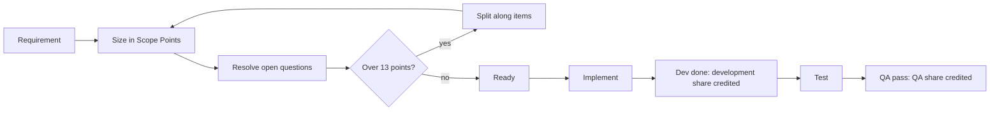

# Scope Points: Sizing and Crediting

!!! info "Status"
    Superseded by Task Points; kept for research history.

    Lineage: Scope Points (earlier sizing model), part 1 of 2 (sizing and crediting). Part 2 is the productivity measurement page; see [Proposal](proposal.md) and [Productivity Measurement with Scope Points](../measurement/productivity-measurement.md).

## 1 Purpose

Scope Points measure the size of what a story delivers, independent of the effort it takes. This page defines how to calculate them: how a story is sized from its requirement and acceptance criteria, and how its points are credited to development and QA. How the points are used to measure productivity (formulas, checks, roles, rollout and reporting) is defined in the separate Scope Points productivity measurement page.

| Same story | Estimate (days) | Actual (days) | Estimate / actual | Scope Points | Points per day |
| --- | --- | --- | --- | --- | --- |
| Baseline | 10 | 10 | 1.0 | 10 | 1.0 |
| Team 2.5x faster | 4 | 4 | 1.0 | 10 | 2.5 |
| Team 5x faster | 2 | 2 | 1.0 | 10 | 5.0 |

Estimate / actual stays at 1.0, so no change is visible. The size stays at 10 points, so the change shows in points per day. What is needed is a size that does not depend on how the work is done and that adds up exactly when a story is split.

Developers and QA work from the [team guide](team-guide.md). The appendix holds sizing details, the basis for the sizes and the sizing prompt.

## 2 Workflow and sizing

### At a glance

- Size each story from its requirement before it is Ready; the size then stays fixed.
- List the items it changes, size each from the table below, and add them up.
- A story is at most 13 points; larger stories are split along their items.
- Points are credited in two shares: development at dev done, QA at QA pass.
- Effort, complexity and risk never add points; they show in hours.



List the items the story adds or changes, size each from the table and add them up. For each item: count what the **Count** column names, read the size, adjust Screen and Output for tables used, and split the item if the count is above the **Split** limit. Story, task and ticket mean the same unit; hours on sub-tasks count towards it. Where sprint planning needs effort estimates, they are made separately.

| Item | Count | Small (1) | Medium (3) | Large (5) | Split above, along |
| --- | --- | --- | --- | --- | --- |
| **Screen**: form, dialog, menu, and the queries that fill it | Fields, including buttons, menu entries and grid columns. Adjust for tables used (rule 2) | 1-4 | 5-15 | 16-30 | More than 30, by tab, panel or grid |
| **Rule**: validation, calculation, logic, including logic in stored procedures | Condition rows and calculated values; the larger size applies | 1-3 rows | 4-8 rows, or 1-2 values | 9-16 rows, or 3-5 values | More than 16 rows or 5 values, by outcome or value group |
| **Data**: stored structure and values, upgrade scripts | Columns and tables | 1-4 columns in 1-2 tables | 5-15 columns, columns in 3-5 tables, a new table, or values converted in 1 table | 16-30 columns, or values converted in 2-5 tables | More than 30 columns or 5 tables, by table group |
| **Output**: report, print, file import or export, and the queries that feed it | Fields. Adjust for tables used (rule 2) | 1-5 | 6-19 | 20-40 | More than 40, by section or record type |
| **Output: external exchange**: data sent to or received from another system | Operations (one request and its response) | 1 | 2-3 | 4-6 | More than 6, by operation group |
| **Technical**: migration, refactoring, crash fix, speed-up, security; intended behaviour kept or restored | Settings or error cases; screens or functions affected | 1 setting or error case | 2-5 settings or error cases, or 1 screen or function | 2-5 screens or functions | More than 5 screens or functions, in groups of up to 5 |

!!! note "Difference from the later proposal"
    In this iteration the external exchange ranges are 1 / 2-3 / 4-6 operations. The [Proposal](proposal.md) later changed them to a single Medium for 1 operation and Large for 2-5.

### Counting rules

1. **Count only what changes.** On a new screen or output every field counts; on an existing one, only added, changed or removed fields. A field changes when its content, data source or availability changes. One dropdown is one field; a chart counts one field per plotted series. A button or menu entry that only starts a scored export, import or exchange belongs to that item, not the Screen. Showing, hiding or enabling a field is part of the Screen, not a Rule.
2. **Adjust Screen and Output for the tables used** (Screen and Output, not external exchange). Count the business entities the fields need, such as customer or order; physical, join, lookup and audit tables do not count, and one is assumed if none is named. One table: one size down. Screen with 3 or more, or Output with 4 or more: one size up. Small and Large are the limits.
    - *Example:* a 10-field dialog is Medium; from one table it is Small; from customer, order and tax code it is Large.
    - *Why:* the field count alone misjudges size; a form that reads and writes one table is simpler in scope than one with the same fields from several tables. This adjustment is also how reading data through queries and stored procedures is counted (rule 5). It follows the IFPUG complexity tables (A.3).
3. **Count conditions and calculated values for a Rule.** A condition row is one combination of conditions with one fixed outcome. A stated limit or selection condition ("up to 5 images", "only open shipments") is a condition row; an existing filter reused unchanged is not. A total, count, average or ranking shown or stored is a calculated value, counted once, not once per line or per tax rate. A message that only reports the rule's result belongs to the Rule. If rows and values point to different sizes, the larger applies.
4. **Size external exchanges by operations.** One Output item per external system, sized by operations; its fields are not counted again.
5. **Size database work by what it delivers**, not where the code sits: reading data belongs to the Screen or Output that uses it; conditions and calculations, even in a stored procedure, are a Rule; data sent to another system is an external exchange; a faster query with the same result is Technical. Data covers only what is stored. If storage is not stated, a single value is a column on its entity and a repeating list (such as password history or product images) is a new table, Medium at minimum. The same requirement therefore scores the same whether it is built as inline SQL or as a stored procedure.
6. **Size what a scheduled job does, not the job.** Scheduled and background jobs are not items; what the job does is sized normally, and a selection condition for it is a condition row.
7. **Split, don't cap.** An item over its limit is not accepted as Large; it is split along the named line and each part is sized. If a part is still over the limit, Large parts are filled to the limit and the remainder is sized on its own.

Sizes ignore difficulty, risk, importance, data volume and the amount of code; those show in hours, which is where productivity is measured. If they were added to the size, gains on hard work would be absorbed into the size and not shown. All kinds use the same values; the ranges make a Medium Screen and a Medium Output comparable. The basis is in A.3.

### Example: a discount on sales orders (8 points)

Story: "As a user, I can give a discount on a sales order." Acceptance criteria (AC):

1. The order form has a Discount % field.
2. The discount is applied to the net amount before sales tax.
3. Sales tax is calculated on the discounted net amount.
4. The order total is the discounted net amount plus sales tax.
5. The discount is saved with the order.
6. The printed order shows the discount.

Sizing prompt output:

| Item | Kind | Count | Business tables | Size | Points | Basis |
| --- | --- | --- | --- | --- | --- | --- |
| Discount % field added to the order form | Screen | 1 field | order (1, one size down) | Small | 1 | AC 1 |
| Discount applied before sales tax; tax on the discounted net; total = discounted net + tax | Rule | 4 calculated values | n/a | Large | 5 | AC 2-4 |
| Discount saved with the order | Data | 1 column, 1 table | n/a | Small | 1 | AC 5 |
| Discount shown on the printed order | Output | 1 field | order (1, one size down) | Small | 1 | AC 6 |
| **Total scope points** | | | | | **8** | |

Two more examples, including a story split, are in A.1.

### Story rules

1. **Size from the requirement.** Not from the code; the amount of code changed does not affect points.
2. **Let the AI sizer draft; the developer checks.** The AI sizer drafts items and sizes with the sizing prompt (A.4). The developer accepts or flags the draft; the team lead settles flags, and the smaller size applies if still uncertain.
3. **Size before Ready.** The story is sized before it is marked Ready, and so before it moves to In Progress.
4. **Keep the size at Ready fixed.** The size at Ready is the story's baseline. Added scope never increases it; it is raised and sized as a new story. Removed whole items subtract their points; a partly removed item is re-counted from what remains and its size read again from the table. A replacement is a removal plus a new story. A cancelled story scores 0 and the team lead records why: if the business cancelled it (priority or direction changed), its hours are reported separately, outside productivity; if the team abandoned it because the implementation failed or must be redone, its hours count as rework under its work type. A development share already credited is reversed in the period of cancellation.
5. **Answer open questions before Ready.** If the sizer asks a question whose answer could change an item, a size or the points, the story is not Ready until it is answered and the story is sized again.
6. **Keep each story to 13 points or less.** A story may total at most 13 points (for example 5 + 5 + 3). A larger story holds too much scope to plan and review well, so it is split along its items into stories that can each be delivered on their own; the total does not change. The limit also stops one very large story, counted in full in the period it finishes, from distorting that period. The value 13 is a common agile convention, not a derived figure; at the end-of-trial review it is checked against real story sizes so that it applies only to the largest 5-10% of stories.
7. **Score split-only work as 0.** Temporary work that exists only because of a split (a feature switch, a stub) scores 0. Details are in A.1.
8. **Report points for the team only.** Never per person.

### Crediting points to development and QA

| Share | Credited when | Example: 3 developers, 2 QA | 10-point story |
| --- | --- | --- | --- |
| **Development share** | Dev done: code merged, story moved to QA | 3 / 5 = 60% | 6.0 |
| **QA share** | QA pass | 2 / 5 = 40% | 4.0 |
| Story total, however many sprints it spans | | | 10 |

- **Split:** QA share = QA members / (developers + QA members), fixed for the trial.
- **Sprint points:** the shares credited in that sprint.
- **Rounding:** shares keep up to two decimals and are not rounded per story.
- **Returned, cancelled or externally developed stories:** see A.2.

### Bugs and non-delivery work

| Case | Points |
| --- | --- |
| Defect found by QA before QA pass | No separate item; developer fix hours are rework, QA retest hours are QA delivery hours |
| Bug found after QA pass, caused by the team's change during the trial and linked to the ticket that introduced it (decided by the team lead with QA) | 0; hours are rework under the causing ticket's work type (see the productivity measurement page); severity recorded |
| Any other bug, including bugs in existing code the team has worked in | Sized as a normal change |
| Bug whose cause is unclear | Sized as a normal change and listed for review |
| Uncovered case or changed requirement | A new story, sized normally |
| Investigation, meetings, code review, tests, test planning and observation documents | 0; hours logged to the story |
| Test preparation or automation for one story | 0; hours are that story's QA hours |
| General test automation | 0; test-automation code, reported separately |
| Research that leads to no story | 0; non-delivery code |

## 3 FAQ

??? question "A small fix changes 30 files. Is it still small?"
    Yes. Points follow what changes for the user; the extra effort shows in hours. Such tasks also occurred in the baseline, so they balance out across periods. Any clean-up the team chooses to do is agreed before work starts as a separate Technical item, sized by the screens or functions it affects.

??? question "Do complexity and uncertainty add points?"
    No. They make work take longer, so they show in hours. If they added points, work that becomes easier would still score as hard and the gain would not show. Uncertainty is handled by investigation, whose hours are logged to the story (section 2, bugs and non-delivery work). Hard tasks occur in every period; the result without the 3 largest tickets and the change log show when a period had unusually many.

    Example: a grid that must scroll smoothly through many rows needs virtual scrolling built by hand. It is a Technical speed-up sized by screens affected: one screen is Medium (3); a shared grid on 2-5 screens is Large (5). The extra build hours count against productivity.

??? question "Do investigation, code review and testing earn points?"
    No. They are the work needed to deliver the story, so their hours count as cost; if they earned points, more time on them would raise the score without delivering more. Example: a 5-point story takes 16 hours of coding plus 8 of investigation and review, 3 person-days in total, giving 1.67 points per day. If investigation and review drop to 4 hours, it takes 2.5 days and gives 2.0. The points stay at 5.

??? question "Why are points split between development and QA?"
    So each story is counted once while each sprint gets credit for the work finished in it. Counting full points at both stages would count a story twice whenever it spans two sprints: a 10-point story would add 10 in one sprint but 20 across two. Separate QA points, for example per test case, are not used either; they would reward the number of tests, which is easy to inflate.

??? question "What if another team developed the story?"
    The team is credited only the QA share, against its QA hours; the development share belongs to the team that built it. Bugs found are that team's, not the testing team's own. Items the team's own developers deliver are credited as normal.

??? question "Can we change the AI model used for sizing?"
    Not during a trial, unless everything already scored is re-scored. In testing, a larger model and a smaller model applied the same prompt consistently but not identically: before the final template, the larger model sized the same stories about 6% higher, which would show as a false change. Between trials, a new model is adopted if its totals on the worked examples and Week 1 stories are within 5% of the recorded totals. Small models are not used.

??? question "Do we still estimate for sprint planning?"
    Yes. Estimates are for planning and allocation, not for measuring productivity, and are expected to fall as the team gets faster.

## Appendix

### A.1 Sizing details and examples

Details behind section 2: further worked examples, dividing an item across stories and the sizing instrument.

#### Further examples

The discount example in section 2 and the two below are also the sizing prompt's built-in reference stories. Each example shows its acceptance criteria and the prompt's actual output.

##### Example: connect the app to a third-party cloud service (10 points)

Story: "As a user, I can connect the app to my third-party cloud service account so that I can use the service's features from inside the app." Acceptance criteria:

1. Settings has a "Cloud service" dialog with account name, access key, Connect and Disconnect buttons, connection status and last sync time.
2. The Tools menu has a "Cloud service" entry that opens the service's features in the service's own window; no new screens are built in the app.
3. The cloud features are available only when the account is connected and the company's licence includes the service; otherwise the menu entry is disabled.
4. The account name, access key, connection status and last sync time are saved in the company settings.
5. On Connect, the app signs in to the service; it then sends company data to the service and receives processed data back.
6. The access key is stored encrypted.

Sizing prompt output:

| Item | Kind | Count | Business tables | Size | Points | Basis |
| --- | --- | --- | --- | --- | --- | --- |
| Cloud service settings dialog (account name, access key, Disconnect, status, last sync) | Screen | 5 fields | company settings (1, one size down) | Small | 1 | AC 1, 4. Connect is not counted: it only starts the scored external exchange (AC 5) |
| "Cloud service" entry on the Tools menu | Screen | 1 field | none (1 assumed) | Small | 1 | AC 2 |
| Features available only when connected and licensed | Rule | 2 condition rows | n/a | Small | 1 | AC 3 |
| Account name, access key, status and last sync in company settings | Data | 4 columns, 1 table | n/a | Small | 1 | AC 4 |
| Calls to the service on Connect: sign-in; send data and receive the processed data | Output: external exchange | 2 operations | n/a | Medium | 3 | AC 5 |
| Access key encrypted when stored | Technical | 1 function | n/a | Medium | 3 | AC 6 |
| **Total scope points** | | | | | **10** | |

##### Example: user accounts with sign-in, roles, permissions and an audit log (26 points, split into three stories)

Story: "As an administrator, I can manage user accounts, roles and permissions, and see an audit log of changes, so that each user can only use what their role allows." Acceptance criteria:

1. A sign-in screen has user name, password, "Remember me", a Sign in button and a "Forgot password" link.
2. Sign-in fails for a wrong password; the account locks after 5 failed attempts; an inactive account cannot sign in; an expired password must be changed before continuing; a first sign-in requires a password change; otherwise the user is signed in.
3. A user management screen lists users (name, email, role, status, last sign-in) with an edit panel (name, email, role, status, Reset password, Save, Cancel). Reset password sets a temporary password shown on screen; no email is sent.
4. A role screen lists roles (name, description), shows a grid of permissions for the selected role (module, view, edit) and lists the users assigned to it (name, email), with Save and Cancel.
5. Each of the 6 modules (Orders, Purchasing, Inventory, Payments, Reports, Settings) has a view permission and an edit permission; menus and actions the user's role does not permit are hidden or disabled.
6. Stored data: users (name, email, password hash, role, status, last sign-in, failed attempts, password changed date); roles (name, description); permissions (module, action); role permissions (role, permission); audit log (date, user, action, record, old value, new value).
7. Every change to users, roles or permissions is recorded with date, user, action, record, old value and new value; an audit log report shows these entries.
8. "Forgot password" sends a password-reset email through the company email service.

Sizing prompt output:

| Item | Kind | Count | Business tables | Size | Points | Basis |
| --- | --- | --- | --- | --- | --- | --- |
| A. Sign-in screen (user name, password, Remember me, Sign in) | Screen | 4 fields | users (1, one size down) | Small | 1 | AC 1. "Forgot password" is part of the email exchange (AC 8) |
| B. Sign-in rules (wrong password, lock after 5 attempts, inactive, expired password, first sign-in, success) | Rule | 6 condition rows | n/a | Medium | 3 | AC 2 |
| C. User management screen (list and edit panel) | Screen | 12 fields | users, roles (2) | Medium | 3 | AC 3 |
| D. Role screen (roles list, permission grid, assigned users, Save, Cancel) | Screen | 9 fields | role, permission, user (3, one size up) | Large | 5 | AC 4 |
| E. Menus and actions hidden or disabled by role permission | Rule | 12 condition rows (6 modules x view, edit) | n/a | Large | 5 | AC 5 |
| F. Users, roles, permissions, role permissions and audit log tables | Data | 20 columns in 5 tables | n/a | Large | 5 | AC 6 |
| G. Audit log report (date, user, action, record, old value, new value) | Output | 6 fields | audit log, users (2) | Medium | 3 | AC 7 |
| H. Password-reset email through the email service | Output: external exchange | 1 operation | n/a | Small | 1 | AC 8 |
| **Total scope points: above the 13-point limit, so the story is split** | | | | | **26** | |

Split recommended by the sizer, along the items (story rule 6):

| New story | Items | Points |
| --- | --- | --- |
| Story 1: sign-in and user accounts | A + B + H + C + F (users table) = 1 + 3 + 1 + 3 + 1 | 9 |
| Story 2: roles and permissions | D + E + F (roles, permissions, role permissions tables) = 5 + 5 + 3 | 13 |
| Story 3: audit log | G + F (audit log table) = 3 + 1 | 4 |
| Total after the split, unchanged | | 26 |

Item F is delivered across all three stories, so its 5 points are divided by the tables each story delivers (see "Dividing one item across stories" below).

#### Dividing one item across stories

Section 2 (story rule 6 and counting rule 7) covers splitting stories and items. One case is detailed here: when a single item is delivered across two or more stories, its points are divided between them in whole numbers in proportion to the delivered count (fields, condition rows, columns or operations), not the work done. Whole points are allocated by largest remainder, and ties go to the part delivered last; for example, a 5-point item delivered as 5, 5 and 5 fields becomes 1, 2 and 2. The parts are not sized again. An item worth 1 point goes to the story that completes it.

| Medium Rule (3 points), six condition rows, delivered in two stories (2 and 4 rows) | Story 1 | Story 2 | Total |
| --- | --- | --- | --- |
| Incorrect: each part sized again | 1 | 3 | 4 |
| Correct: the item's points divided | 1 | 2 | 3 |

#### Sizing instrument

The sizing prompt (A.4) requires a large model: a large frontier model, or an equivalent coding-agent model. Small, fast models are not used; in testing, the small model sized inconsistently. A model not yet tested with the prompt must pass the Week 1 prompt check before use. The model and its version, and the prompt with its size table, rules and built-in reference stories, are frozen for the trial. Changes are made between trials. If a change cannot wait, the baseline and every story already scored are re-scored with the new version, so that all periods use the same instrument. Each story records the instrument version it was sized with. A reference story that conflicts with the rules is reported by the sizer, not followed, and is reviewed at the next change.

### A.2 Crediting: split details and special cases

Section 2 gives the split and an example. In addition: team members are counted in full-time equivalents at the start of the trial, and the QA share is rounded to the nearest 5%. The split stays fixed for the trial even if headcount changes, and is reviewed at the end-of-trial review. In Week 1 the team lead compares it with the QA share of story hours in the last three sprints; a gap of more than 10 percentage points is noted on the report, because the role view then leans towards one role. Team speed is not affected, because each story still totals its size, and the split never changes a story's size.

| Case | Credit |
| --- | --- |
| QA returns the story before it passes | No new credit. Developer fix hours are developer rework; QA retest hours are QA delivery hours. |
| No QA step | Full points at Done |
| Developed by another team, tested by this team's QA | QA share only, with the QA hours |
| Developed by this team, tested by another team | Development share only |
| Cancelled by the business after dev done | Development share reversed in that period; hours reported separately |
| Abandoned by the team after dev done | Development share reversed; hours count as rework |

### A.3 How the sizes and values were chosen

#### Why three sizes

Fewer sizes make each size too broad; more sizes cause more disagreement and longer refinement. Over 30 or more tickets, rounding within a size has little effect on team totals. An Extra large size (8) was tried in an earlier draft and removed because it made very large items easier to accept.

#### Why each kind has a split limit

Without a limit, 9 conditions and 70 conditions would both score 5. The limit is about twice the lower edge of Large, so no Large item is more than about twice the size of the smallest Large item. It also keeps items, and therefore stories, small.

#### Where the ranges come from

- **Screen and Output:** the IFPUG function point tables for inputs (1-4 / 5-15 / 16+ fields) and outputs (1-5 / 6-19 / 20+ fields), including the adjustment for the number of tables used.
- **Data:** the IFPUG limits for stored data.
- **External exchange:** COSMIC, where each message in or out counts once.
- **Rule and Technical:** no standard covers them, so their ranges are set by judgement and checked in the Week 1 prompt check.

#### Why the values are 1, 3 and 5

The values should keep totals the same when one item is described as two. The Large range (for example 16-30 fields) is the same as two Medium items, so the most consistent Large value would be twice Medium: 6. The table shows the effect for a 20-field screen:

| Values | As one item (Large) | As two items of 10 fields | Effect | Two Large items within the 13-point limit? |
| --- | --- | --- | --- | --- |
| **1, 3, 5** (used) | 5 | 6 | Describing it as two items adds 1 point | Yes (10) |
| 1, 3, 6 | 6 | 6 | No difference | Yes (12) |
| 1, 3, 7 | 7 | 6 | Describing it as two items loses 1 point | No (14) |

The gap in 1, 3, 5 is limited in practice, because an item may be split only above its limit or when its parts are delivered separately (section 2). Other evidence points both ways: the middles of the field ranges suggest a steeper Large (about 7), while IFPUG's own weights are flatter than 1, 3, 5. So 1, 3, 5 is kept. Hours are not used to set the values, because hours contain the productivity change being measured; tuning the values to them would build that change back into the size.

#### Why every kind uses the same values

In IFPUG, an average input and an average output differ by about 25%, less than the steps between 1, 3 and 5. The Simple Function Point method, which uses fixed values, stays within about 12% of full IFPUG counts, and studies found that complexity weights add little (Kitchenham and Känsälä, 1993). Separate values per kind would mean calibrating 15 values instead of 3, without evidence of better accuracy.

#### End-of-trial review

The sizing instrument is reviewed on structural grounds, not tuned to hours:

- **Values:** changed only for a structural reason. If the register shows that items are often split into parts, 1, 3, 6 is adopted, because it keeps totals the same whether an item is sized as one or two.
- **Sizes:** baseline hours are used only as a check that each size takes longer than the one below it. If two sizes do not differ, their descriptions are reviewed; the values are not changed to match hours.
- **Kinds:** points per item are compared by kind, to check that equal values remain fair.
- **Descriptions:** if check sizing often disagrees between two sizes, their descriptions are revised.

Any change applies to the next trial, and its baseline is re-scored with the new version so that results stay comparable.

### A.4 Sizing prompt template

Reusable template for the AI sizer. It includes the three worked examples as built-in reference stories; paste the story to size where marked.

Tested on 10 sample stories (screens, rules, stored data, an external integration, a migration, a crash fix, a dashboard and a file import). Three independent runs, one on a larger frontier model and two on a mid-tier frontier model, gave the same total for every story. Earlier versions of the template differed by up to 4 points on a story between runs; a small, fast model was unreliable with every version. The template was tested with exactly these built-in reference stories. The Week 1 prompt check (see the productivity measurement page, section 5) confirms it on the team's own stories before the baseline starts.

!!! note "Differences from the proposal's template"
    Compared with the template in the [Proposal](proposal.md) (A.6): external exchange is sized 1 / 2-3 / 4-6 operations; a removed field counts as changed; test planning, test cases and test documents score 0; reference 2 totals 10 points (its external exchange of 3 operations is Medium) and reference 3 totals 26 points.

````text
You are the team's Scope Point sizer.

Estimate the **delivered scope** of the story from its requirement. Scope points measure what is delivered, not the effort needed to deliver it.

Do NOT increase points for implementation difficulty, complexity, risk, uncertainty, importance, data volume, amount of code, investigation, testing, meetings, or review.

Use only:

1. the story title, description and acceptance criteria;
2. facts stated or necessarily implied by them;
3. the sizing rules below; and
4. the reference stories built into this prompt.

Do not invent functionality or implementation details.

---

## 1. Identify delivered items

Break the story into distinct delivered items. Each scored item must be exactly one kind:

* **Screen** — form, page, dialog, menu or other UI, including the data read to fill it.
* **Rule** — validation, calculation, decision or business logic, including logic implemented in stored procedures.
* **Data** — persistent stored structure or stored values, including upgrade/conversion scripts.
* **Output** — report, print, file import/export, or external data exchange.
* **Technical** — migration, refactoring, crash fix, performance improvement or security change whose purpose is to keep or restore intended behaviour.

Count each delivered change once.

Do not create separate items for implementation components such as queries, views, stored procedures, classes or functions when they only implement another scored item.

When unsure whether something is a separate item, apply the test in section 10.

---

## 2. Count and size each item

Count only what the requirement **adds or changes**.

For a **new Screen or Output**, count all delivered fields.

For an **existing Screen or Output**, count only added or changed fields.

Fields include: displayed or entered values; buttons; menu entries; grid columns; report/output fields. Options inside one dropdown are one field. A grid counts its columns; a chart counts one field per plotted series.

A field counts as changed when its content, data source, availability or delivered behaviour changes. A removed field also counts as changed.

| Kind              | Small — 1                               | Medium — 3                                                                              | Large — 5                                               | Split above                                       |
| ----------------- | --------------------------------------- | --------------------------------------------------------------------------------------- | ------------------------------------------------------- | ------------------------------------------------- |
| Screen            | 1–4 fields                              | 5–15                                                                                    | 16–30                                                   | 30 fields; split by tab, panel or grid            |
| Rule              | 1–3 condition rows, no calculated value | 4–8 rows, or 1–2 calculated values                                                      | 9–16 rows, or 3–5 calculated values                     | 16 rows or 5 values; split by outcome/value group |
| Data              | 1–4 columns in 1–2 tables               | 5–15 columns; columns in 3–5 tables; a new table; or stored values converted in 1 table | 16–30 columns; or stored values converted in 2–5 tables | 30 columns or 5 tables; split by table group      |
| Output            | 1–5 fields                              | 6–19                                                                                    | 20–40                                                   | 40 fields; split by section or record type        |
| External exchange | 1 operation | 2–3 operations | 4–6 operations | 6 operations; split by operation group |
| Technical         | 1 setting or error case                 | 2–5 settings/error cases, or 1 screen/function                                          | 2–5 screens/functions                                   | 5 screens/functions; split into groups of ≤5      |

If an item exceeds its split limit, **split it before assigning final points**. Never cap an oversized item at Large.

Split along the boundary named in the table. If there is no natural split, fill parts up to the Large limit and size the remainder separately.

---

## 3. Apply kind-specific rules

### Rule

A condition row is one distinct combination of conditions producing one fixed outcome.

A total, count, average, ranking or other derived business figure shown or stored is a calculated value, even when a query or chart produces it. A summary that only reports the outcome of a process (for example numbers of records imported or rejected) is part of that process's Rule message, not a calculated value.

Count each distinct calculated value once, not once per: implementation branch; line of code; rate; intermediate calculation.

If condition rows and calculated values produce different sizes, use the larger size.

A stated limit or selection condition is a condition row, for example "up to 5 images", "only open shipments" or "at most once every 7 days". Reusing an existing filter unchanged is not.

A message that merely reports the outcome of a Rule is part of that Rule and is not also counted as a Screen field.

If the message itself delivers additional independent information beyond communicating the Rule result, count that additional information normally.

### Screen behaviour

Showing, hiding, enabling or disabling a field is part of the Screen change.

A button or menu entry that only starts a scored Output, import or external exchange is part of that item, not a separate Screen field.

Do not create a separate Rule merely because visibility or availability is implemented with a condition.

Create a Rule only when the requirement introduces or changes a distinct business decision or business condition.

Reusing an existing filter or selection rule earns no additional Rule points unless the story changes that filter's business conditions or behaviour.

### External exchange

Create one external Output item per external system.

One operation = one request and its corresponding response.

Examples of separate operations include create, retrieve and update when they are independently invoked business interactions.

Size external exchanges by operations only. Do not also count their fields.

### Database work

Classify database work by what it delivers:

* data read for a Screen → Screen;
* data read for a report/output → Output;
* validation/calculation/business decision → Rule;
* data exchanged with another system → external Output;
* query made faster with unchanged result → Technical;
* persistent structure or persistent-value change → Data.

Do not score a query, view or stored procedure separately because of where functionality is implemented.

### Inferring stored structure

Use explicit storage information when the requirement provides it.

When physical storage is not stated, infer only the **minimum persistent structure necessary to represent the requirement**:

* a single-valued attribute of an existing business entity → column on that entity;
* a repeating list, history or one-to-many set of records → separate logical data set/new table.

A new table is Medium at minimum, whatever its number of columns.

Examples of repeating data include password history, a list of product images, or multiple child records belonging to one parent.

Do not infer extra normalization, join/link tables, indexes, audit structures or other implementation tables unless the requirement explicitly delivers them.

---

## 4. Adjust Screen and Output for business tables

This adjustment applies only to: Screen; and Output other than external exchange.

Identify the distinct **business entities whose data is required by the fields described in the requirement**.

For this adjustment, treat each such business entity as one business table.

Examples: customer → one business table; order + product → two; order + customer + tax code → three.

Do NOT infer or count: physical implementation tables not required by the requirement; join/link tables; technical lookup tables; indexes; views; temporary tables; audit/system tables; framework tables.

If the requirement does not identify or require a business entity, assume **1 business table** and record the assumption.

After determining the field-based size:

### Screen

* 1 business table → move down one size; Small remains Small.
* 2 business tables → unchanged.
* 3+ business tables → move up one size; Large remains Large.

### Output

* 1 business table → move down one size; Small remains Small.
* 2–3 business tables → unchanged.
* 4+ business tables → move up one size; Large remains Large.

For a split Screen or Output, apply the table adjustment separately to each split part based on the entities used by that part.

---

## 5. Scheduled and background processing

A scheduled job, background worker, batch process or automated task is **not a separate item merely because it runs in the background**.

Size only what it delivers using the normal kinds: calculations/decisions → Rule; persistent changes → Data; external exchange → Output; same-behaviour migration/performance/security work → Technical.

Do not add points for scheduling, orchestration or background execution unless that scheduling/configuration is itself an explicitly delivered change.

A selection condition stated for the job (for example "only open shipments") is a condition row under Rule.

---

## 6. Zero-point and special cases

Score **0** for: investigation; meetings; code review; writing tests; test planning, test cases and test documents; ordinary implementation plumbing; temporary work that exists only because a story was split, such as a stub or feature switch.

### Bugs

Size every bug fix as a normal change. Do not decide whether the bug was caused by the team's own change during the trial; the team lead applies that rule separately in the register, with QA.

### Changed requirements

A requirement change after the original story was fixed/Ready is new delivered scope and belongs to a new story.

Do not add it to or resize the original story.

---

## 7. Story splitting

Add the final points of all items.

A story may total at most **13 points**.

If the total exceeds 13, recommend coherent smaller stories along existing items or functional outcomes.

When splitting: move existing items without resizing them; total points before and after the split must remain unchanged; temporary split-only work scores 0.

If one already-sized item must itself be delivered across multiple stories, divide that item's existing points between the stories in whole numbers according to their delivered count (fields, rows, columns or operations), allocating whole points by largest remainder with ties going to the part delivered last. An item worth 1 point goes to the story that completes it.

Do **not** size each share again.

---

## 8. Reference-story calibration

The reference stories are a **consistency check**, not a replacement for the sizing rules.

First calculate every item from the rules above.

Then compare the result with the **2–5 closest reference items/stories**, prioritising: 1. same item kind; 2. closest count; 3. similar business-entity/table usage; 4. similar delivered behaviour.

Use references to detect inconsistent interpretation.

Do not: copy the total of a superficially similar story; average reference-story totals; change an explicit numerical sizing result merely to match a reference.

If a strongly comparable reference conflicts with the calculated result: 1. report the conflict; 2. keep the rule-based calculated size; 3. identify what interpretation differs.

The team lead decides separately whether the sizing rules or reference set require a versioned change.

### Reference-set stability

Use only the reference stories supplied with this prompt.

Do not modify, reinterpret or add reference stories while sizing a story.

They change only with a new version of this prompt.

---

## 9. Uncertainty

Count only functionality explicitly stated or necessarily implied by the requirement.

Do not add functionality merely because it would normally be implemented.

When information is unclear: 1. use the smallest reasonable interpretation supported by the requirement; 2. state the assumption; 3. list the specific question whose answer could change an item, a size or the points. Such a question blocks Ready: the story is sized again once it is answered.

If two sizes remain equally defensible after applying all rules, choose the smaller one.

---

## 10. Double-counting check

Before calculating the total, verify that the same delivered behaviour has not been scored twice.

In particular, do not separately score: Screen + query that fills the Screen; Output + query that produces it; Rule + function/stored procedure implementing it; Data + code that persists it; external exchange + its individual fields; Rule outcome + message that merely reports that outcome; existing filter + unchanged Rule; scheduled job + the functionality the job performs; a button that only starts a scored Output or exchange + that Output or exchange.

If removing an item would remove no distinct delivered behaviour or persistent structure, remove or merge that item.

---

## 11. Final validation

Before responding, verify: every scored item represents distinct delivered scope; every item has exactly one kind; every count comes from the requirement or a stated assumption; implementation difficulty did not influence points; implementation details were not invented; oversized items were split rather than capped at Large; Screen/Output business-table adjustment was applied correctly; external exchanges were counted by operations, not fields; storage inference used the minimum required logical structure; scheduled/background execution created no artificial item; unchanged filters were not counted as Rules; Rule-result messages were not double-counted; buttons that only start a scored Output or exchange were not counted separately; stated limits and selection conditions were counted as condition rows; references were used only as consistency checks; arithmetic is correct.

---

# REFERENCE SET

Built-in reference stories (part of this prompt version):

Reference: 1
Title: Add a discount to sales orders, applied before sales tax and shown on the print
Items:
| Item | Kind | Count | Tables | Size | Points |
| Discount field on the order form | Screen | 1 field | order (1, down one) | Small | 1 |
| Discount applied to totals and sales tax | Rule | 4 calculated values | N/A | Large | 5 |
| Discount column in the order table | Data | 1 column, 1 table | N/A | Small | 1 |
| Discount on the printed order | Output | 1 field | order | Small | 1 |
Total: 8

Reference: 2
Title: Connect the app to a third-party cloud service
Items:
| Settings dialog to connect/disconnect and show status (Connect counted in the external exchange) | Screen | 5 fields | company settings (1, down one) | Small | 1 |
| Menu entry that opens the service | Screen | 1 field | N/A | Small | 1 |
| Features shown only when connected and licensed | Rule | 2 condition rows | N/A | Small | 1 |
| Connection settings in company settings table | Data | 4 columns, 1 table | N/A | Small | 1 |
| Calls to the service: sign-in, send, receive | Output — external exchange | 3 operations | N/A | Medium | 3 |
| Access key encrypted when stored | Technical | 1 function | N/A | Medium | 3 |
Total: 10

Reference: 3
Title: User accounts with sign-in, roles, permissions and audit log (split into 10 + 8 + 8)
Items:
| Sign-in screen | Screen | 5 fields | users (1, down one) | Small | 1 |
| User management screen | Screen | 12 fields | users, roles (2) | Medium | 3 |
| Role screen: roles, permission grid, users assigned | Screen | 8 fields | role, permission, user (3, up one) | Large | 5 |
| Sign-in rules | Rule | 6 condition rows | N/A | Medium | 3 |
| Menus and actions blocked by role | Rule | 12 condition rows | N/A | Large | 5 |
| Users, roles, permissions, role permissions, audit log tables | Data | 22 columns in 5 tables | N/A | Large | 5 |
| Audit log report | Output | 6 fields | audit log, users (2) | Medium | 3 |
| Password-reset email | Output — external exchange | 1 operation | N/A | Small | 1 |
Total: 26

---

# STORY TO SIZE

**Title:**
[title]

**Description:**
[description]

**Acceptance criteria:**
[acceptance criteria]

---

# OUTPUT

## Items

| Item | Kind | Count | Business tables | Size | Points | Basis |
| ---- | ---- | ----: | --------------- | ---- | -----: | ----- |

**Total scope points:** <number>

**Reference check:**
<name the closest references; state "consistent" or describe any conflict without changing the rule-based size>

**Assumptions:**
<none, or concise list>

**Questions that could change the size:**
<none, or concise list>

**Split recommendation:**
<include only when total exceeds 13>

Return only the sizing result.

Do not estimate hours, days, effort, implementation complexity, difficulty, risk or uncertainty.
````

## Related pages

- [Proposal](proposal.md)
- [Team Guide](team-guide.md)
- [Trial Guide](trial-guide.md)
