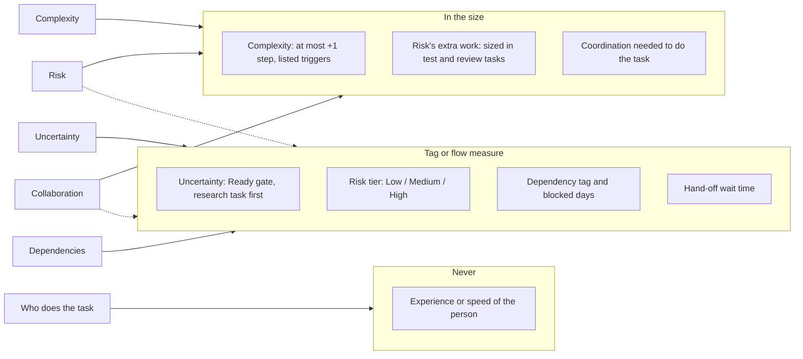
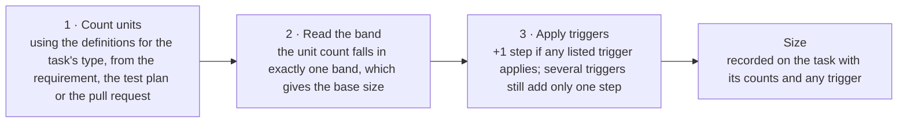

# Life of a Task (worked example)

!!! info "Status"
    Current (v0.1 draft)

    Lineage: Task Points, proposed size factors and tags. A worked example that follows one task through all seven task types; it applies the counting rules of the [Task Points Guide](guide.md).

Complexity, uncertainty, risk, dependencies and collaboration all affect a task. If each sizer decides alone how much of that to add, the same task comes out as a 5 for one person and a 13 for another. This page follows one task from request to report and shows where each factor ends up.

!!! note "The rule"
    A factor goes into the points only when it changes the amount of work. Everything else becomes a tag on the task or shows up in a flow measure, where it can be seen without distorting the size.

## Where each factor goes

Six factors are sorted into three places.



| Factor | In the size | Tag or flow measure | Never |
| --- | --- | --- | --- |
| Complexity | At most +1 step, listed triggers | | |
| Uncertainty | | Ready gate, research task first | |
| Risk | The extra work, sized in test and review tasks | Risk tier: Low / Medium / High | |
| Dependencies | | Dependency tag and blocked days | |
| Collaboration | Coordination needed to do the task | Hand-off wait time | |
| Who does the task | | | Experience or speed of the person |

Risk and collaboration each go to two places. The extra work they cause is sized. The rating and the waiting are tagged or measured.

## The counting rules

The rules cover seven task types: Research, Dev, Code review, Test planning, Testing, Defect correction and Defect retest. Every task gets its size the same way. Count the units its type defines, read the base size from the band table, then add one step only if a listed trigger applies. Nothing else changes the size, so two people counting the same task get the same number.



### Step 1: what counts as a unit

| Type | Count each of these once | Do not count |
| --- | --- | --- |
| Research | For each question, the options, file formats, products or code areas that must be examined. Add them up across questions. | Background reading that isn't needed to answer a question |
| Dev | Each screen, dialog or printed report added or changed: 1 item (a new one: 2). Business rules: 1 item per 4 condition rows, all rules together, rounded up. A calculated value counts as one row. Each database table changed: 1 item (a new table: 2). Each external file format or interface whose reading or writing changes: 1 item. | A field is counted with its screen, and its column with its table. A message that only reports a rule's outcome is part of the rule, not a changed screen. Code that only moves data between counted items adds nothing. |
| Code review | Files changed in the pull request. This includes the pull requests for defect fixes. | Generated files, such as designer and resource files |
| Test planning | Each new or changed scenario written: 1 unit. Each regression area selected: 1 unit. | Scenarios reused unchanged from the regression suite, which are covered by their area |
| Testing | Each scenario run: 1 unit. Each regression area run: 5 units. | Re-runs after a defect fix, which belong to a Defect retest task |
| Defect correction | The change items of the fix, counted with the Dev rules. The minimum is 1. | An investigation large enough to be its own Research task |
| Defect retest | Each scenario re-run, meaning the failed ones and any others the fix reaches: 1 unit. Each regression area the fix reaches: 5 units. | Scenarios the fix does not reach |

### Step 2: band table

| Units counted | 1 | 2 | 3 | 5 | 8 | 13 |
| --- | --- | --- | --- | --- | --- | --- |
| Research: sources to examine | 1 | 2–4 | 5–8 | 9–14 | 15–20 | 21+ |
| Dev and Defect correction: change items | 1 | 2 | 3–4 | 5–7 | 8–11 | 12+ |
| Code review: files changed | 1–3 | 4–8 | 9–15 | 16–30 | 31–50 | 51+ |
| Test planning: planning units | 1–5 | 6–12 | 13–25 | 26–45 | 46–80 | 81+ |
| Testing and Defect retest: test units | 1–5 | 6–10 | 11–25 | 26–50 | 51–90 | 91+ |

A size of 13 means the task must be split. Dev, Defect correction, Test planning and Testing tasks that cannot be split into usable parts get planned checkpoints instead. Research, Code review and Defect retest tasks of 13 are always split.

**Rework:** Defect correction, the review of its fix and Defect retest are rework points when the defect came from the team's own earlier work. For defects in older code they are delivered points.

### Step 3: triggers that add one step

- **Dev:** the code is in a module with no automated tests; it changes a shared component used by other modules; it converts existing customer data; it involves multi-user or locking behaviour; or it needs coordination with another team.
- **Research:** a working prototype is needed to answer the question.
- **Code review:** the pull request includes a shared component or a data conversion script.
- **Test planning:** new test data, such as sample files or test user accounts, must be built by hand.
- **Testing and Defect retest:** a special environment is needed, such as multi-user or another OS or database version.
- **Defect correction:** any Dev trigger, or the defect is intermittent or hard to reproduce.

### Risk tier: changes the counts, not the step

- **High** if the change affects money or payments, security or permissions, legal or regulatory output, existing customer data, or messages sent to customers. Test planning selects every area the change reaches as a regression area, Testing runs them all, and every pull request, including defect fixes, gets a second review task.
- **Medium** if it changes a shared component and none of the High triggers apply. The directly affected area is regression-tested.
- **Low** otherwise. The directly affected area is regression-tested.

### Calculator reference

The original page included an interactive calculator. It opened with the story's dev task, EX-101, and each task type opened with the matching task from the story. Changing the counts sizes any task. It produces the final size, a trail (for example "4 change items → base 3 → +1 step (module has no automated tests) → 5") and notes.

| Task type | Inputs (defaults in brackets) | Triggers |
| --- | --- | --- |
| Dev | Screens or reports changed [1]; new screens or reports, 2 each [0]; rule condition rows, all rules [6]; tables changed [1]; new tables, 2 each [0]; external formats or interfaces changed [0] | Module has no automated tests [checked]; changes a shared component; converts existing customer data; multi-user or locking behaviour; needs coordination with another team |
| Research | Sources to examine, all questions [4] | Needs a working prototype |
| Testing | Scenarios in the test plan [18]; regression areas, 5 units each [3] | Needs a special environment |
| Code review | Files changed, excluding generated [6] | Includes a shared component or data conversion script |
| Test planning | New or changed scenarios written [18]; regression areas selected, 1 unit each [3] | New test data must be built by hand |
| Defect correction | Same fields as Dev, with defaults screens 0, new screens 0, rule rows [1], tables 0, new tables 0, interfaces 0 | "No automated tests" [checked]; the Dev triggers; plus "Intermittent or hard to reproduce" |
| Defect retest | Scenarios re-run [4]; regression areas the fix reaches, 5 units each [1] | Needs a special environment |

Calculator logic:

```
Dev / Defect correction units = screens + 2 × new screens + ceil(rule rows ÷ 4) + tables + 2 × new tables + interfaces
                                (Defect correction minimum 1)
Test planning units           = scenarios + areas
Testing, Defect retest units  = scenarios + 5 × areas
Research units                = sources
Code review units             = files

Band upper limits (sizes 1, 2, 3, 5, 8; above the last limit = 13):
  Dev, Defect correction : 1, 2, 4, 7, 11
  Research               : 1, 4, 8, 14, 20
  Test planning          : 5, 12, 25, 45, 80
  Testing, Defect retest : 5, 10, 25, 50, 90
  Code review            : 3, 8, 15, 30, 50
Size scale: 1, 2, 3, 5, 8, 13. Any ticked trigger moves the size one step up (capped at 13).
```

Notes the calculator shows:

- Several triggers still add only one step.
- At 13: "split the task, or give it planned checkpoints if it cannot be split into usable parts" (Dev, Defect correction, Test planning, Testing), or "split this task" (the other types).
- Defect correction counts as rework if the defect came from the team's own earlier work.
- Dev and Defect correction notes show rule rows converted to items (1 per 4, rounded up).

## The story in eight moments

The task: *when a parcel delivery fails, the system should automatically create a follow-up for the support team and tell the customer.* The app already receives tracking updates from four delivery companies (carriers A to D). It runs across three sprints and uses all seven task types. The sizes are illustrative and follow the counting rules above.

Timeline: Sprint 7 request fails Ready · Sprint 7 research answers it · Sprint 8 counted: 3, then 5 · Sprint 8 risk: High · Sprint 8 blocked 3 days · Sprint 8 hand-off wait · Sprints 8–9 a defect: rework · Sprints 8–9 what the report shows.

### 1. Sprint 7, refinement: nobody can size what nobody understands

The request looks small. At refinement, the team realises nobody knows how each of the four carriers marks a failed delivery in its tracking updates. Two developers give sizes of 3 and 8. The spread comes from not knowing, not from the work.

The task fails the Ready check. Instead of adding points to cover the unknown, the team creates a research task with one question: *how does each carrier mark a failed delivery?*

!!! note "Uncertainty: not in the size"
    High uncertainty blocks Ready. A research task goes first, and the dev task is sized once the answer is known.

??? example "Task cards"

    - **EX-101** · Dev · status **Not Ready**. Title: "Follow up failed deliveries automatically". Size: not sized. Ready check: failed, failure format unknown.
    - **EX-102** · Research: how do the 4 carriers mark a failed delivery? (1 question × 4 carriers = 4 sources → band 2–4) = size 2.

### 2. Sprint 7, day 6: the research turns the unknown into a count

The decision note answers the question. Carriers A, B and C use a status code for a failed delivery. Carrier D says it only in the message text: "Delivery attempt failed". A peer reads the note and accepts it.

The research task earns its 2 points in sprint 7. The dev task now has something countable to size from: four conditions that recognise a failed delivery, a follow-up rule with two conditions, and one new field on the carrier settings screen with its column in the carrier table. The app already reads the status code and message text of every update, so no carrier interface changes.

**Result:** the uncertainty became visible work with its own points, credited in the sprint it was done. It was never hidden inside the dev estimate.

??? example "Task card"

    **EX-102** · Research, **Done**. Title: How do the 4 carriers mark a failed delivery? Size 2. Credited: 2 points, sprint 7. Output: decision note, 3 carriers by status code, 1 by message text.

### 3. Sprint 8, planning: counting gives 3; one complexity trigger makes it 5

The developer counts change items with the dev rules:

| Count | Items |
| --- | --- |
| Carrier settings screen: changed (new "Follow-up queue" field) | 1 |
| Failed-delivery recognition (4 rows) + follow-up rule (2 rows): 6 condition rows ÷ 4, rounded up | 2 |
| Carrier table: changed (new column) | 1 |
| Carrier interfaces: reading unchanged | 0 |
| **Change items → band 3–4** | **4 → 3** |

The follow-up code sits in an older notifications module with no automated tests. That is a listed dev trigger, so the size goes up **one step, to 5**, with the trigger written on the task. The developer and a peer sized it independently, and both said 5.

Size ladder: **3** (base: 4 change items) → **5** (+1 step: legacy module, no tests) → 8 (not allowed: only one step).

!!! note "Complexity: in the size, limited"
    It raises the size by at most one step, only for a listed trigger, and the reason is written down.

??? example "Task card"

    **EX-101** · Dev, **Ready**. Size 5. Size reason: 4 change items → base 3; +1 step: module with no automated tests. Sized by: developer 5 · peer 5 (blind).

### 4. Sprint 8, planning: High risk changes the testing and review, not the dev size

The change sends emails to customers. Messages sent to customers are a High-risk trigger, so the task is tagged **Risk: High**.

The dev size stays at 5, because the risk doesn't change the code. What it changes is the work around the code:

- The test plan has 18 scenarios: 4 carriers with a failed and a normal update (8), a later "Delivered" update that closes the follow-up, per carrier (4), a batch of mixed updates per carrier (4), an unknown status code (1) and a carrier with no follow-up queue set (1).
- At Low or Medium risk, only the parcel tracking screen would be regression-tested: 18 + 5 = 23 units, size **3**. High risk adds every area the change reaches, so the support queue and customer emails are added too: 18 + 3 × 5 = 33 units, size **5**.
- The pull request changes 6 files, which gives a review size of **2**. High risk requires a second reviewer, so there are two review tasks of 2 points each.

QA writes the plan first as its own **Test planning** task: 18 new scenarios and 3 regression areas selected, 21 planning units, size **3**. The **Testing** task then runs them.

!!! note "Risk: two places"
    The tier is a tag. The extra work it causes goes into the counts of the testing and review tasks, where that work is actually done.

??? example "Task card"

    **EX-101** · Dev, Ready. Size 5. Risk tier: High (sends messages to customers). Sub-items:

    - **EX-106** · Test planning: 18 scenarios + 3 areas = 21 units → 3
    - **EX-103** · Testing: 18 scenarios + 3 areas × 5 = 33 units → 5
    - **EX-104** · Review 1: 6 files changed → 2
    - **EX-105** · Review 2 (required by High risk) → 2

### 5. Sprint 8, days 4–6: a dependency costs time, and time is what shows it

Testing carrier D needs real sample updates from the carrier, and they arrive three working days late. Because the Ready check had flagged this, the task already carried an **external dependency** tag.

Nobody adds points for the wait, because waiting is not work. The three days show up where they belong: as blocked days on the testing task and in its cycle time.

!!! note "Dependencies: not in the size"
    They are checked at Ready and tagged. Blocked days and cycle time by tag show what they cost.

??? example "Task card"

    **EX-103** · Test, status **Blocked**. Title: Test: 18 scenarios + 3 regression areas. Size 5 (unchanged). Dependency: external, sample updates from carrier D. Blocked: 3 working days.

### 6. Sprint 8, days 5–8: collaboration: the work is sized, the waiting is measured

The developer and QA wrote the test scenarios together in one session. That is work needed to do the task, so it is already inside the testing task's size, and the task is credited once.

The dev task reached Done on day 5, but testing only started on day 8. Those three working days of hand-off wait are no one's work, so they earn no points. They are measured as the gap between Dev Done and the start of testing.

If the team had needed a joint test with the team that owns the email service, that test would have been its own task with its own size.

!!! note "Collaboration: two places"
    Joint work is sized once, inside the task it belongs to or as its own task. Hand-off waits are measured, not sized.

??? example "Task card"

    **EX-101** · Dev, **Done**. Size 5. Credited: 5 points, sprint 8. Hand-off wait: 3 working days to testing start.

### 7. Sprint 8 day 9 to sprint 9: a defect comes back and is counted as rework

During testing, carrier B sends the same failed-delivery update twice, and the customer gets two emails and the queue two follow-ups. QA links the defect to EX-101, so it is the team's own defect. Every task that follows from it is sized with the same counting rules and credited as **rework points**.

| Task | Points |
| --- | --- |
| **Defect correction:** 1 rule row changed → 1 change item → base 1; +1 step, module with no automated tests | 2 |
| **Code review** of the fix: 2 files changed | 1 |
| **Second review**, required by High risk: 2 files changed | 1 |
| **Defect retest:** 4 repeated-update scenarios (one per carrier) + 1 area the fix reaches × 5 = 9 units | 2 |
| **Rework points, sprint 9** | **6** |

None of these points add to EX-101's 5, and they don't count as delivered. They show up in the rework share, so the defect has a visible cost.

!!! note "Rework: counted, but kept apart"
    Defect correction, the reviews of the fix and Defect retest follow the normal counting rules. A link to the team's own earlier work turns them into rework points.

??? example "Task card"

    **EX-107** · Defect correction, status Rework. Title: Repeated failed-delivery update creates two follow-ups. Caused by: EX-101 (team's own work). Size 2. Credited: 2 rework points, sprint 9. Sub-items:

    - **EX-108** · Code review of the fix → 1
    - **EX-109** · Second review (High risk) → 1
    - **EX-110** · Defect retest: 9 units → 2

### 8. Sprints 8–9, sprint review: what the report shows at the end

Testing was not Done by the end of sprint 8. The scenarios for carriers A, B and C had been run and logged, and a peer confirmed it. That earns an unplanned checkpoint of 2 points: half of 5, rounded down. The remaining 3 points were credited when testing finished in sprint 9, after the fix for repeated updates passed its retest.

**Sprint 8: planned vs credited points**

| Work | Credited / planned |
| --- | --- |
| Test planning | 3 / 3 |
| Dev | 5 / 5 |
| Review 1 + 2 | 4 / 4 |
| Testing | 2 / 5 |

**14 of 17** planned points credited, a plan reliability of **82%**. The shortfall is explained by the external dependency tag and its 3 blocked days, not by a sizing error.

**The whole story in one line per factor**

| Factor | Where it ended up |
| --- | --- |
| Uncertainty | A 2-point research task in sprint 7 |
| Complexity | +1 step on dev: 3 → 5, reason recorded |
| Risk | High tag; testing 5 and a second review |
| Dependency | External tag; 3 blocked days |
| Collaboration | Inside testing; 3-day hand-off wait |

## The whole story, by task type

All seven task types appear in the story. Delivered points measure new work, and rework points show what the defect cost.

| Task type | Tasks | How it was counted | Delivered | Rework |
| --- | --- | --- | --- | --- |
| Research | EX-102 | 4 sources | 2 | – |
| Dev | EX-101 | 4 change items + trigger | 5 | – |
| Code review | EX-104, EX-105; EX-108, EX-109 | 6 files × 2 reviews; fix 2 files × 2 reviews | 4 | 2 |
| Test planning | EX-106 | 21 planning units | 3 | – |
| Testing | EX-103 | 33 test units | 5 | – |
| Defect correction | EX-107 | 1 change item + trigger | – | 2 |
| Defect retest | EX-110 | 9 test units | – | 2 |
| **Total** | | Rework share: 6 ÷ (19 + 6) = 24% | **19** | **6** |

## Why the rule matters: three people size the same task

Imagine sizing EX-101 without the rule, with each person adding whatever worries them.

**View 1: everyone adds what worries them**

| Sizer | Size | How it was reached |
| --- | --- | --- |
| Dev A | **5** | Base from counting: 3; legacy module: +1 step |
| Dev B | **8** | Base: 3; legacy module: +1; emails customers, risky: +1 |
| QA 1 | **13** | Base: 3; legacy module: +1; risky: +1; carrier D samples may be late: +1 |

Verdict: **the same task gets 5, 8 and 13.** Each person priced a different worry into the points. The team's points per day would then depend on who did the sizing, not on how much work was done.

**View 2: with the rule**

| Sizer | Size | How it was reached |
| --- | --- | --- |
| Dev A | **5** | 4 change items → 3, + trigger → 5; risk: tag High; dependency: tag External |
| Dev B | **5** | 4 change items → 3, + trigger → 5; risk extra work counted in test and review; dependency: tag External |
| QA 1 | **5** | 4 change items → 3, + trigger → 5; test: 18 scenarios + 3 regression areas = 33 units → 5; blocked days measured, not sized |

Verdict: **all three count 4 change items and apply one trigger, so all three give 5.** Risk and the dependency are still visible, as tags, as the testing and review tasks they require, and as blocked days. The size stays consistent.

## What never enters the size

Suppose a developer who joined last month had taken EX-101. It would still be a 5. If they take longer, that shows in the team's points per available day and in the task's cycle time. The size describes the work, never the person. That is what makes sizes comparable from sprint to sprint.

!!! note "Who does the task: never in the size"
    Experience, familiarity with the module and personal speed never change the points.

*Illustrative example of the proposed Task Points size factors and tags. The tags, the risk-tier triggers, the complexity triggers and the Ready check are proposals to confirm before use.*
