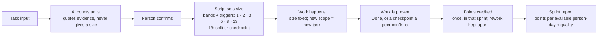

# Task Points Quick Guide

!!! info "Status"
    Current (v0.1 draft)

    Lineage: Task Points v0.1, quick guide. A single-page companion to the full Task Points Guide, with the same rules.

## What Task Points measures

Task Points shows how much work the team completes each sprint without using logged hours. Every task in the issue tracker gets a size in points before it starts, and its points count only in the sprint where the work is proven.

It covers seven task types: Research, Dev, Code review, Test planning, Testing, Defect correction and Defect retest. Three ideas carry the whole system:

1. **Size before work starts**, from counts of what the task involves, not from guesses of time.
2. **Credit only proven work**: at Done, or at a checkpoint a peer has confirmed.
3. **Read the trend per available person-day**, always beside quality and rework, for the team as a whole.

Life of a task's points, sized and then credited:

See the [Task Points Guide](guide.md) for the same material with the diagram in two rows.

## Sizing a task

An AI assistant counts the units in the task and quotes the evidence for each count. It never proposes a size. The person doing the task checks every count, then a fixed script turns the counts into a size, so the same counts always give the same size.

| Task type | What is counted | 1 | 2 | 3 | 5 | 8 | 13 |
| --- | --- | --- | --- | --- | --- | --- | --- |
| Research | Sources to examine, across all questions | 1 | 2–4 | 5–8 | 9–14 | 15–20 | 21+ |
| Dev, Defect correction | Change items (below) | 1 | 2 | 3–4 | 5–7 | 8–11 | 12+ |
| Code review | Files changed, excluding generated files | 1–3 | 4–8 | 9–15 | 16–30 | 31–50 | 51+ |
| Test planning | Scenarios to write + regression areas selected | 1–5 | 6–12 | 13–25 | 26–45 | 46–80 | 81+ |
| Testing, Defect retest | Scenarios + 5 × regression areas | 1–5 | 6–10 | 11–25 | 26–50 | 51–90 | 91+ |

**Change items** = screens changed + 2 × new screens + rule rows ÷ 4 (rounded up) + tables changed + 2 × new tables + interfaces changed. A rule row is one combination of conditions with one outcome; a calculated value also counts as one row.

**Triggers add one step.** A trigger is a stated fact that makes the same change more work. Any trigger moves the size up one step (3 → 5); several triggers still move it only one step.

- Dev and Defect correction: no automated tests, shared component, converts customer data, multi-user locking, other-team coordination; Defect correction also has intermittent defect.
- Research: prototype needed. Code review: shared component, data conversion script. Test planning: hand-built test data. Testing and Defect retest: special environment.

**What the size ignores.** Who does the task, their experience, how much AI they use, and how hard it feels. Uncertainty becomes its own Research task. Once work starts the size is fixed; new delivered behaviour found later becomes a new task with its own size.

**A 13 is too big for one task.** Split it into parts that each produce a usable result. If it cannot be split that way (Dev, Defect correction, Test planning or Testing), give it planned checkpoints instead (next section).

### Example: sizing a Dev task

Task: *Follow up failed deliveries automatically.* A new "Follow-up queue" field goes on the carrier settings screen. Four carrier conditions mark a delivery as failed; a failed delivery creates a follow-up and emails the customer; a later "Delivered" update closes it.

| Count | Value | Change items |
| --- | --- | --- |
| Screens changed: carrier settings | 1 | 1 |
| Rule rows: 4 failure conditions + create and email + close on Delivered | 6 | 6 ÷ 4 → 2 |
| Tables changed: the new setting is a column on the carrier table | 1 | 1 |
| New screens, new tables, interfaces changed | 0 | 0 |
| **Total** |  | **4 → base size 3** |

The Notifications module has no automated tests, which is a trigger, so the size moves one step to **5**. The change also emails customers, which makes it High risk, so a second review task is created.

## Crediting: only proven work counts

A task's points are credited once, in the sprint where the work is proven. Being close earns nothing, and a closed sprint's figures never change; corrections go into the current sprint. Points belong to the task, not to a person.

- **At Done**, the normal case. Research counts when its decision note is accepted, Code review when the change is approved, Test planning when the test plan is complete.
- **At a planned checkpoint**, for a task that will not fit one sprint and cannot be split into usable parts.
- **At an unplanned checkpoint**, for a task that unexpectedly misses the sprint end.

|  | Planned checkpoint | Unplanned checkpoint |
| --- | --- | --- |
| Set | When the task is sized, before work starts | At the sprint end, when the task is not Done |
| Applies to | Tasks of 3 points or more | Tasks of 3–8 points with no planned checkpoints |
| How many | Up to 4, never more than the task's points; the last one is Done | One per task |
| Points | Whole-point shares, at least 1 each, adding up to the task's points | At most half the points, rounded down; the rest at Done |

Every checkpoint has an **exit condition**: what will exist when it is reached. A peer who did not work on the task confirms it against evidence, no later than the sprint review. "Parser committed on the branch; build passes; unit tests pass" is accepted. "Parser about 60% done" is not.

**Rework is credited the same way but reported separately.** Fixing or retesting the team's own earlier work, a reopened task and a restarted approach all earn rework points, which never count toward productivity. QA links each defect to the task that caused it, and the team lead settles disputes. A defect in older code the team has not changed is normal work.

### Example: two Dev tasks across three sprints

| Task | Sprint 2 | Sprint 3 | Sprint 4 |
| --- | --- | --- | --- |
| Tracking integration, 13 points, planned checkpoints 5 + 5 + 3 | 5 (CP1) | 5 (CP2) | 3 (CP3, Done) |
| Carrier settings, 3 points, planned for sprint 3 |  | 1 (unplanned) | 2 (Done) |

The settings task missed the end of sprint 3 with its fields built and tested but one check still missing. A peer confirmed that, so it earned 1 point (half of 3, rounded down) and the other 2 at Done. Had points been credited only at Done, sprints 2 and 3 would show no development at all and sprint 4 would jump.

## Reading the numbers

The headline figure is **delivered points ÷ available person-days**, compared with the team's own baseline. Available person-days are every developer and QA engineer on the roster at the start of the sprint, times working days, minus leave and public holidays.

**Example (illustrative).** Take an illustrative team of 11 people: 11 people × 10 working days − 6 days of leave = 104 person-days. The sprint delivers 78 points: 78 ÷ 104 = 0.75. Against a baseline of 0.68, the trend index is 1.10, about 10% more work completed per available day.

Each sprint report shows the headline beside these measures, for the sprint and as a rolling three-sprint figure (points and days summed, then divided):

| Measure | Calculation |
| --- | --- |
| Delivered points by task type | Points credited in the sprint, per type |
| Rework share | Rework points ÷ (delivered + rework points) |
| Cycle time by type | Working days from start to Done; median and 85th percentile |
| Reopened tasks | Tasks reopened after Done ÷ tasks Done |
| Escaped defects per 100 points | Defects found after release ÷ delivered points × 100 |

- **Baseline:** the first sprints under this system, until at least 35 tasks are Done with at least 5 of each of the seven types, usually about three sprints.
- **A real change** holds for two non-overlapping three-sprint periods while the quality measures have not got worse.
- **The figures show whether** the team completes more per available day, not why. A change log of tool, people and process changes travels with every report.

## Adopting it

**Set up once**

1. The issue tracker: a points field on every issue and sub-task, a task type field with the seven types, checkpoint sub-tasks named "CP n of m: …" with points and an evidence link, a rework label, and fields for the AI model and prompt version used to count.
2. A module registry: for each module, whether it has automated tests and whether it is shared. Triggers are read from it.
3. Reference tasks: 8–12 real finished tasks covering the task types and a range of sizes, each with its counts, size and the reason. They are calibration fixtures only: used to confirm the bands at setup and as known cases in the quarterly check. New tasks are never sized by comparison with them; sizes always come from counts.
4. Run the counting prompt and script on 10 recent tasks, then confirm or adjust the bands. All values here are v0.1 proposals and are reviewed again after the baseline.

**Every sprint**

| When | What happens |
| --- | --- |
| Refinement | Create and size new tasks; plan checkpoints for any task that won't fit a sprint and can't be split |
| Sprint planning | Confirm sizes and which checkpoints are expected this sprint |
| During the sprint | Move tasks to Done; a peer confirms each checkpoint and links its evidence |
| Last day | For each 3–8 point task not Done, decide whether it gets an unplanned checkpoint |
| Sprint review | Check every confirmation is complete, sample 1 in 5 for evidence, calculate the figures |

**Keeping it honest**

- **Quarterly check.** The team lead picks 8 completed tasks at random. Two or three people who did not work on them re-count them blind with the same counting rules. If the totals differ by more than 20%, trend reporting pauses, the team re-agrees the sizing guidance and a new baseline starts. A new baseline also starts when more than 30% of the team changes.
- **Look into it when** checkpoints exceed 30% of delivered points over three sprints, a sprint has more than 2 unplanned checkpoints, the share of tasks sized 1 or 2 rises sharply, or a task misses its size by 2 or more steps.
- **Rules of use.** Figures are produced for the team only. They are never used as targets or quotas, in appraisals, pay or headcount decisions, or to compare teams.
