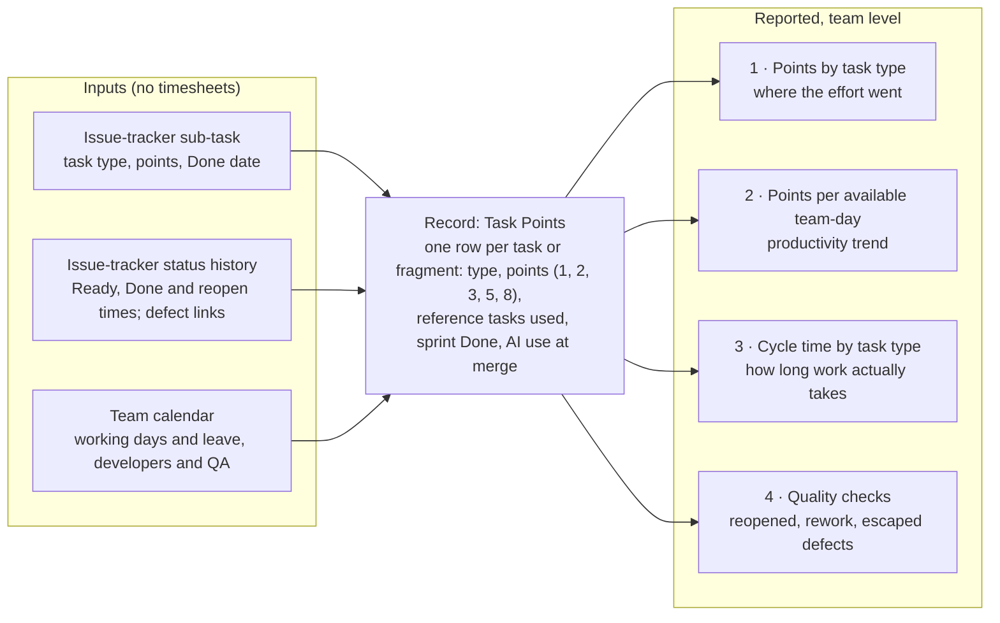

# Requirements Synthesis

!!! warning "Status"
    Superseded: earlier, reference-task form of Task Points. Kept for research history; do not use it to size work. The current contract is count-based sizing across seven task types in the [Task Points Guide](guide.md).

    Lineage: Task Points synthesis. Maps the requirements gathered during the [Scope Points](../scope-points/proposal.md) work, plus new management constraints, onto the Task Points model. A proposal for discussion, not a decided standard.

Management wants every task measured on its own, including research, dev, code review and testing, even when a task is split across several sprints. They want effort measured, but not from hours. This page brings together the goals from the Scope Points work and the new management constraints. It shows which ones Task Points meets, where conditions apply and what it cannot do.

| Result | Requirements |
| --- | --- |
| Met | 10 |
| Met with a condition | 4 |
| Partly met | 1 |
| Not covered | 1 |

**Recommendation:** adopt Task Points for task-level measurement and keep the Scope Points sizing table as the reference aid for dev tasks. Before relying on the trend, run the quarterly anchor check (see [What this system cannot do](#what-this-system-cannot-do)).

Sections: The system · Coverage · Split tasks · What we report · For the team · Limits · From Scope Points · Open decisions · Evidence. Each section was labelled in the original for its audience: management, the team, both, or the team lead.

## The system at a glance

*For management.*

Each task in the issue tracker is sized in points before it starts, compared with a small set of written reference tasks for its type. It earns its points only in the sprint it reaches Done. We divide the points completed by the team-days available on the calendar and read that figure beside cycle time and quality checks.



**Trust gate:** each quarter the team re-sizes the frozen reference tasks without seeing the recorded sizes. If the sizes have drifted, trend figures are paused until the anchors are agreed again.

## Requirement coverage

*For both management and the team.*

These 16 requirements come from two places: the new management constraints (4, IDs starting M) and the goals set during the Scope Points work (12, IDs starting G). Six of them are not simply "Met" and need attention.

| ID | Group | Requirement | Status | How it is met | Source |
| --- | --- | --- | --- | --- | --- |
| M1 | Management | Measure every task on its own: research, dev, code review, testing | Met | Each task type has its own size driver and reference tasks. Every sub-task in the issue tracker gets points. | Management constraint |
| M2 | Management | Account for tasks split into fragments across sprints | Met | Each fragment is its own sub-task and earns its full points in the sprint it is Done. Spillover is credited when it finishes. | Management constraint |
| M3 | Management | Measure effort | Met, with condition | Points estimate effort against reference tasks. Condition: this is estimated effort, not recorded effort (Limit 1). | Management constraint |
| M4 | Management | Do not rely on effort hours | Met | No figure uses timesheets. Capacity comes from the team calendar and durations from the issue tracker's status history. | Management constraint |
| G1 | Earlier goal | Show whether the team delivers faster over time, end to end, QA included | Met, with condition | Points per available developer and QA day, plus cycle time. Condition: valid only while the quarterly reference-task check passes. | Scope Points goal; project notes |
| G2 | Earlier goal | A size that does not shrink as AI makes the work faster | Partly met | Frozen reference tasks and a blind quarterly re-size detect shrinking sizes, but relative points can still drift between checks. Requirement-based Scope Points were stronger here. | [Scope Points proposal](../scope-points/proposal.md), section 1 |
| G3 | Earlier goal | Totals stay the same when work is split | Met | Splitting divides a task's points among its fragments. Only new scope adds points, as a new task. | Scope Points proposal, A.4 |
| G4 | Earlier goal | Timesheet padding must not distort the result | Met | Hours are not used anywhere. | [Pre-mortem](../scope-points/pre-mortem.md), risk B1 |
| G5 | Earlier goal | No gain counts unless quality holds | Met | Reopened tasks, rework tasks and escaped defects are reported next to every productivity figure. | Scope Points section 3; [Dyno, Road & Destination](../measurement/dyno-road-destination.md) principles |
| G6 | Earlier goal | Never used as a target, in appraisals, for headcount or to rank teams | Met | The same use-of-results rule is carried over. Figures are team-level only. | Pre-mortem A1, A2; amendment 1 |
| G7 | Earlier goal | Honest attribution: productivity gain, not AI gain | Met | A change log of tool, staff and process changes goes beside every report. | Pre-mortem D1 |
| G8 | Earlier goal | AI use visible as context | Met | The AI-use tag is recorded at merge and compared within the same task type. It is read as context, never as cause. | [AI-assisted SDLC standard](../agentic-sdlc/ai-assisted-sdlc-standard.md); Scope Points section 3 |
| G9 | Earlier goal | Detect sizing drift | Met | The frozen reference tasks are re-sized blind each quarter. | Scope Points check sizing |
| G10 | Earlier goal | Measurement overhead under 2% | Met, with condition | Sizing happens during refinement, which already takes place, plus one reference-task session a quarter. Condition: the actual overhead still has to be measured. | Scope Points pause rules |
| G11 | Earlier goal | A baseline without reliable pre-AI data | Met, with condition | The first sufficient sample becomes the baseline. Condition: the minimum size is still an open decision (proposed: at least 30 tasks and 5 per type). | AI-assisted SDLC standard notes |
| G12 | Earlier goal | Causal proof that AI caused a change | Not covered | Only a controlled comparison, such as the replay experiment in Dyno, Road & Destination, can show cause. Task Points shows trends only. | Dyno, Road & Destination |

Tally: Met 10 (M1, M2, M4, G3 to G9), met with condition 4 (M3, G1, G10, G11), partly met 1 (G2), not covered 1 (G12).

## How a task split across sprints is credited

Example story: *import payment files into the finance module*. It runs over five sprints, which matches the pattern management described: research only, then dev in parts, then testing in parts. The sizes are illustrative.

| ID | Task or fragment | Type | Points | First sprint | Last sprint (credited here when Done) | Why this size |
| --- | --- | --- | --- | --- | --- | --- |
| R1 | Research: compare payment file formats | Research | 3 | 1 | 1 | 2 questions to answer, 3 file formats to evaluate. Credited when the decision note is accepted. |
| D1 | Dev 1: import screen and file parser | Dev | 5 | 2 | 2 | Sized against the dev reference tasks. Scope aid: one new screen and a file import output. |
| V1 | Review of Dev 1 | Review | 1 | 2 | 2 | Small, contained change in one module. |
| D2 | Dev 2: matching rules | Dev | 5 | 3 | 4 | Many condition rows in the matching logic. It spilled from sprint 3 into sprint 4, so it earns its 5 points in sprint 4. (Under percentage-complete crediting, 4 of 5 points would be claimed in sprint 3 and the rest in sprint 4.) |
| V2 | Review of Dev 2 | Review | 2 | 4 | 4 | Dense logic in a shared component, so more review effort. |
| D3 | Dev 3: posting to the finance module | Dev | 3 | 4 | 4 | Posting rule plus stored values in existing tables. |
| V3 | Review of Dev 3 | Review | 1 | 4 | 4 | Small change. |
| T1 | Test 1: import and matching scenarios | Test | 3 | 4 | 4 | Scenario count for the parser and matching rules. |
| T2 | Test 2: posting and regression | Test | 5 | 5 | 5 | Posting scenarios plus regression across finance reports. |

Story total: 28 points (3 + 5 + 1 + 5 + 2 + 3 + 1 + 3 + 5).

The original page had a toggle comparing two crediting modes. In the chart, a faded bar is work in progress (0 points) and a solid bar is points credited in that sprint, with stacked totals per sprint under the grid.

- **Credit when Done (Task Points):** sprint 3 shows 0 because Dev 2 was not finished. Its 5 points land in sprint 4. The story total is 28 either way, and every credited point is a finished task.
- **Percentage complete (rejected):** sprint 3 claims 4 of Dev 2's 5 points (80%), a figure the developer reports. The total is still 28, but sprint 3 now depends on a guess, and teams tend to overstate percent complete. That is why Task Points does not use it.

## What we report each sprint

*For management.*

All figures are team-level. Each one is shown for the sprint and as a rolling three-sprint figure, because one sprint can be empty for a task type when work spills over (sprint 3 above).

| Report | Calculated as | Answers | Source |
| --- | --- | --- | --- |
| Points by task type | Sum of points Done, per type | Where the team's effort went | Issue tracker |
| Points per available team-day | Points Done ÷ available developer and QA days | Is the team getting faster over time? | Issue tracker + calendar |
| Cycle time by type | Start to Done, median and 85th percentile | How long work actually takes | Issue-tracker history |
| Quality checks | Reopened tasks, rework tasks, escaped defects | Did speed cost quality? | Issue-tracker links |

**Productivity trend, worked example (illustrative figures).** Take an illustrative team of 11 people (developers and QA):

```
points per available team-day = points Done ÷ (people × working days − leave days)
11 people × 10 days − 8 leave days = 102 available days
76 points Done ÷ 102 = 0.75 points per available team-day
```

This figure is compared with the team's own baseline, never with another team. The earlier capacity check used developer days only. Here QA days are included because testing tasks now earn points, which covers the end-to-end (Dev and QA) goal.

## How tasks are sized

*For the team.*

Every task type uses the same scale: 1, 2, 3, 5, 8. Each type has two or three written reference tasks. When sizing a new task, compare it with those references, not with how long something took last time.

| Task type | What drives the size | Credited when |
| --- | --- | --- |
| Research | Questions to answer and options to evaluate, within a fixed timebox | The written finding or decision note is accepted, whatever it concludes |
| Dev | What the fragment delivers. The Scope Points item table (Screen, Rule, Data, Output, Technical) is the reference aid | The code is merged and the fragment meets its Done criteria |
| Code review | Size and risk of the change: files and components touched, logic density, shared code | The review is complete |
| Testing | Scenarios designed or run, plus regression scope | The test run is complete and defects are logged |

### Rules for split work

- Each fragment is its own sub-task in the issue tracker, with its own Done criteria. It is sized before it starts.
- Nothing is credited for partial progress. A fragment earns 0 until it is Done, then its full points.
- A fragment that spills over earns its points in the sprint where it finishes.
- Splitting a task divides its points among the fragments. Only new scope adds points, as a new task.
- Research, review and testing points are not added into the dev size.

### Reference tasks

- About 8 reference tasks in total, 2 or 3 per task type, each written down with its size.
- They stay frozen. They change only by a recorded decision, and the baseline is re-read when they do.
- Each quarter the team re-sizes them without seeing the recorded sizes. This is the drift check.
- Where two teams work on the same product, they use the same reference set, so their sizing stays consistent. Figures are still never used to rank the teams.

## What this system cannot do

*For management.* These are the direct cost of not using hours. They should be agreed before the first report.

1. **Points estimate effort; they don't record it.** They show planned effort that was completed, not effort actually spent. Cycle time is the only measured duration, and it is elapsed time, not working time.
2. **The trend is only as good as the reference tasks.** Relative points drift when people size against remembered effort. The quarterly check detects drift but cannot prevent it. The requirement-based Scope Points size was stronger on this point.
3. **No comparison between teams.** Velocities are not comparable across teams without a deliberately shared baseline. Once a number becomes a target or a ranking, teams inflate it (Goodhart's law).
4. **No proof of cause.** A rise shows the team got faster, not why. Tool, staff and process changes go in a change log beside every report.
5. **Single sprints are noisy.** Spillover can leave a sprint near zero for a task type. Decisions use rolling three-sprint figures.

## What carries over from Scope Points

*For both management and the team.*

### Kept

- The Screen, Rule, Data, Output and Technical table, as the sizing aid for dev tasks
- Crediting on completion, and no new points for rework or the team's own bugs
- The capacity-based measure, now the main productivity figure
- Quality beside speed; the change log; team-level reporting only
- The drift check (formerly check sizing), now run on the reference tasks
- The AI-use tag at merge, read as context, never as cause
- The use-of-results rule: no targets, no appraisals, no headcount decisions, no team rankings

### Dropped

- The productivity gain calculated from timesheet hours
- Story-level crediting only; points now go to each task
- The fixed Dev/QA share, no longer needed because testing tasks earn their own points
- Zero points for investigation, code review and testing. Management wants these measured, so they now earn points

## Open decisions

*For the team lead.* These values are proposed, not decided. Where a Scope Points value exists, it is shown as the proposed default.

| Decision | Proposed default | Why it matters |
| --- | --- | --- |
| Who drafts sizes | AI draft against the reference tasks, accepted or flagged by the assignee, as in Scope Points | Keeps overhead low and sizing consistent |
| Drift tolerance | 20%, taken from Scope Points check sizing | Sets when trend reporting pauses |
| Baseline | At least 30 tasks and at least 5 per task type, taken from Scope Points | No reliable pre-AI history exists |
| Research timebox | To be set per team | Stops research from running open-ended |
| Review as a sub-task | Required, if review is not tracked separately today | Review cannot be measured unless it is its own task |

## How this was put together

- **Requirements** were taken from the Scope Points proposal, the Scope Points pre-mortem, the Dyno, Road & Destination spec, the team handbook sources, and management's new constraints.
- **Design** was checked against two independent reviews by a second, lower-cost model. Both reached the same structure. They differed on one point: whether research, review and testing points should add into the story total. They are kept separate here because they measure different things.
- **Limitation:** no team data exists yet. Every number on this page is illustrative. The earlier Scope Points sizing standard was not re-read in full.

### References

1. Relative estimation expresses effort, complexity and uncertainty, not hours. [Cohn, What Are Story Points](https://www.mountaingoatsoftware.com/blog/what-are-story-points)
2. No partial credit; unfinished work carries its estimate and is credited when finished. [Cohn, 2024](https://www.mountaingoatsoftware.com/blog/dont-take-partial-credit-for-semi-finished-stories), [Cohn, 2024](https://www.mountaingoatsoftware.com/blog/should-you-re-estimate-unfinished-stories)
3. Spikes are timeboxed with an agreed question to answer; whether to point them is disputed. [XP rules](http://www.extremeprogramming.org/rules/spike.html), [Agile Alliance, 2018](https://agilealliance.org/the-practice-of-sizing-spikes-with-story-points/)
4. Velocity is not comparable across teams without a shared baseline; standardised points get gamed. [Cohn](https://www.mountaingoatsoftware.com/agile/is-it-dangerous-to-calculate-the-cost-per-point), [Fowler, 2004](https://www.martinfowler.com/bliki/StandardStoryPoints.html), [Strathern, 1997](https://gwern.net/doc/statistics/decision/1997-strathern.pdf)
5. Flow metrics (cycle time, throughput, work item age, flow distribution) are taken from start and finish points. [Vacanti, ProKanban](https://www.prokanban.org/blog/https-prokanban-org-blog-the-kanban-pocket-guide-chapter-6-the-basic-metrics-of-flow), [Flow Framework](https://flowframework.org/ffc-discover/)
6. Balance productivity with quality measures. [SPACE, ACM Queue 2021](https://queue.acm.org/detail.cfm?id=3454124), [DORA metrics](https://dora.dev/guides/dora-metrics/)

*Proposal for discussion, not a decided standard.*
