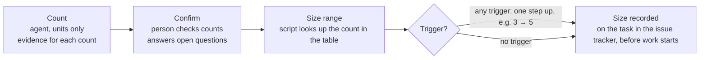

# Sizing Procedure and Owner Reference

!!! info "Status"
    Current (v0.1 draft)

    Lineage: Task Points v0.1, internal sizing procedure and owner reference. It holds only the sizing detail and owner cadence that the [Agentic SDLC Handbook](../agentic-sdlc/handbook.md) leaves to a separate procedure (the handbook covers crediting, slice rules, reporting, baseline and adoption). The count-and-band tables are also in the [Task Points Guide](guide.md).

This is the internal reference for the people who run Task Points sizing and for the future sizing prompt. It is not part of the team handbook. It describes the procedure behind the "sizing procedure" box in the handbook's life-of-a-task diagram: how counts become a size, and how a sized task's points are shared across its slices.

## How a task is sized

An agent counts the units in the task from its signed work breakdown (WBS) document, or from the test plan, pull request or diagnosis note, and shows the evidence for each count. It never proposes a size. A person confirms the counts. A script turns them into a size, so the same counts always give the same size.



**Reading the table:** find the task type, count its units, then read the size from the column the count falls in. Example: a code review of 12 changed files falls in 9–15, so it is size 3.

| Task type | Units counted | Size 1 | 2 | 3 | 5 | 8 | 13 |
| --- | --- | --- | --- | --- | --- | --- | --- |
| Research | Sources that must be examined to answer the questions | 1 | 2–4 | 5–8 | 9–14 | 15–20 | 21+ |
| Dev, Defect correction | Change items (formula below) | 1 | 2 | 3–4 | 5–7 | 8–11 | 12+ |
| Code review | Files changed, excluding generated files | 1–3 | 4–8 | 9–15 | 16–30 | 31–50 | 51+ |
| Test planning | Scenarios to write + regression areas selected | 1–5 | 6–12 | 13–25 | 26–45 | 46–80 | 81+ |
| Testing, Defect retest | Scenarios + 5 × regression areas | 1–5 | 6–10 | 11–25 | 26–50 | 51–90 | 91+ |

```
change items = screens changed + 2 × new screens + ⌈rule rows ÷ 4⌉ + tables changed + 2 × new tables + interfaces changed
```

### Definitions

- **Screen:** a screen, dialog or printed report.
- **Rule row:** one line of a decision table, that is one combination of conditions leading to one outcome. A calculated value, a stated limit or a filter is one row; a rule reused unchanged is not counted. `⌈rule rows ÷ 4⌉` means divide by 4 and round up (1–4 rows = 1).
- **Table changed:** its structure changes or its stored data changes. Adding a single new value to an existing entity (for example a new setting) counts as a column on that entity's table.
- **Interface changed:** an external file format or interface whose reading or writing changes.
- **Not counted separately:** fields, columns, plumbing code, tests and investigation.
- **Scenario:** one test case QA will run.
- **Regression area:** a part of the application to re-test because the change could affect it.

### Triggers

Triggers are conditions that make a task bigger than its counts show. If any trigger applies, the size moves up one place on the scale (for example 3 becomes 5); several triggers still give only one step. A trigger counts only when it is recorded in the module registry (the per-module list the team lead sets up before the first item) or written in the task.

- **Dev and Defect correction:** the module has no automated tests; it is a shared component; the change converts customer data; it involves multi-user locking; it needs coordination with another team. Defect correction also: the defect is intermittent.
- **Research:** a prototype is needed.
- **Code review:** a shared component or a data conversion script is involved.
- **Test planning:** test data must be built by hand.
- **Testing and Defect retest:** a special environment is needed.

!!! warning "First version"
    These ranges and triggers have not been tried yet. The team will size about 10 recent tasks with them and adjust any that give odd results, before measurement starts.

??? example "Example: sizing a Dev task, spending-limit warning on the order form"

    **Requirement:** warn before saving an order that would take a customer over their spending limit; a system setting turns the warning on or off; a customer with no limit never triggers it.

    - 2 screens changed: system settings, order form
    - 4 rule rows: over limit → warn; not over → no warning; no limit → no warning; setting off → no warning. 4 ÷ 4, rounded up = 1
    - 1 table changed: system settings

    | Step | Result |
    | --- | --- |
    | Change items | 2 screens + 1 (rule rows) + 1 table = **4** |
    | Size range | 4 falls in 3–4 → **size 3** |
    | Trigger | Order module has no automated tests: one step up |
    | Size | **5 points**, shared across its slices (see slice shares below) |

    How those 5 points are credited slice by slice is shown in the crediting examples of the [Agentic SDLC Handbook](../agentic-sdlc/handbook.md).

## Dev change items: terms, weights and reasons

```
change items = screens changed + 2 × new screens + ⌈rule rows ÷ 4⌉ + tables changed + 2 × new tables + interfaces changed
```

| Term | What counts | Weight | Why |
| --- | --- | --- | --- |
| Screens changed | Each existing screen, dialog or printed report whose content or behaviour changes | 1 each | A change inside something that already exists |
| New screens | Each new screen, dialog or printed report | 2 each | Built from nothing: layout, loading, saving, navigation |
| Rule rows | Condition rows across all business rules: one combination of conditions with one outcome. A calculated value counts as one row; a stated limit or filter counts as one row; an unchanged reused rule does not count | ÷ 4, round up | Rows are small and numerous. Four rows count as one change item, so a rule-heavy task does not swamp the screen and table counts |
| Tables changed | Each existing table whose structure or stored values change; a new single value on an entity is a column on its table | 1 each | |
| New tables | Each new table; a repeating list or history needs one | 2 each | New structure, keys, upgrade script |
| Interfaces changed | Each external file format or interface whose reading or writing changes | 1 each | |

What is not counted is listed under Definitions above. One addition: a message that only reports a rule's outcome belongs to the rule and does not make its screen "changed".

### Worked example: spending-limit warning

| Count | Evidence | Value | Change items |
| --- | --- | --- | --- |
| Screens changed | System settings screen gets the on/off option; the order form shows the warning | 2 | 2 |
| New screens | None | 0 | 0 |
| Rule rows | (1) over the limit → warn; (2) not over → no warning; (3) no limit set → no warning; (4) setting off → no warning | 4 | ⌈4 ÷ 4⌉ = 1 |
| Tables changed | The setting is a single value on the system settings table | 1 | 1 |
| New tables, interfaces | None | 0 | 0 |
| **Total** | | | **4 → band 3–4 → size 3** |

**Trigger.** The module registry says the order module has no automated tests, so the size moves up one step, from 3 to **5**.

## Slice shares

Slice shares are proportional to each slice's change items, rounded down; the remaining points go to the largest remainders, ties to the later slice.

| Slice | Change items | Share of 5 | Rounded down | Final |
| --- | --- | --- | --- | --- |
| S1 Setting (screen + table) | 2 | 2.50 | 2 | 3 (largest remainder) |
| S2 Limit check (4 rule rows) | 1 | 1.25 | 1 | 1 |
| S3 Warning on save (order screen) | 1 | 1.25 | 1 | 1 |

The rounded-down shares add up to 4, so the one remaining point goes to S1, which has the largest remainder (0.50).

## Issues to settle in the sizing prompt

- **The no-automated-tests trigger applies to every Dev task today**, so it adds a step everywhere and inflates splitting. Rule decided: tasks split from one requirement are sized once from their combined counts, and that size is divided among them.
- **Release regression:** size per regression area from the release test catalogue, counting scenarios only.
- **Testing counts** only scenarios QA will execute; variants that differ only in data count once.
- **Research sources** are distinct modules, tables, documents or interfaces that a person confirms must be examined.
- **Behaviour-unchanged work** (refactoring, performance, testability) counts zero change items under this formula and needs its own counting rule.

## Owner cadence

For the team lead. The setup checklist, sprint review sample, quarterly check, watch list, baseline and reporting rules, and other measures are in the [Agentic SDLC Handbook](../agentic-sdlc/handbook.md) (Task Points, adoption and agreed-values sections). The recurring rhythm is:

| When | What |
| --- | --- |
| **Each sprint review** | Run the sprint review sample (1 in 5 slice records; each sampled commit must be in the merged pull request; a share whose commit is missing is reversed in the current sprint). Prepare the sprint report. |
| **Each quarter** | Run the blind sizing check: eight completed tasks across the types are re-counted blind, with the same counting rules, by people who did not work on them. A total difference over 20% pauses the trend and starts a new baseline. Any task re-sized two or more steps lower is examined on its own. |
| **Ongoing** | Settle disputes, including rework decisions. Agree, or refuse, lowering a triggered High risk level (written reason needed). Decide when a required model tier is unavailable; an approved downgrade is recorded on the slice record. Set work-in-progress limits. Sample reviews. |

The team lead also watches four signals: shares whose task is not Dev Done within two sprints, more than 2 unplanned credits in a sprint, a rising share of 1–2 point tasks, and sizing misses of two or more steps.

*Internal page, not part of the team navigation. Team-level figures only.*
