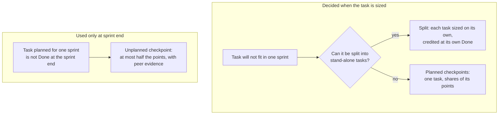

# Task Points Specification: Measuring Task Effort Each Sprint

!!! warning "Status"
    Superseded: earlier, reference-task form of Task Points. Kept for research history; do not use it to size work. The current contract is count-based sizing across seven task types in the [Task Points Guide](guide.md).

    Lineage: Task Points, full specification (reference-task iteration). Sizing here compares each task with written reference tasks across four task types; the [Task Points Guide](guide.md) later replaced that with count-and-band sizing across seven types. Crediting, checkpoint, reporting and trust rules are shared by both.

## Summary

Task Points measures how much work the team completes each sprint, task by task, without using logged hours. It covers every task in the issue tracker: research, development, code review and testing. Each task is sized in points before work starts by comparing it with a small set of written reference tasks. Points are credited in the sprint where the work is proven, which is when the task reaches Done or, for a task too large for one sprint, when one of its checkpoints is confirmed.

Each sprint the team reports points credited by task type and points per available person-day. These are read next to cycle time and quality measures. All figures are for the team as a whole. They show whether the team's way of working is improving and are never used to judge individuals.

The system in five rules:

1. Size every task before it starts, on a scale of 1 to 13, against reference tasks of the same type.
2. Credit points only when the work is proven: at Done, or when a checkpoint is confirmed.
3. A task too large for one sprint that cannot be split into usable parts gets planned checkpoints, each with its own share of the points.
4. A task that unexpectedly misses the sprint end can earn at most half its points before Done, and only with evidence.
5. Divide the points credited by available person-days to see the trend, and read that trend next to the quality measures.

## Key terms

| Term | Meaning |
| --- | --- |
| Task | An issue or sub-task for one piece of research, development, code review or testing |
| Task type | Research, Dev, Code review or Testing. Each type has its own reference tasks |
| Points | How much work a task needs, compared with the reference tasks of its type. Points are not hours |
| Reference task | A real, finished task recorded with its size and the reason for it, used as the yardstick when sizing new tasks |
| Checkpoint | An intermediate stage of a large task. It has an exit condition and its own share of the task's points |
| Exit condition | A short statement of what will exist when a checkpoint or task is complete, which a peer can check, for example "parser on the branch, build passes, unit tests pass" |
| Credited | Counted in a sprint's figures. Each point is credited once, in one sprint |
| Delivered points | Points credited for new work |
| Rework points | Points credited for fixing the team's own earlier work. Reported separately from delivered points |
| Available person-day | One working day of one team member who takes sized tasks, after leave and public holidays are removed |

## Sizing a task

Every task is sized before work starts, during refinement or sprint planning. Sizing answers one question: how much work does this task need compared with the reference tasks of its type?

**Scale.** Sizes are 1, 2, 3, 5, 8 and 13. The gaps widen as sizes grow because large tasks cannot be sized as precisely. Pick the nearest value; if you are unsure between two, choose the smaller. A 13-point task is either split or given planned checkpoints (next section). Anything larger than 13 is split before it enters a sprint.

**Reference tasks.** The yardstick is a set of 8 to 12 real, finished tasks, two or three per type, covering a range of sizes. Each is recorded with what it involved, its size and why it has that size. Compare new tasks with these references, not with how long similar work took recently. The set changes only by a recorded decision (see Keeping the numbers trustworthy).

**What drives the size.** The table below is starting guidance until the team has chosen its reference tasks. After that, the reference tasks take priority.

| Size | Research | Dev | Code review | Testing |
| --- | --- | --- | --- | --- |
| 1 | One narrow question answered from existing docs or code | One small change in one place, such as a label or one validation | A few lines in one file | A handful of scenarios, no regression |
| 2 | One question that needs a short experiment | A few related changes in one module | A small change across 2–3 files | Up to about 10 scenarios |
| 3 | Two or three options compared | A new dialog with simple logic, or a change across 2–3 modules | A moderate change, or dense logic in one module | 10–25 scenarios with targeted regression |
| 5 | Several options compared, with prototypes | A feature slice across screen, logic and data | A large change, or a change to a shared component | 25–50 scenarios, or one regression area |
| 8 | A wide investigation across several areas | Several screens or complex business rules | A very large or high-risk change, such as a data upgrade | A broad regression across modules |
| 13 | Too large: split into separate questions | Needs splitting or planned checkpoints | Too large: split the review by component | Release-level regression: needs planned checkpoints |

**What the size does not include.** The size reflects the work itself. It does not depend on who does the task, how experienced they are, or how much AI assistance they use. Uncertainty is handled by a separate research task, not by adding points to the dev task. A task has one size however many people work on it.

**Who sizes.**

- The person expected to do the task proposes a size. At least one other team member sizes it independently and writes their size down before seeing the proposal. The team can also size together at refinement.
- If the two sizes are one step apart, use the smaller. If they are further apart, compare the task with the reference tasks for a couple of minutes and agree. If there is still no agreement, the team lead decides, and if the team lead cannot decide either, the smaller size is used.
- An AI assistant may draft a size and its reasoning against the reference tasks. A person always accepts or changes the draft.
- Once work starts, the size is fixed. It changes only when the scope changes (see Edge cases).

## Tasks larger than a sprint

If a task will not fit in one sprint, first try to split it into separate tasks that each produce a usable result. When that is not possible, give the task planned checkpoints, so the work done in each sprint still earns points.

How a task earns points: two planning decisions, one sprint-end check.



The left path is decided when the task is sized. The right path is used only when a task planned for one sprint is not Done at the sprint end.

**Split when each part can stand alone.** A part stands alone if it can be merged, tested and used without the other parts. For example, "import format A" and "import format B" can each be released separately. Each resulting task is sized on its own and credited at its own Done.

**Use planned checkpoints when the parts cannot stand alone.** For example, a matching engine is only usable once all its match types work. It stays one task, and its checkpoints record the progress.

**Checkpoint rules**

1. Checkpoints are planned when the task is sized, before work starts. Each checkpoint is recorded as a sub-task of the task in the issue tracker, for example "CP 1 of 3: parser on branch".
2. A task has at most 4 checkpoints, and never more checkpoints than it has points. Each checkpoint should be reachable within one sprint. The last checkpoint is always the task's Done.
3. Each checkpoint has an exit condition that a peer can check against something that exists, such as code on a branch that builds, unit tests that pass, a test run record or a draft decision note.
4. The task's points are divided among its checkpoints in whole numbers, according to the share of the work each covers. Every checkpoint gets at least 1 point, and the shares add up exactly to the task's points.
5. A checkpoint is credited in the sprint in which a peer confirms its exit condition, which must be no later than that sprint's review. The peer must not be the assignee or anyone who worked on the task with them. Being close to a checkpoint earns nothing.
6. Tasks of 1 or 2 points never have checkpoints.

| Exit condition accepted | Not accepted |
| --- | --- |
| Parser for formats A and B committed on the feature branch; build passes; parser unit tests pass | "Parser about 60% done" |
| Scenario group 1 (import, 14 scenarios) run; results and defects logged in the issue tracker | "Most of the import testing done" |
| Questions 1 and 2 answered in the decision note; a peer has read it | "Research well under way" |
| Status mapping merged; walkthrough with a peer done | "Worked on it for 4 days" |

**When a one-sprint task misses the sprint end.** Sometimes a task planned to finish within the sprint is not Done by the sprint end. It can earn part of its points before Done only through an unplanned checkpoint:

1. At the sprint end, the assignee writes an exit condition that describes what already exists. They also write a second one for the remaining work, which becomes the final checkpoint.
2. A peer checks the first exit condition against the evidence.
3. If the peer confirms it, the unplanned checkpoint is credited with at most half of the task's points, rounded down. The rest is credited at Done.
4. If the peer cannot confirm it, nothing is credited in this sprint. All the points are credited at Done.
5. A task can have only one unplanned checkpoint. Unplanned checkpoints apply only to tasks of 3 to 8 points that have no planned checkpoints. Tasks under 3 points are credited only at Done.

The cap is lower than for planned checkpoints. Planned checkpoints are agreed before the work starts, while an unplanned one is judged afterwards, so the cap keeps planning honest. Example: a 5-point task gets at most 2 points from an unplanned checkpoint (half of 5 is 2.5, rounded down). The remaining 3 points are credited at Done.

## What a sprint is credited with

A sprint's delivered points are all the points proven in that sprint. The points come from three places:

- tasks without checkpoints that reached Done in the sprint, with their full points;
- planned checkpoints confirmed in the sprint, with their share of the points (the final checkpoint is confirmed when the task reaches Done);
- unplanned checkpoints confirmed at the end of the sprint, with their capped share.

```
delivered points (sprint) = sum of points of tasks Done + sum of points of checkpoints confirmed
```

Fixes to the team's own earlier work are credited in the same way, but they count as rework points, not delivered points (see Edge cases).

**Timing rules**

- A task counts in the sprint in which it reached Done, meaning its first resolution date in the issue tracker is on or before the sprint's last day. If the task is reopened later, that date does not change (see Edge cases). A checkpoint counts in the sprint in which it was confirmed.
- Each point is credited once. A sprint's figures are never changed after that sprint closes, and any correction goes into the current sprint.
- If a task reaches two checkpoints in one sprint, both are credited in that sprint.
- Points belong to the task, not to a person. Work done in pairs or shared between people is credited once.
- A task with no confirmed progress earns nothing, however much work went into it. Its points are credited when it reaches a checkpoint or Done.

## Worked example

One story, "Receive tracking updates from a new delivery company (carrier E)", runs over five two-week sprints. Sprint 1 is research, sprints 2 to 4 are development and sprints 4 and 5 are testing. The story earns 30 delivered points and 2 rework points. The sizes are illustrative.

**The plan**

| Task | Type | Points | How it is credited |
| --- | --- | --- | --- |
| R1 Compare carrier E's API and file feed options | Research | 3 | At Done |
| D1 Carrier E tracking integration | Dev | 13 | Planned checkpoints: CP1 connection and update reader on the branch (5), CP2 status mapping rules on the branch (5), CP3 updates shown on the parcel timeline, merged, Done (3) |
| D2 Carrier E settings on the carrier setup screen | Dev | 3 | At Done, planned for sprint 3 |
| V1 Code review of D1 | Code review | 3 | At Done, when the change is approved |
| T1 Test receiving, mapping, display and regression | Testing | 8 | Planned checkpoints: CP1 receiving and mapping scenarios run (5), CP2 display and regression run with defects logged (3) |

D1 has checkpoints because the update reader, the status mapping rules and the timeline display could not be released or tested on their own. That means it could not be split into usable tasks, and at 13 points it would not fit in one sprint.

**What happened**

- D2 was planned for sprint 3 but was not Done by the sprint end. By then the settings fields were on the branch, the build passed and the save and load unit tests passed, but the check of the API key was still missing. A peer confirmed this, so an unplanned checkpoint was credited with 1 point (half of 3, rounded down). The other 2 points were credited at Done in sprint 4.
- In sprint 5, T1 found that updates arriving out of order overwrote a newer status. The fix, F1, was sized at 2 points. It was credited as rework because the defect came from D1.

**Points credited, by sprint**

| Task | Sprint 1 | Sprint 2 | Sprint 3 | Sprint 4 | Sprint 5 |
| --- | --- | --- | --- | --- | --- |
| R1 | 3 (Done) |  |  |  |  |
| D1 |  | 5 (CP1) | 5 (CP2) | 3 (CP3, Done) |  |
| D2 |  |  | 1 (unplanned CP) | 2 (Done) |  |
| V1 |  |  |  | 3 (Done) |  |
| T1 |  |  |  | 5 (CP1) | 3 (CP2, Done) |
| F1 |  |  |  |  | 2 (rework) |

Sprint totals (delivered): sprint 1: 3, sprint 2: 5, sprint 3: 6, sprint 4: 13, sprint 5: 3; rework in sprint 5: 2.

With checkpoints, sprints 2 and 3 show the development work that was actually done in them. If points were credited only at Done, those sprints would show nothing and sprint 4 would jump to 19. The 2 rework points in sprint 5 are reported separately under both rules.

## Edge cases

Each case below has one rule. Where a case is not listed, apply the general principle: points are fixed before work starts, credited once when the work is proven, and never taken back from a closed sprint.

**Scope and size**

| Situation | Rule | Result |
| --- | --- | --- |
| The task turns out harder or easier than sized, but the scope is the same | The size stays as it is | The difference shows up in points per day and cycle time. A miss of 2 or more steps is noted for the reference-task review |
| Scope is added while the task is in progress | The added work becomes a new task and is sized on its own | The original task keeps its size |
| Scope is removed before any points are credited | The assignee and a peer re-size the task downwards | For example, an 8 becomes a 5 |
| Scope is removed after checkpoints are credited | Credited points stay. The unreached checkpoints are reduced, each keeping at least 1 point | The task total can never fall below the points already credited |
| Research shows the dev task is larger than expected | Size or re-size the dev task after the research and before development starts | The research task is credited separately |
| A research timebox ends without a full answer | The note records what was learned and what is still open | Credited in full when the note is accepted. Any further research is a new task |
| A review or test task cannot be sized until the dev work is known | Size it once the dev change is ready for review, or at test planning, before that task starts | Sized before it starts, as for any task |
| An urgent task arrives mid-sprint, such as a hotfix | The assignee and one peer size it on the day it starts. If that is not possible, the team lead sizes it | Flagged and checked at the next refinement |

**Progress and timing**

| Situation | Rule | Result |
| --- | --- | --- |
| The task finishes early | Normal crediting | Full points in that sprint |
| A planned checkpoint is not reached in its sprint | A planned checkpoint cannot be given an unplanned one | It is credited in the sprint in which it is confirmed, and the next sprint may confirm two |
| The task is blocked by the customer or another team | Nothing is credited until a checkpoint or Done | Marked as blocked. Cycle time shows the wait |
| The task is reassigned | Nothing changes | The points and checkpoints stay with the task |
| The task is reopened after Done | The original stays credited. The fix is a linked rework task, sized on its own | The reopening is counted in the quality measures |
| A confirmed checkpoint later turns out not to hold | Past credit is not changed | The corrective work is a rework task |
| The business cancels the task | Credited points stay. Unreached checkpoints are removed | Reported as cancelled points |
| The team abandons its approach and starts again | Credited points stay | The new work is sized as new tasks, tagged as rework |

**Quality and rework**

| Situation | Rule | Result |
| --- | --- | --- |
| A defect is found in work the team delivered | The fix is sized and credited as rework points. QA links the defect to the task that caused it, and the team lead settles disputes | Rework points are reported separately and not counted as delivered |
| A defect is found in older code the team has not changed | Treated as a normal task | Delivered points |
| A task is linked to a bug or a reopened task | It is treated as rework unless the team lead agrees otherwise | This prevents rework from being logged as new work |
| Retesting is needed after the team's own defects are fixed | A rework testing task | Rework points |
| A code review sends the change back for several rounds | The review task is credited once, when the change is approved | The extra rounds show up in cycle time |

**People and capacity**

| Situation | Rule | Result |
| --- | --- | --- |
| People pair or work as a group on a task | The task is credited once | No double counting |
| Leave or a public holiday falls in the sprint | Those days are removed from available person-days | Points per day stays comparable |
| A new member joins | They are counted from their first day | Recorded in the change log |
| Work with no task in the issue tracker: meetings, ceremonies, training, untracked support | Not sized | If this work grows, points per day falls. The reason goes in the change log |
| Support work tracked in the issue tracker | Sized as the closest task type | Delivered points |

## What is reported

The main productivity figure is delivered points per available person-day, compared with the team's own baseline. Each sprint's report gives the six measures below, both for the sprint and as a rolling three-sprint figure.

| Measure | How it is calculated | What it shows |
| --- | --- | --- |
| Delivered points by task type | Delivered points credited in the sprint, per type | Where the team's effort went |
| Points per available person-day | Delivered points ÷ available person-days | Productivity, compared with the baseline |
| Rework share | Rework points ÷ (delivered points + rework points) | How much effort went into fixing the team's own work |
| Cycle time by type | Working days from the start of work to Done: median and 85th percentile. Tasks with checkpoints are measured from start to final Done | How long work takes |
| Reopened tasks | Tasks reopened after Done ÷ tasks Done | Whether work is right the first time |
| Escaped defects per 100 points | Defects found after release in the team's work ÷ delivered points × 100 | Quality that reaches users |

**Formulas**

```
available person-days = sum over team members of (working days in the sprint - leave days)

trend index = (delivered points, last 3 sprints ÷ available person-days, last 3 sprints)
              ÷ (baseline delivered points ÷ baseline available person-days)
```

- **Team members** are all developers and QA engineers on the team roster at the start of the sprint. Only leave and public holidays are removed. The roster is fixed so that the figure cannot be improved by leaving people out.
- **Rolling figures** add up the points and the person-days over the last three sprints, then divide. They do not average three sprint ratios.
- **Rework points** are left out of the productivity figure. Time spent on rework therefore lowers delivered points per day, which is the intended effect.

**Example (illustrative).** Take an illustrative team of 11 people (9 developers, 2 QA) with 10 working days in a sprint, and 6 days of leave taken. That gives 11 × 10 − 6 = 104 available person-days. If the sprint delivers 78 points, that is 78 ÷ 104 = 0.75 points per available person-day. Against a baseline of 0.68, the trend index is 1.10, meaning about 10% more work completed per available day.

**Baseline.** The baseline is the first sprints measured under this system, continuing until at least 30 tasks are Done with at least 5 of each task type. This usually takes about three sprints. A new baseline starts when the reference tasks are agreed again after a failed quarterly check, or when more than 30% of the team has changed.

**Reading the trend.** A trend index above 1.0 means more work was completed per available day than in the baseline. Treat a change as real only if it holds for two non-overlapping three-sprint periods and the quality measures have not got worse over the same time.

## Keeping the numbers trustworthy

The figures are only as reliable as the sizing and the checkpoint evidence behind them. For that reason, sizing is checked once a quarter and a few indicators are watched every sprint.

**Quarterly sizing check**

1. The team lead picks 8 tasks completed during the quarter at random, two of each type.
2. Two or three team members who did not work on those tasks size each one against the reference tasks. They work independently and do not see the recorded sizes.
3. Their average sizes are added up and compared with the recorded sizes. The difference is expressed as a percentage of the recorded total.
4. If the difference is 20% or less, no action is needed. If it is more than 20%, trend reporting pauses. The team reviews the reference tasks and the sizing guidance, agrees them again, and starts a new baseline.

The reference tasks change only at this check. Each change is recorded with its date and reason.

**Sprint indicators**

| Indicator | Look into it when |
| --- | --- |
| Share of delivered points that came from checkpoints | It is above 30% over a rolling three-sprint period, which may mean tasks are being planned too large |
| Unplanned checkpoints | There are more than 2 in a sprint. Raise it at the retrospective |
| Checkpoint confirmations | At each sprint review, 1 in 5 confirmations is checked for its evidence link. Discuss any that lack one |
| Share of tasks sized 1 or 2 | It rises sharply compared with the baseline, which may mean work is being split to avoid scrutiny |
| Sizing misses of 2 or more steps | Always. Note them for the next quarterly check |

**Rules of use**

- Figures are produced for the team only. No figures are produced or shown for individuals.
- The figures are not used as targets or quotas, or in appraisals, pay or headcount decisions.
- Teams are not compared with each other, because each team has its own reference tasks and baseline.
- Every report shows the quality measures next to productivity, together with a change log of changes to tools, people and process.
- The figures show whether the team completes more work per available day. They do not show why.

## Roles and sprint routine

The rules decide most cases. A peer confirms evidence, and the team lead handles only disputes and exceptions.

| Role | Responsibilities |
| --- | --- |
| Assignee | Proposes the size. Proposes checkpoints for large tasks. Records the evidence for each checkpoint. Writes the unplanned checkpoint when a task misses the sprint end |
| Peer | Sizes the task independently. Confirms checkpoint evidence |
| QA | Sizes testing tasks. Links each defect to the task that caused it |
| Team lead | Settles disputes about sizing and rework. Maintains the reference tasks. Runs the quarterly check. Prepares the sprint report |

**Each sprint**

1. **Refinement:** size new tasks. Plan checkpoints for tasks that will not fit in one sprint and cannot be split.
2. **Sprint planning:** confirm the sizes and which checkpoints are expected in this sprint.
3. **During the sprint:** move tasks to Done. A peer confirms each checkpoint when it is reached, and a link to the evidence is added to the checkpoint's sub-task.
4. **Last day of the sprint:** for each task of 3 to 8 points that is not Done, decide whether it gets an unplanned checkpoint.
5. **Sprint review:** make sure all checkpoint confirmations are complete, sample 1 in 5 of them, and calculate the figures.
6. **Report:** publish the sprint and rolling figures, the quality measures and the change log.

Once a quarter, run the sizing check.

**What the issue tracker needs**

- A points field on every issue and sub-task.
- A task type field with four values: Research, Dev, Code review and Testing.
- Checkpoints as sub-tasks named "CP n of m: …", each with its points and a link to its evidence.
- A rework label.
- The standard sprint and resolution date fields, which already exist.

## Limits and values to confirm

Task Points gives a consistent, hour-free view of work completed per sprint. It has limits that everyone reading the figures should know.

- **Points are estimates.** They are set before the work, so they show planned work that was completed, not the effort actually spent.
- **Sizes can drift.** Relative sizing tends to creep over time. The quarterly check catches drift but does not prevent it.
- **Partial credit depends on judgement.** Checkpoints rely on evidence and a peer's confirmation, which is more open to optimism than crediting only at Done. That is why unplanned checkpoints are capped at half the points and confirmations are sampled.
- **Change, not cause.** A rising trend shows the team completes more per available day. The change log helps explain why, but it is not proof.
- **Short periods are noisy.** One sprint can be low simply because a large task landed in the next one. Base decisions on rolling figures.
- **Only within one team.** Figures cannot be compared across teams.

The values below are proposed starting points. Confirm them before the first sprint, and review them after the baseline.

| Value | Proposed | Where it is used |
| --- | --- | --- |
| Size scale | 1, 2, 3, 5, 8, 13 | Sizing |
| Maximum checkpoints per task | 4, and never more than the task's points | Tasks larger than a sprint |
| Unplanned checkpoint cap | Half the task's points, rounded down; tasks of 3 to 8 points only | Tasks larger than a sprint |
| Research timebox | To be set by the team | Sizing research |
| Baseline minimum | 30 tasks Done, with at least 5 of each type | Reporting |
| New baseline after team change | More than 30% of members changed | Reporting |
| Drift tolerance in the quarterly check | 20% | Quarterly sizing check |
| Checkpoint share alert | 30% of delivered points | Sprint indicators |
| Unplanned checkpoint alert | More than 2 in a sprint | Sprint indicators |
| Confirmation sample | 1 in 5 | Sprint review |
